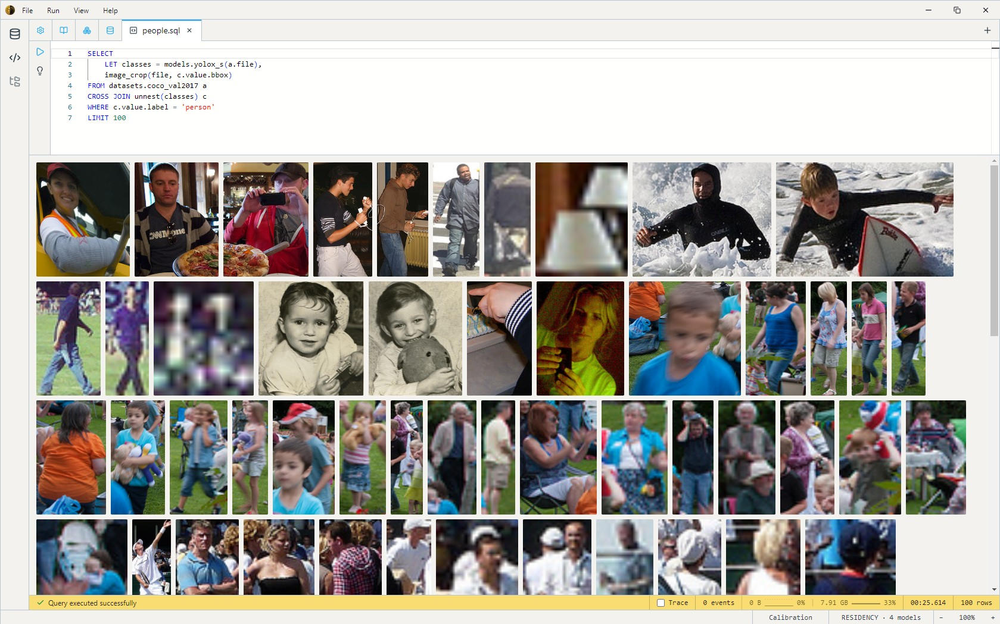
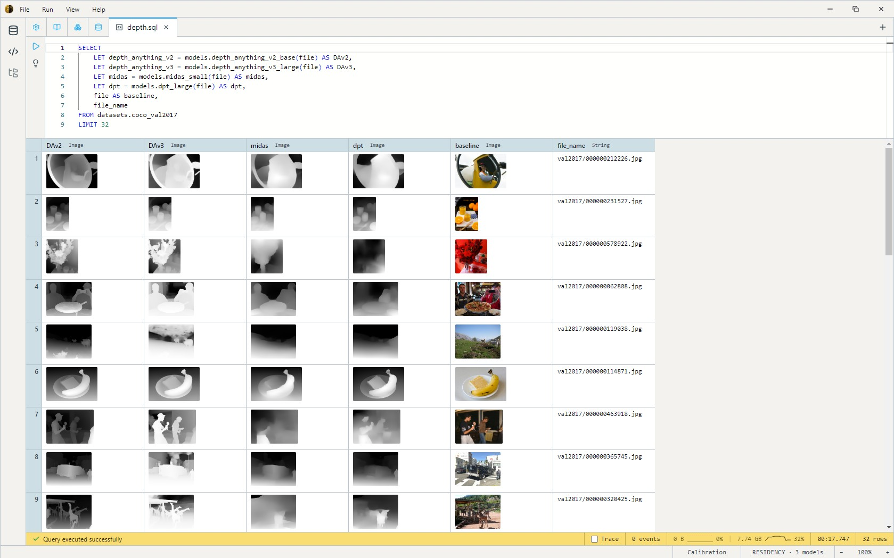

# DatumV™

[]
[]
[]

DatumV runs ML models on your data — locally, batched, no Python. You describe what you want in SQL, and the engine handles inference, batching, calibration, and I/O across dozens of vision, audio, and text models from a built-in catalog.



```sql
SELECT
    LET classes = models.yolox_s(a.file),
    image_crop(file, c.value.bbox)
FROM datasets.coco_val2017 a
CROSS JOIN unnest(classes) c
WHERE c.value.label = 'person'
LIMIT 100
```

## Same input, four depth models



```sql
SELECT
    LET depth_anything_v2 = models.depth_anything_v2_base(file) AS DAv2,
    LET depth_anything_v3 = models.depth_anything_v3_large(file) AS DAv3,
    LET midas = models.midas_small(file) AS midas,
    LET dpt = models.dpt_large(file) AS dpt,
    file AS baseline,
    file_name
FROM datasets.coco_val2017
LIMIT 32
```

See [Examples — Depth model comparison](docs/examples.md#depth-model-comparison) for the full walkthrough.

## Installing

<!-- Replace this block with the actual install/launch instructions for the current release artifact. -->

[Install / launch instructions for the current release artifact.]

## Why DatumV?

- **Local-first.** Your data and models live on your machine. No data leaves the host.
- **Offline.** No internet connection required for queries, inference, or workflow execution after install.
- **No Python.** No `pip install`, no virtualenv, no CUDA-version mismatches.
- **Batched by default.** Inference is a column operation across thousands of rows. No manual `DataLoader` wiring.
- **Queryable.** Filter, join, group, and rank on model outputs without writing glue code.
- **Inspectable.** Every intermediate is a row in a table you can `SELECT` from.

## The catalog

DatumV ships with a built-in catalog spanning object detection, segmentation, classification, depth estimation, OCR, captioning, embeddings, text-to-speech, image generation, and LLMs — including MobileSAM, the YOLOX family, Stable Diffusion variants, all-MiniLM-L6-v2, Florence-2, PaddleOCR, MiDaS, DPT, U²-Net, and Bark.

You can add your own ONNX models with `CREATE MODEL`. See [docs/models.md](docs/models.md) for the current catalog and [docs/sql/create-model.md](docs/sql/create-model.md) for adding new ones.

## Documentation

| | |
|--|--|
| [Getting Started](docs/getting-started.md) | Install, your first query, the load → transform → export pipeline |
| [Examples](docs/examples.md) | Things you can do |
| [SQL Reference](docs/sql/select.md) | SELECT, JOIN, WHERE, GROUP BY, window functions, type system, DDL/DML |
| [Functions](docs/functions/string.md) | 200+ built-in functions across math, string, image, vector, temporal, JSON |
| [Models](docs/models.md) | Built-in catalog and how to add your own |
| [Engine internals](docs/technical/architecture.md) | Architecture, file format, indexes, execution plans, C# API |

## Building from source

```bash
git clone https://github.com/Heliosoph/DatumV.git
cd DatumV
dotnet build
dotnet test
```

## Built with

**DatumV is built with Llama.** Use of Llama models is subject to Meta's [Llama Community License](https://llama.meta.com/llama3_1/license/) and [Acceptable Use Policy](https://llama.meta.com/llama3/use-policy/).

DatumV's catalog references third-party models — Llama, Stable Diffusion, MiDaS, YOLOX, the Florence family, MobileSAM, U²-Net, Bark, and others — that are downloaded from their publishers at install time. Each model retains its upstream license; you can review the license for any model before downloading via the install dialog, or browse the bundled set in [licenses/](licenses/).

DatumV is built on:

- [Llama](https://llama.meta.com/) and [LLamaSharp](https://github.com/SciSharp/LLamaSharp) — LLM inference
- [ONNX Runtime](https://onnxruntime.ai/) — vision, audio, and embedding model inference
- [FFmpeg](https://ffmpeg.org/) — media decoding
- [Apache Arrow](https://arrow.apache.org/) — columnar in-memory format
- [Electron](https://www.electronjs.org/) — desktop shell
- [.NET 10](https://dotnet.microsoft.com/) — engine runtime

## License

DatumV's source code, the Electron shell, and the catalog manifests are MIT-licensed. Third-party models referenced from the catalog are subject to their own upstream licenses (see [Built with](#built-with) above) and are not redistributed by this project.

---

DatumV™ is a trademark of Heliosoph LLC.

*Datum: a fact known or assumed as the basis for reasoning or calculation. A premise. A given — the atomic unit of information from which inferences are drawn.*