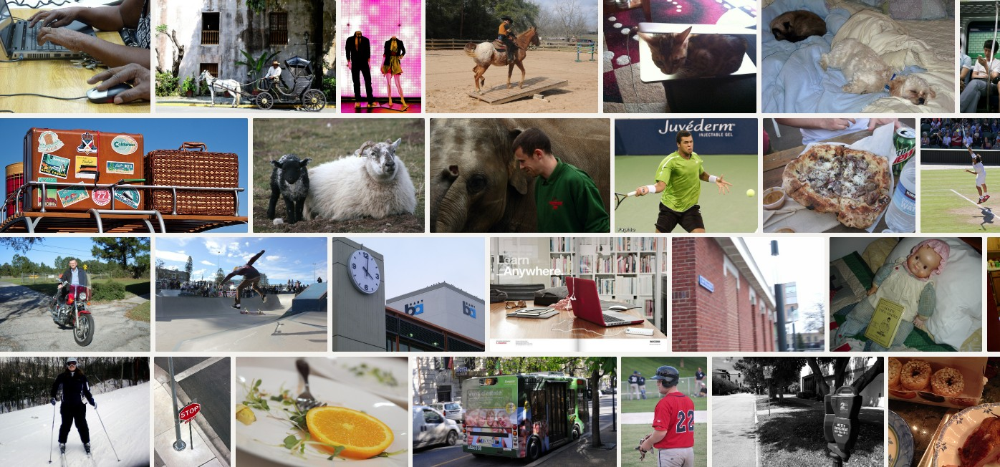

# COCO 2017

Microsoft Common Objects in Context — the 2017 release. Eighty-class
object detection, segmentation, keypoint, and captioning corpus drawn
from Flickr. The default reach-for benchmark in computer vision: every
pretrained detector / segmenter / captioner reports COCO mAP, and most
of them were trained on it.

All variants share the same image distribution and label vocabulary —
they differ only in which split. Pick a split, not a dataset: the
schemas are interchangeable so you can swap `datasets.coco_val2017` for
`datasets.coco_test2017` in a query and the only thing that changes is
the number of rows.

## When to use which split

| Variant   | Images  | Annotations | Best for                                              |
| --------- | ------- | ----------- | ----------------------------------------------------- |
| val2017   | 5 000   | Public      | Quick sanity checks, leaderboard-style evaluation.    |
| **test2017** | **40 670** | **Held out** | **Default** for examples. Largest unlabeled image bag. |
| train2017 | 118 287 | Public      | Fine-tuning. Only pull this if you need labels.       |

Start with **test2017** for new tinkering — biggest image set, no
annotations means smallest manifest and fastest install. Move to
val2017 when you want to check detector mAP against a ground truth.

## Example SQL

Run a pretrained YOLOX detector over every COCO image:

```sql
SELECT
  file_name,
  models.yolox_s(file) AS detections
FROM datasets.coco_test2017
LIMIT 100;
```

Unnest into one row per box:

```sql
SELECT
  i.file_name,
  d.value.label,
  d.value.score,
  d.value.bbox
FROM datasets.coco_test2017 AS i
CROSS JOIN UNNEST(models.yolox_s(i.file)) AS d
WHERE d.value.score > 0.5;
```

Count detections by class across the whole split:

```sql
SELECT d.value.label AS label, COUNT(*) AS hits
FROM datasets.coco_test2017 AS i
CROSS JOIN UNNEST(models.yolox_s(i.file)) AS d
WHERE d.value.score > 0.4
GROUP BY d.value.label
ORDER BY hits DESC;
```

Draw boxes for spot-checking:

```sql
SELECT
  file_name,
  image_draw_bounding_boxes(file, models.yolox_s(file)) AS annotated
FROM datasets.coco_test2017
LIMIT 12;
```

## Output schema

Every split produces the same `images` table:

```
file_name:    String      -- entry path inside the source zip
file:         Image       -- decoded JPEG, sidecar-backed
file_width:   Int32       -- pixel width (null when header parse failed)
file_height:  Int32       -- pixel height
file_channels: UInt8      -- 1 / 3 / 4
file_byte_length: Int64   -- uncompressed bytes
file_orientation: String  -- "landscape" / "portrait" / "square"
```

When annotations are present (val2017, train2017) a sibling `annotations`
table joins on `file_name` and carries bbox / segmentation / category_id. The
JSON loader that produces it is staged for a follow-up release —
test2017 ships images-only until then.

## Screenshots



## Tips

- **Sidecar-backed images** — the `file` column carries a handle into
  a `.datum-blob` companion file, not inline bytes. Materializing the
  full pixel data is lazy; most filter / count queries never touch the
  blob store at all.
- **No annotations on test2017** — the COCO benchmark holds them on
  the evaluation server. Use val2017 when you need ground truth for
  detector accuracy.
- **Aspect ratios vary wildly** — the source is Flickr, so anything
  from extreme panoramas to square crops. If your model expects a
  fixed size, batch with `image_letterbox` or `image_resize_to_stride`.

## License & attribution

CC-BY-4.0 over the annotations; image rights flow through individual
Flickr contributors per the upstream COCO terms. Use commercially —
just preserve attribution.

- Paper: [Microsoft COCO: Common Objects in Context](https://arxiv.org/abs/1405.0312)
- Site: [cocodataset.org](https://cocodataset.org/)
- Labels: [COCO 80 class list](https://github.com/amikelive/coco-labels)
