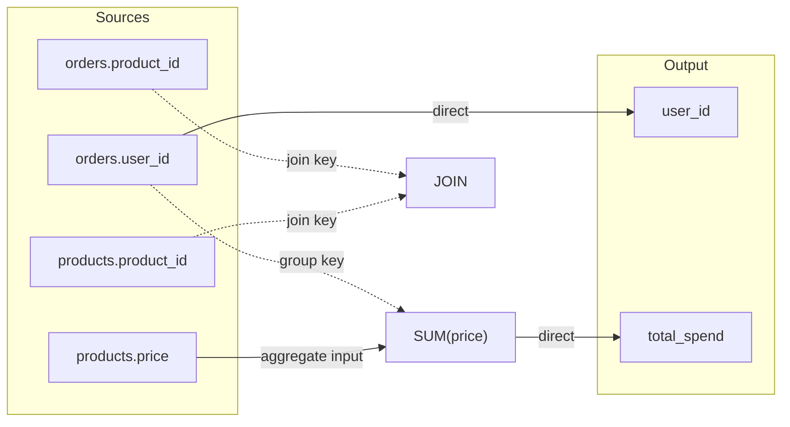

# Column Lineage Analysis — Implementation Plan

## Overview

Column lineage answers "for each output column, which source columns contributed to its value and how?" It builds a directed acyclic graph (DAG) from source columns to output columns by walking the parsed AST — no query execution is required.

The analysis is **purely static**: it operates on the parsed `QueryExpression` and an optional `LanguageServerManifest` (for wildcard expansion and column resolution). Because it requires no runtime data access, it belongs in `DatumIngest.Parsing`, keeping it available to the WASM-hosted language server without pulling in execution or I/O dependencies.

Use cases:

| Consumer | Transport | Purpose |
|---|---|---|
| Editor (Monaco) | SignalR via `LanguageServerHub` | Interactive lineage visualization in the query editor |
| CLI | Direct call, Mermaid text output | `--lineage` flag on `query` / `explain` commands |
| CI / data catalog | gRPC `GetLineage` RPC | Programmatic lineage extraction for audit, impact analysis, governance |
| WASM language server | Direct call | Browser-hosted lineage without a server roundtrip |

The key design tension is handling SQL constructs that obscure column identity: `SELECT *` hides which columns exist until the manifest is consulted, `LET` bindings create intermediate names that must be resolved transitively, CTEs and subqueries introduce nested scopes, and `PIVOT`/`UNPIVOT` synthesize or collapse columns dynamically. The solution is a **scope-tracking recursive walk** modeled on the existing `SemanticAnalyzer` pattern, combined with a `LineageScope` object that resolves aliases, CTE definitions, LET bindings, and lambda parameters at each level of nesting.

---

## Graph Model

**File:** `src/DatumIngest.Parsing/Lineage/LineageGraph.cs` (new)

All graph types are immutable records. The graph is a flat collection of nodes and edges, with optional subgraphs for scoped constructs (CTEs, subqueries).

### Node kinds

```csharp
/// <summary>Classifies a node in the lineage graph by its role in the data flow.</summary>
public enum LineageNodeKind
{
    /// <summary>A column read from a source table or CTE.</summary>
    Source,

    /// <summary>A computed value produced by an expression (arithmetic, function call, cast, etc.).</summary>
    Expression,

    /// <summary>An aggregate function output (COUNT, SUM, AVG, etc.).</summary>
    Aggregation,

    /// <summary>A window function output (ROW_NUMBER, LAG, running SUM, etc.).</summary>
    Window,

    /// <summary>A lambda body evaluation within a higher-order function.</summary>
    Lambda,

    /// <summary>A column in the final output row of the query.</summary>
    Output,

    /// <summary>A LET binding that acts as a named intermediate value.</summary>
    Binding,

    /// <summary>A literal constant with no upstream dependency.</summary>
    Constant,

    /// <summary>A SCAN accumulator node (fold/prefix-scan state variable).</summary>
    Scan,
}
```

### Edge kinds

```csharp
/// <summary>Classifies how data flows along an edge in the lineage graph.</summary>
public enum LineageEdgeKind
{
    /// <summary>Direct column-to-column data flow (e.g., SELECT col, CAST(col AS ...)).</summary>
    Direct,

    /// <summary>Column used as a GROUP BY key — determines grouping but is not aggregated.</summary>
    GroupKey,

    /// <summary>Column fed into an aggregate function as input.</summary>
    AggregateInput,

    /// <summary>Column used as a join key — determines row matching between tables.</summary>
    JoinKey,

    /// <summary>Column referenced in a WHERE or HAVING predicate — filters rows but does not produce values.</summary>
    Filter,

    /// <summary>Column used in a PARTITION BY or ORDER BY within a window specification.</summary>
    WindowFrame,

    /// <summary>Element-level data flow inside a lambda body (array_transform, array_filter).</summary>
    LambdaElement,

    /// <summary>Feedback edge from a SCAN accumulator's output back to its next-row input.</summary>
    ScanFeedback,
}
```

### Core records

```csharp
/// <summary>
/// A single node in the column lineage graph. Nodes represent source columns,
/// intermediate computations, and output columns.
/// </summary>
/// <param name="Identifier">Unique identifier within the graph (e.g., "src:orders.user_id", "out:0:user_id").</param>
/// <param name="Kind">The role of this node in the data flow.</param>
/// <param name="Label">Human-readable label for display (e.g., "orders.user_id", "SUM(amount)").</param>
/// <param name="TableName">The source table name, or null for non-source nodes.</param>
/// <param name="ColumnName">The column name, or null for expression-only nodes.</param>
/// <param name="Span">Source location in the SQL text for editor integration.</param>
public sealed record LineageNode(
    string Identifier,
    LineageNodeKind Kind,
    string Label,
    string? TableName = null,
    string? ColumnName = null,
    SourceSpan? Span = null);

/// <summary>
/// A directed edge in the lineage graph from an upstream node to a downstream node.
/// </summary>
/// <param name="FromNodeIdentifier">The upstream node identifier (data flows from here).</param>
/// <param name="ToNodeIdentifier">The downstream node identifier (data flows to here).</param>
/// <param name="Kind">How the data flows along this edge.</param>
public sealed record LineageEdge(
    string FromNodeIdentifier,
    string ToNodeIdentifier,
    LineageEdgeKind Kind);

/// <summary>
/// A named subgraph containing the lineage for a scoped construct
/// (CTE, subquery, or compound query branch).
/// </summary>
/// <param name="Name">The scope name (CTE name, "subquery:N", "union:left", etc.).</param>
/// <param name="Graph">The lineage graph for this scope.</param>
public sealed record LineageSubgraph(
    string Name,
    LineageGraph Graph);

/// <summary>
/// The complete column lineage graph for a query. Contains all nodes, edges,
/// and optional nested subgraphs for CTEs and subqueries.
/// </summary>
/// <param name="Nodes">All nodes in the graph.</param>
/// <param name="Edges">All directed edges in the graph.</param>
/// <param name="Subgraphs">Nested lineage graphs for CTEs and subqueries, or null if none.</param>
public sealed record LineageGraph(
    IReadOnlyList<LineageNode> Nodes,
    IReadOnlyList<LineageEdge> Edges,
    IReadOnlyList<LineageSubgraph>? Subgraphs = null);
```

### Node identifier scheme

Identifiers are deterministic strings scoped by role:

| Pattern | Example | Used for |
|---|---|---|
| `src:{table}.{column}` | `src:orders.user_id` | Source column nodes |
| `out:{ordinal}:{alias}` | `out:0:user_id` | Output column nodes |
| `expr:{N}` | `expr:3` | Intermediate expression nodes (monotonic counter) |
| `agg:{function}:{N}` | `agg:SUM:1` | Aggregate function nodes |
| `win:{function}:{N}` | `win:ROW_NUMBER:0` | Window function nodes |
| `let:{name}` | `let:total` | LET binding nodes |
| `const:{N}` | `const:0` | Literal constant nodes |
| `lambda:{N}` | `lambda:0` | Lambda body expression nodes |
| `scan:{name}:{N}` | `scan:running_total:0` | SCAN accumulator nodes |
| `cte:{name}:src:{col}` | `cte:monthly:src:amount` | Source nodes within CTE subgraphs |

---

## Analyzer Design

**File:** `src/DatumIngest.Parsing/Lineage/LineageAnalyzer.cs` (new)

### Entry point

```csharp
/// <summary>
/// Builds a column-level lineage graph from a parsed query expression.
/// The analysis is purely static — it walks the AST without executing the query.
/// </summary>
public static class LineageAnalyzer
{
    /// <summary>
    /// Analyzes the given query expression and returns its column lineage graph.
    /// </summary>
    /// <param name="query">The parsed query expression (single SELECT or compound).</param>
    /// <param name="manifest">
    /// Optional manifest for resolving table schemas (needed for SELECT * expansion
    /// and column type information). When null, wildcard columns cannot be expanded
    /// and are represented as a single "all columns" source node per table.
    /// </param>
    /// <returns>The complete lineage graph.</returns>
    public static LineageGraph Analyze(QueryExpression query, LanguageServerManifest? manifest = null)
    {
        // Dispatch to AnalyzeSelect or AnalyzeCompound based on query type.
    }
}
```

### Scope tracking

The analyzer maintains a `LineageScope` that tracks name resolution state at each nesting level, modeled on `SemanticAnalyzer`'s `aliasToTable` dictionary and `opaqueAliases` set:

```csharp
/// <summary>
/// Tracks name resolution state during lineage analysis. Each scope level
/// corresponds to a query nesting boundary (outer query, CTE, subquery).
/// </summary>
internal sealed class LineageScope
{
    /// <summary>Maps table aliases to their resolved table names.</summary>
    internal Dictionary<string, string> AliasToTable { get; } = new(StringComparer.OrdinalIgnoreCase);

    /// <summary>Maps table names to their known column lists (from manifest or CTE output).</summary>
    internal Dictionary<string, IReadOnlyList<string>> TableColumns { get; } = new(StringComparer.OrdinalIgnoreCase);

    /// <summary>Maps CTE names to their analyzed lineage subgraphs.</summary>
    internal Dictionary<string, LineageGraph> CommonTableExpressionGraphs { get; } = new(StringComparer.OrdinalIgnoreCase);

    /// <summary>Maps LET binding names to the node identifiers that produce their values.</summary>
    internal Dictionary<string, IReadOnlyList<string>> LetBindingNodes { get; } = new(StringComparer.OrdinalIgnoreCase);

    /// <summary>Lambda parameter names currently in scope (opaque — no upstream lineage).</summary>
    internal HashSet<string> LambdaParameters { get; } = new(StringComparer.OrdinalIgnoreCase);

    /// <summary>Monotonic counter for generating unique expression node identifiers.</summary>
    internal int ExpressionCounter { get; set; }
}
```

### Walk order

The analyzer processes a `SelectStatement` in clause order, matching the logical evaluation sequence of the DatumIngest SQL dialect:

1. **CTEs** (`CommonTableExpressions`) — analyze each CTE body recursively, store resulting graphs in `scope.CommonTableExpressionGraphs`. For recursive CTEs, add a cycle edge labeled `ScanFeedback` from the recursive member's output back to the anchor.
2. **FROM** (`From`) — resolve the primary table; populate `AliasToTable` and `TableColumns` from the manifest (or mark as unresolved).
3. **JOINs** (`Joins`) — for each join, resolve the joined table, register its alias, and trace the ON condition with `JoinKey` edges.
4. **LET bindings** (`LetBindings`) — trace each binding's expression, add a `Binding` node, register in `LetBindingNodes` for downstream resolution. Destructured bindings expand into multiple binding nodes.
5. **WHERE** (`Where`) — trace the predicate with `Filter` edges. These edges connect source columns to a virtual filter node but do not flow into output columns.
6. **GROUP BY** (`GroupBy`) — trace grouping expressions with `GroupKey` edges.
7. **HAVING** (`Having`) — trace the having predicate with `Filter` edges.
8. **SELECT** (`Columns`) — trace each select column's expression, create `Output` nodes. Handle `SelectAllColumns` (wildcard expansion), `SelectTableColumns` (qualified wildcard), `EXCEPT`, and `REPLACE`.
9. **Window functions** — detected during SELECT expression tracing; create `Window` nodes with `WindowFrame` edges from PARTITION BY/ORDER BY columns.
10. **QUALIFY** (`Qualify`) — trace the qualify predicate with `Filter` edges.
11. **PIVOT** (`Pivot`) — create synthetic output nodes for each value × aggregate combination.
12. **UNPIVOT** (`Unpivot`) — collapse multiple source columns into a single value column and a name column.
13. **ORDER BY** (`OrderBy`) — not traced by default (ordering does not affect column values). Could optionally add informational edges.

### Expression tracing

The core `TraceExpression` method recursively walks an `Expression` and returns the set of node identifiers that contribute to the expression's value. It switches on all 22 concrete `Expression` subtypes (plus `ColumnReference` which is a non-sealed record):

```csharp
/// <summary>
/// Recursively traces an expression and returns the identifiers of all
/// lineage nodes that contribute to its computed value.
/// </summary>
private static IReadOnlyList<string> TraceExpression(
    Expression expression,
    LineageScope scope,
    List<LineageNode> nodes,
    List<LineageEdge> edges)
{
    switch (expression)
    {
        case ColumnReference column:
            // Resolve through alias → table, LET binding, or lambda parameter.
            // Return the source node identifier(s).

        case LiteralExpression:
            // Create a Constant node (no upstream edges).

        case ParameterExpression:
            // Treat as a constant (parameter value is bound before planning).

        case BinaryExpression binary:
            // Trace Left and Right; create an Expression node with Direct edges from both.

        case UnaryExpression unary:
            // Trace Operand; create an Expression node with a Direct edge.

        case LikeExpression like:
            // Trace Expression, Pattern, EscapeCharacter; merge upstream sets.

        case FunctionCallExpression function:
            // Trace each argument; create an Expression node with Direct edges from all.

        case WindowFunctionCallExpression window:
            // Trace arguments → Window node with Direct edges.
            // Trace PartitionBy and OrderBy → WindowFrame edges.

        case InExpression inExpr:
            // Trace the test expression and all value list entries.

        case BetweenExpression between:
            // Trace Expression, Low, High.

        case IsNullExpression isNull:
            // Trace Expression.

        case CastExpression cast:
            // Trace Expression; Direct edge (type conversion preserves lineage).

        case CaseExpression caseExpr:
            // Trace Operand (if present), all WhenClause conditions and results, ElseResult.
            // Output lineage is the union of all result branches.

        case SubqueryExpression subquery:
            // Analyze the inner SelectStatement recursively with a new scope.
            // Create a subgraph; connect inner output nodes to a single expression node.

        case InSubqueryExpression inSubquery:
            // Trace the outer expression; analyze the subquery as a nested scope.

        case ExistsExpression exists:
            // Analyze the subquery as a nested scope; no direct data flow to output.

        case AtTimeZoneExpression atTimeZone:
            // Trace Expression and TimeZone; create an Expression node.

        case LambdaExpression lambda:
            // Push parameter names to scope.LambdaParameters.
            // Trace Body; create a Lambda node with LambdaElement edges.
            // Pop parameter names.

        case ScanExpression scan:
            // Trace InitExpressions; create Scan nodes for each accumulator.
            // Trace BodyExpressions with accumulator names in scope.
            // Add ScanFeedback edges from body outputs back to accumulator inputs.
            // Trace Window PartitionBy/OrderBy with WindowFrame edges.

        case StructLiteralExpression structLiteral:
            // Trace each field's Value expression.

        case IndexAccessExpression indexAccess:
            // Trace Source and Index expressions.

        case TypeLiteralExpression:
            // No data flow — type name used for comparison.

        case ErrorExpression:
            // Skip — placeholder from error-recovering parser.

        default:
            throw new NotSupportedException(
                $"Lineage analysis does not handle expression type '{expression.GetType().Name}'. " +
                "This is a bug — update LineageAnalyzer.TraceExpression to cover this type.");
    }
}
```

The `default` arm throws `NotSupportedException` rather than silently ignoring unknown types. This ensures that adding a new `Expression` subtype without updating the lineage analyzer produces a loud failure rather than silently incomplete lineage.

---

## Expression Type Coverage

All concrete `Expression` subtypes as of the current codebase, with their lineage handling:

| Expression type | Lineage handling | Edge kind(s) |
|---|---|---|
| `ColumnReference` | Resolve via scope (alias → table, LET → binding, lambda → opaque) | Direct |
| `LiteralExpression` | Constant node, no upstream edges | — |
| `ParameterExpression` | Constant node (parameters are bound before planning) | — |
| `BinaryExpression` | Expression node; trace Left + Right | Direct |
| `UnaryExpression` | Expression node; trace Operand | Direct |
| `LikeExpression` | Expression node; trace Expression + Pattern + EscapeCharacter | Direct |
| `FunctionCallExpression` | Expression node; trace all Arguments | Direct |
| `WindowFunctionCallExpression` | Window node; trace Arguments + PartitionBy + OrderBy | Direct, WindowFrame |
| `InExpression` | Expression node; trace test Expression + all Values | Direct |
| `BetweenExpression` | Expression node; trace Expression + Low + High | Direct |
| `IsNullExpression` | Expression node; trace Expression | Direct |
| `CastExpression` | Expression node; trace Expression (type conversion preserves lineage) | Direct |
| `CaseExpression` | Expression node; trace Operand + all WhenClause pairs + ElseResult | Direct |
| `SubqueryExpression` | Nested scope; subgraph with cross-scope edges | Direct |
| `InSubqueryExpression` | Trace outer Expression; nested scope for subquery | Direct |
| `ExistsExpression` | Nested scope for subquery; no direct data flow to output | Filter |
| `AtTimeZoneExpression` | Expression node; trace Expression + TimeZone | Direct |
| `LambdaExpression` | Lambda node; push params to scope, trace Body, pop params | LambdaElement |
| `ScanExpression` | Scan nodes; trace Init + Body + Window; feedback edges | Direct, ScanFeedback, WindowFrame |
| `StructLiteralExpression` | Expression node; trace each field's Value | Direct |
| `IndexAccessExpression` | Expression node; trace Source + Index | Direct |
| `TypeLiteralExpression` | Constant node (type name literal) | — |
| `ErrorExpression` | Skipped — error-recovery placeholder | — |

This table must be kept in sync with `AstNodes.cs`. The exhaustiveness reflection test (see Test Plan) enforces this automatically.

---

## Wildcard Expansion

`SELECT *`, `SELECT table.*`, `EXCEPT`, and `REPLACE` require manifest-aware expansion.

### With manifest

When a `LanguageServerManifest` is available:

1. **`SelectAllColumns`** (`SELECT *`) — look up every table in `scope.AliasToTable`, resolve each table's columns from `manifest.Tables`, create one `Source` → `Output` edge per column. Apply `ExcludedColumns` (EXCEPT) to remove columns from the expansion. Apply `ReplacedColumns` (REPLACE) by tracing the replacement expression instead of producing a direct source edge.

2. **`SelectTableColumns`** (`SELECT table.*`) — same as above but scoped to a single table alias.

### Without manifest (degraded mode)

When no manifest is available (`manifest` is null), wildcard expansion cannot enumerate individual columns. Instead:

- Create a single `Source` node labeled `"{table}.*"` for each table in scope.
- The lineage graph is approximate — it shows table-level rather than column-level flow.
- This mode is still useful for showing which tables contribute to the query output.

---

## Mermaid Serializer

**File:** `src/DatumIngest.Parsing/Lineage/LineageMermaidSerializer.cs` (new)

Serializes a `LineageGraph` to a Mermaid flowchart string for rendering in documentation, CLI output, or the editor.

```csharp
/// <summary>
/// Serializes a <see cref="LineageGraph"/> to a Mermaid flowchart definition.
/// </summary>
public static class LineageMermaidSerializer
{
    /// <summary>
    /// Renders the lineage graph as a Mermaid flowchart (left-to-right orientation).
    /// </summary>
    /// <param name="graph">The lineage graph to render.</param>
    /// <returns>A Mermaid flowchart string suitable for <c>```mermaid</c> code blocks.</returns>
    public static string Serialize(LineageGraph graph)
    {
        // Build "flowchart LR" with subgraph blocks for CTEs, styled edges per kind.
    }
}
```

### Example output

For the query:

```sql
SELECT o.user_id, SUM(p.price) AS total_spend
FROM orders o
JOIN products p ON o.product_id = p.product_id
GROUP BY o.user_id
```

The serializer produces:



### Edge styling

| Edge kind | Mermaid syntax | Visual |
|---|---|---|
| Direct | `-->` | Solid arrow |
| GroupKey | `-.->` | Dashed arrow |
| AggregateInput | `-->` | Solid arrow (labeled) |
| JoinKey | `-.->` | Dashed arrow (labeled) |
| Filter | `-..->` | Dotted arrow |
| WindowFrame | `-.->` | Dashed arrow |
| LambdaElement | `-->` | Solid arrow (labeled) |
| ScanFeedback | `-.->` | Dashed arrow (labeled) |

Subgraphs are emitted for each CTE and subquery scope, with cross-scope edges drawn between the subgraph and the outer graph.

---

## Edge Cases

### SELECT * EXCEPT / REPLACE

`EXCEPT` removes columns from the wildcard expansion. `REPLACE` substitutes expressions:

```sql
SELECT * EXCEPT (internal_id) REPLACE (UPPER(name) AS name)
FROM users
```

Lineage: all columns from `users` get `Source → Output` edges except `internal_id`. The `name` output gets a `Source → Expression → Output` chain through `UPPER()` instead of a direct edge.

### Recursive CTEs

```sql
WITH RECURSIVE hierarchy AS (
    SELECT id, parent_id, name, 0 AS depth FROM employees WHERE parent_id IS NULL
    UNION ALL
    SELECT e.id, e.parent_id, e.name, h.depth + 1 FROM employees e JOIN hierarchy h ON e.parent_id = h.id
)
SELECT * FROM hierarchy
```

The anchor member is analyzed normally. The recursive member references the CTE itself — the analyzer detects this self-reference and adds `ScanFeedback` edges from the recursive member's output columns back to the corresponding anchor columns, creating a cycle annotation without an infinite walk.

### PIVOT

```sql
SELECT user_id, electronics, clothing
FROM orders
PIVOT (SUM(amount) FOR category IN ('electronics', 'clothing'))
```

PIVOT creates synthetic output columns: one per value in the IN list, each fed by the aggregate applied to the filtered subset. The lineage creates:
- `Source(orders.amount)` → `Aggregation(SUM)` → `Output(electronics)` with the filter `category = 'electronics'`
- `Source(orders.amount)` → `Aggregation(SUM)` → `Output(clothing)` with the filter `category = 'clothing'`

### UNPIVOT

```sql
SELECT user_id, metric_name, metric_value
FROM stats
UNPIVOT (metric_value FOR metric_name IN (height, weight, age))
```

UNPIVOT collapses multiple source columns into a value column and a name column:
- `Source(stats.height)`, `Source(stats.weight)`, `Source(stats.age)` → `Output(metric_value)` (all three contribute)
- `Constant("height")`, `Constant("weight")`, `Constant("age")` → `Output(metric_name)` (synthesized names)

### Compound queries (UNION / INTERSECT / EXCEPT)

```sql
SELECT user_id, email FROM active_users
UNION ALL
SELECT user_id, email FROM archived_users
```

Each branch is analyzed as a separate subgraph. Output columns are matched positionally:
- `active_users.user_id` and `archived_users.user_id` both flow into `Output(user_id)` at ordinal 0.
- `active_users.email` and `archived_users.email` both flow into `Output(email)` at ordinal 1.

### Correlated subqueries

```sql
SELECT u.name,
       (SELECT COUNT(*) FROM orders o WHERE o.user_id = u.id) AS order_count
FROM users u
```

The inner subquery references `u.id` from the outer scope. The analyzer creates:
- A subgraph for the subquery containing `Source(orders.user_id)` → `Filter` and `Aggregation(COUNT)`.
- A cross-scope edge from `Source(users.id)` in the outer graph to the filter node in the subgraph.
- A cross-scope edge from the subquery's output back to the outer `Output(order_count)`.

### No manifest (degraded mode)

Without a manifest, the analyzer cannot expand wildcards or verify column existence. It operates in degraded mode:
- `SELECT *` produces a single approximate `Source("{table}.*")` → `Output("*")` edge per table.
- Unqualified column references cannot be resolved to a specific table — the `Source` node has `TableName = null`.
- The graph is still useful for showing expression-level data flow between explicitly named columns.

---

## Integration Points

### LanguageService

**File:** `src/DatumIngest.LanguageServer/LanguageService.cs`

Add a `GetLineage` method alongside the existing `GetCompletions`, `GetDiagnostics`, and `GetHover`:

```csharp
/// <summary>
/// Returns the column lineage graph for the given SQL text, or null if
/// the SQL cannot be parsed into a valid query expression.
/// </summary>
/// <param name="sql">The SQL text to analyze.</param>
/// <returns>The lineage graph, or null if parsing fails.</returns>
public LineageGraph? GetLineage(string sql)
{
    TokenList<SqlToken> tokens = SqlParser.Tokenize(sql);
    QueryExpression? query = SqlParser.TryParseQuery(tokens);

    if (query is null)
    {
        return null;
    }

    return LineageAnalyzer.Analyze(query, _manifest);
}
```

This method does not require `EnsureInitialized()` — lineage analysis works without a manifest (degraded mode). When the manifest is available, it enables wildcard expansion and richer source nodes.

### LanguageServerHub (SignalR)

**File:** `src/DatumIngest.Editor/LanguageServerHub.cs`

Add a hub method that mirrors `GetLineage`:

```csharp
/// <summary>
/// Returns the column lineage graph for the given SQL text.
/// </summary>
/// <param name="sql">The SQL text to analyze.</param>
/// <returns>The lineage graph as a serializable object, or null if parsing fails.</returns>
public LineageGraph? GetLineage(string sql)
{
    LanguageService service = GetInitializedService();
    return service.GetLineage(sql);
}
```

The SignalR JSON serialization handles the record types natively. The Monaco editor client receives the graph as JSON and can render it using a library like Mermaid.js or a custom DAG renderer.

### gRPC

**File:** `src/DatumIngest.Compute/Protos/datum_compute.proto`

Add a `GetLineage` RPC to `DatumComputeService`, following the `Explain` pattern:

```protobuf
// ───────────────────── Lineage ─────────────────────

rpc GetLineage (GetLineageRequest) returns (GetLineageResponse);
```

#### Request / Response messages

```protobuf
message GetLineageRequest {
  string session_id = 1;
  string sql = 2;

  // Query context for temp table and CTE resolution.
  string context_id = 3;
}

message GetLineageResponse {
  // The lineage graph for the query.
  LineageGraphMessage graph = 1;

  // Human-readable Mermaid flowchart text.
  string mermaid_text = 2;
}
```

#### Graph messages

```protobuf
enum LineageNodeKindValue {
  LINEAGE_NODE_KIND_UNSPECIFIED = 0;
  LINEAGE_NODE_KIND_SOURCE = 1;
  LINEAGE_NODE_KIND_EXPRESSION = 2;
  LINEAGE_NODE_KIND_AGGREGATION = 3;
  LINEAGE_NODE_KIND_WINDOW = 4;
  LINEAGE_NODE_KIND_LAMBDA = 5;
  LINEAGE_NODE_KIND_OUTPUT = 6;
  LINEAGE_NODE_KIND_BINDING = 7;
  LINEAGE_NODE_KIND_CONSTANT = 8;
  LINEAGE_NODE_KIND_SCAN = 9;
}

enum LineageEdgeKindValue {
  LINEAGE_EDGE_KIND_UNSPECIFIED = 0;
  LINEAGE_EDGE_KIND_DIRECT = 1;
  LINEAGE_EDGE_KIND_GROUP_KEY = 2;
  LINEAGE_EDGE_KIND_AGGREGATE_INPUT = 3;
  LINEAGE_EDGE_KIND_JOIN_KEY = 4;
  LINEAGE_EDGE_KIND_FILTER = 5;
  LINEAGE_EDGE_KIND_WINDOW_FRAME = 6;
  LINEAGE_EDGE_KIND_LAMBDA_ELEMENT = 7;
  LINEAGE_EDGE_KIND_SCAN_FEEDBACK = 8;
}

message LineageNodeMessage {
  string identifier = 1;
  LineageNodeKindValue kind = 2;
  string label = 3;
  string table_name = 4;   // empty string when not applicable
  string column_name = 5;  // empty string when not applicable
  int32 span_line = 6;     // 0 when no span
  int32 span_column = 7;
  int32 span_length = 8;
}

message LineageEdgeMessage {
  string from_node_identifier = 1;
  string to_node_identifier = 2;
  LineageEdgeKindValue kind = 3;
}

message LineageSubgraphMessage {
  string name = 1;
  LineageGraphMessage graph = 2;
}

message LineageGraphMessage {
  repeated LineageNodeMessage nodes = 1;
  repeated LineageEdgeMessage edges = 2;
  repeated LineageSubgraphMessage subgraphs = 3;
}
```

#### ProtoConverter

**File:** `src/DatumIngest.Compute/ProtoConverter.cs`

Add `ToProto(LineageGraph)` and `FromProto(LineageGraphMessage)` methods following the existing `ToProto(ExplainPlanNode)` pattern. The mapping is mechanical — enum-to-enum, record-to-message, list-to-repeated.

### CLI

**File:** `src/DatumIngest.Cli/Program.cs`

Add a `--lineage` flag to the `query` and `explain` commands, or a standalone `lineage` subcommand:

```
datumingest lineage "SELECT o.user_id, SUM(p.price) FROM orders o JOIN products p ON o.product_id = p.product_id GROUP BY o.user_id" --source ./data
```

Output options:
- Default: Mermaid flowchart text to stdout
- `--format json`: JSON-serialized `LineageGraph`
- `--format mermaid`: Explicit Mermaid output (same as default)

The CLI parses the SQL, loads the manifest from the source directory, calls `LineageAnalyzer.Analyze`, and passes the result to `LineageMermaidSerializer.Serialize` or JSON serialization.

---

## Exhaustiveness Risk Mitigation

C# does not support exhaustive pattern matching across class hierarchies (unlike Rust `enum` or F# discriminated unions). When a new `Expression` subtype is added to `AstNodes.cs`, the lineage analyzer's `TraceExpression` switch will silently fall through to `default` and throw. This is the intended behavior — but the risk is that a developer adds a new expression type and forgets to update the analyzer.

Three mitigations:

### 1. Reflection-based CI test

A test that discovers all concrete `Expression` subtypes via reflection and asserts that `TraceExpression` handles each one:

```csharp
/// <summary>
/// Ensures that <see cref="LineageAnalyzer"/> handles every concrete
/// <see cref="Expression"/> subtype. Fails when a new subtype is added
/// without updating the lineage switch.
/// </summary>
[Fact]
public void AllExpressionSubtypes_AreHandledByLineageAnalyzer()
{
    Type expressionBase = typeof(Expression);
    Assembly parsingAssembly = expressionBase.Assembly;

    List<Type> concreteSubtypes = parsingAssembly
        .GetTypes()
        .Where(type => type.IsSubclassOf(expressionBase)
                    && !type.IsAbstract
                    && type != typeof(SelectAllColumns)
                    && type != typeof(SelectTableColumns))
        .ToList();

    // Each subtype must appear in a known-handled set maintained by the analyzer,
    // or the test must invoke TraceExpression with a minimal instance and not throw
    // NotSupportedException.

    foreach (Type subtype in concreteSubtypes)
    {
        // Construct a minimal instance using Activator or manual factory.
        // Call TraceExpression and assert it does not throw NotSupportedException.
    }
}
```

> `SelectAllColumns` and `SelectTableColumns` are excluded because they inherit from `SelectColumn` (which extends `Expression`) but are handled at the SELECT column level, not inside `TraceExpression`.

### 2. Throw on unknown (already in design)

The `default` arm of `TraceExpression` throws `NotSupportedException` with a message identifying the unhandled type. This catches the issue at runtime during testing even if the reflection test is temporarily disabled.

### 3. Checklist comment on Expression base record

Add a comment on the `Expression` base record listing all consumers that switch on expression types:

```csharp
/// <summary>
/// Base type for all expression AST nodes.
/// </summary>
/// <remarks>
/// When adding a new Expression subtype, update the following switch sites:
/// - <see cref="ColumnReferenceCollector.Walk"/>
/// - <see cref="ExpressionEvaluator"/> (EvaluateExpression method)
/// - <see cref="ExpressionTypeResolver"/> (ResolveType method)
/// - <see cref="SemanticAnalyzer"/> (AnalyzeExpression method)
/// - <see cref="LineageAnalyzer"/> (TraceExpression method)
/// - <see cref="HoverProvider"/> (expression hover method)
/// </remarks>
public abstract record Expression;
```

This is a manual checklist, not enforcement — but it catches the common case where a developer is already looking at the base type when adding a new subtype.

---

## Test Plan

**File:** `tests/DatumIngest.Tests/Lineage/LineageAnalyzerTests.cs` (new)

### Core expression tests

One test per expression type to verify correct node/edge creation:

```csharp
[Fact] void ColumnReference_Qualified_CreatesSourceNode()
[Fact] void ColumnReference_Unqualified_ResolvesViaScope()
[Fact] void LiteralExpression_CreatesConstantNode()
[Fact] void ParameterExpression_CreatesConstantNode()
[Fact] void BinaryExpression_TracesLeftAndRight()
[Fact] void UnaryExpression_TracesOperand()
[Fact] void LikeExpression_TracesAllThreeChildren()
[Fact] void FunctionCallExpression_TracesAllArguments()
[Fact] void WindowFunctionCallExpression_TracesArgumentsAndFrame()
[Fact] void InExpression_TracesExpressionAndValues()
[Fact] void BetweenExpression_TracesExpressionLowHigh()
[Fact] void IsNullExpression_TracesExpression()
[Fact] void CastExpression_PreservesLineageThroughCast()
[Fact] void CaseExpression_UnionOfAllBranches()
[Fact] void SubqueryExpression_CreatesSubgraph()
[Fact] void InSubqueryExpression_TracesOuterAndSubquery()
[Fact] void ExistsExpression_CreatesSubgraphNoDirectFlow()
[Fact] void AtTimeZoneExpression_TracesExpressionAndTimeZone()
[Fact] void LambdaExpression_TracesBodyWithParameterScope()
[Fact] void ScanExpression_TracesInitAndBodyWithFeedback()
[Fact] void StructLiteralExpression_TracesAllFields()
[Fact] void IndexAccessExpression_TracesSourceAndIndex()
[Fact] void TypeLiteralExpression_CreatesConstantNode()
[Fact] void ErrorExpression_IsSkipped()
```

### Clause-level tests

```csharp
[Fact] void SimpleSelect_DirectColumnLineage()
[Fact] void SelectWithAlias_OutputUsesAlias()
[Fact] void Join_CreatesJoinKeyEdges()
[Fact] void LeftJoin_SameAsInnerJoinForLineage()
[Fact] void Where_CreatesFilterEdges()
[Fact] void GroupBy_CreatesGroupKeyEdges()
[Fact] void Having_CreatesFilterEdges()
[Fact] void LetBinding_ResolvesTransitively()
[Fact] void LetBinding_Destructured_ExpandsToMultipleNodes()
[Fact] void Qualify_CreatesFilterEdges()
[Fact] void OrderBy_NoEdgesByDefault()
```

### Wildcard and expansion tests

```csharp
[Fact] void SelectStar_WithManifest_ExpandsAllColumns()
[Fact] void SelectStar_WithoutManifest_DegradedMode()
[Fact] void SelectTableStar_ExpandsOnlyThatTable()
[Fact] void SelectStar_Except_ExcludesNamedColumns()
[Fact] void SelectStar_Replace_TracesReplacementExpression()
```

### CTE and subquery tests

```csharp
[Fact] void CommonTableExpression_AnalyzedAsSubgraph()
[Fact] void CommonTableExpression_ReferenceInMainQuery_CrossScopeEdges()
[Fact] void RecursiveCte_CreatesScanFeedbackEdges()
[Fact] void CorrelatedSubquery_CrossScopeEdges()
[Fact] void ScalarSubquery_InSelectList_SubgraphToOutput()
```

### Compound query tests

```csharp
[Fact] void UnionAll_PositionalColumnMapping()
[Fact] void Intersect_PositionalColumnMapping()
[Fact] void Except_PositionalColumnMapping()
[Fact] void NestedUnion_MultiLevelSubgraphs()
```

### PIVOT / UNPIVOT tests

```csharp
[Fact] void Pivot_CreatesSyntheticOutputColumns()
[Fact] void Unpivot_CollapsesMultipleSourceColumns()
```

### Mermaid serializer tests

```csharp
[Fact] void Serialize_SimpleSelect_ValidMermaid()
[Fact] void Serialize_WithSubgraphs_EmitsSubgraphBlocks()
[Fact] void Serialize_EdgeKinds_CorrectArrowSyntax()
[Fact] void Serialize_SpecialCharactersInLabels_Escaped()
```

### Exhaustiveness test

```csharp
[Fact] void AllExpressionSubtypes_AreHandledByLineageAnalyzer()
```

### Integration tests

```csharp
[Fact] void Integration_LanguageService_GetLineage_ReturnsGraph()
[Fact] void Integration_LanguageService_GetLineage_NullOnInvalidSql()
[Fact] void Integration_MermaidRoundtrip_ParseAnalyzeSerialize()
```

---

## Implementation Phases

### Phase 1 — Core graph model and basic expression walk

**Scope**: `LineageGraph.cs` (all model types), `LineageAnalyzer.cs` (entry point + `TraceExpression` for all expression types + basic SELECT/FROM handling), core expression tests, exhaustiveness reflection test.

This is the minimal vertical slice. It handles:
- Single-table queries (`SELECT col FROM table`)
- Expression lineage (arithmetic, functions, CASE, CAST, etc.)
- All 22+ expression types in `TraceExpression`
- The exhaustiveness test to catch future gaps

It does NOT handle: wildcards, JOINs, GROUP BY, CTEs, subqueries, PIVOT/UNPIVOT, compound queries, or any integration points. The `TraceExpression` switch handles every expression type, but the clause-level walk only processes FROM + SELECT.

**Deliverables**:
- `LineageNodeKind` enum (all 9 values)
- `LineageEdgeKind` enum (all 8 values)
- `LineageNode`, `LineageEdge`, `LineageSubgraph`, `LineageGraph` records
- `LineageScope` class
- `LineageAnalyzer` with `Analyze` entry point + `TraceExpression`
- All core expression tests + exhaustiveness test

**Estimated touch points**: 0 files changed, 2 new files (`LineageGraph.cs`, `LineageAnalyzer.cs`), 1 new test file.

### Phase 2 — Clauses, scope tracking, and wildcards

**Scope**: Complete clause walk (JOINs, WHERE, GROUP BY, HAVING, LET, QUALIFY, ORDER BY), `LineageScope` population from manifest, wildcard expansion (SELECT *, EXCEPT, REPLACE), PIVOT/UNPIVOT handling, degraded mode without manifest, CTE and subquery recursive analysis, compound query positional mapping, all clause-level and wildcard tests.

This phase makes the lineage graph complete for all SQL constructs. The main complexity is scope management:
- CTEs create nested scopes with their own `AliasToTable`/`TableColumns` dictionaries.
- Subqueries create isolated child scopes; correlated references cross scope boundaries.
- LET bindings add entries to `LetBindingNodes` that must be resolved transitively when referenced.
- Lambda parameters add entries to `LambdaParameters` that shadow outer column names.

**Deliverables**:
- Full clause walk in `LineageAnalyzer`
- Manifest-based wildcard resolution
- Degraded mode (no manifest)
- CTE subgraph analysis (including recursive)
- Subquery subgraph analysis (including correlated cross-scope edges)
- Compound query positional mapping
- PIVOT/UNPIVOT handling
- All clause-level, wildcard, CTE, compound, and PIVOT/UNPIVOT tests

**Estimated touch points**: 1 file changed (`LineageAnalyzer.cs`), 0 new files.

### Phase 3 — Serialization, integration, and transport

**Scope**: `LineageMermaidSerializer.cs`, `LanguageService.GetLineage`, `LanguageServerHub.GetLineage`, gRPC proto messages + `ComputeService.GetLineage` + `ProtoConverter` extensions, CLI `lineage` subcommand (or `--lineage` flag), Mermaid serializer tests, integration tests.

**Deliverables**:
- `LineageMermaidSerializer` with Mermaid flowchart output
- `LanguageService.GetLineage` method
- `LanguageServerHub.GetLineage` hub method
- Proto messages (`GetLineageRequest`, `GetLineageResponse`, `LineageGraphMessage`, `LineageNodeMessage`, `LineageEdgeMessage`, `LineageSubgraphMessage`, enums)
- `GetLineage` RPC in `DatumComputeService`
- `ProtoConverter` `ToProto`/`FromProto` for lineage types
- CLI integration
- Serializer + integration tests
- Checklist comment on `Expression` base record

**Estimated touch points**: 4 files changed (`LanguageService.cs`, `LanguageServerHub.cs`, `datum_compute.proto`, `ProtoConverter.cs`, `Program.cs`), 1 new file (`LineageMermaidSerializer.cs`).

---

## Files Changed Summary

| File | Change |
|---|---|
| `src/DatumIngest.Parsing/Lineage/LineageGraph.cs` | **New** — `LineageNodeKind`, `LineageEdgeKind`, `LineageNode`, `LineageEdge`, `LineageSubgraph`, `LineageGraph` |
| `src/DatumIngest.Parsing/Lineage/LineageAnalyzer.cs` | **New** — static analyzer, `LineageScope`, `TraceExpression`, clause walk |
| `src/DatumIngest.Parsing/Lineage/LineageMermaidSerializer.cs` | **New** — Mermaid flowchart serializer |
| `src/DatumIngest.Parsing/Ast/AstNodes.cs` | Add checklist comment on `Expression` base record |
| `src/DatumIngest.LanguageServer/LanguageService.cs` | Add `GetLineage(string sql)` method |
| `src/DatumIngest.Editor/LanguageServerHub.cs` | Add `GetLineage(string sql)` hub method |
| `src/DatumIngest.Compute/Protos/datum_compute.proto` | Add `GetLineage` RPC, request/response/graph messages, enums |
| `src/DatumIngest.Compute/ProtoConverter.cs` | Add `ToProto(LineageGraph)` and `FromProto(LineageGraphMessage)` |
| `src/DatumIngest.Cli/Program.cs` | Add `lineage` subcommand or `--lineage` flag |
| `tests/DatumIngest.Tests/Lineage/LineageAnalyzerTests.cs` | **New** — full test suite |
| `docs/sql.md` | Document the lineage analysis capability |
