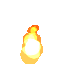

# Examples

A growing collection of interesting things you can do in DatumV. Each example is a single self-contained query — paste it into the CLI or the web shell and it runs.

## Procedural graphics

### Animated torch



A looping GIF of a tongue of flame, rendered entirely from a particle system. Particles spawn at the base, rise upward, shrink as they age, and fade from yellow through orange to dark red. The `'add'` blend mode gives the additive glow where particle trails overlap; `warmup := lifetime` ensures the first frame is already fully ablaze, so the GIF loop has no empty seam.

Named arguments (`name := value`) label the procedural-graphics parameters that a magic number wouldn't — `lifetime`, `jitter`, `seed`, `warmup` — so the call reads like the prose that describes it.

```sql
SELECT frames_to_gif(
        frames => animate_frames(
            duration => 1.0,
            fps => 24,
            size => point2d(64, 64),
            render_frame => (t) -> draw_particles(
                t => t,
                emit_at => point2d(32, 56),
                rate     => 40,
                lifetime => 0.4,
                velocity => point2d(0, -80),
                jitter   => 3.4,
                sprite_fn => (x) -> blend(
                    content => draw_circle(
                        at => point2d(0, 0),
                        radius => 1 + 10 * (1.0 - x),
                        fill => color(255, lerp(x, 220, 80), lerp(x, 100, 0))
                    ),
                    mode => 'add'
                ),
                seed   => 42,
                warmup => 0.4
            )
        ),
        fps => 12
    )

```

See [`draw_particles`](functions/drawing.md#draw_particles), [`animate_frames`](functions/drawing.md#animate_frames), and [`frames_to_gif`](functions/drawing.md#frames_to_gif) for the building blocks.
