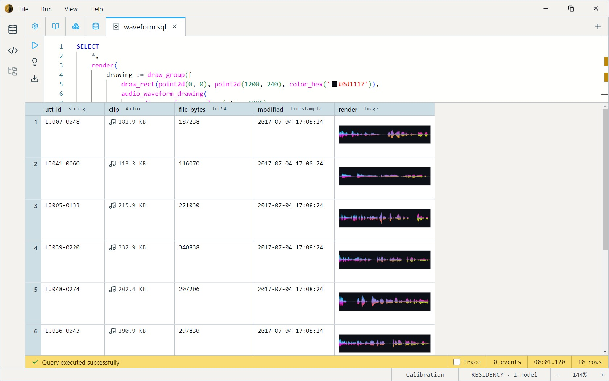

A waveform thumbnail rendered entirely from SQL: compute the envelope of each audio clip, walk it with a per-sample drawing lambda, and emit an `Image` column alongside the original audio. The result is the audio dataset with a visual rendering next to each clip — useful for quick browsing or spot-checking before training.

The visual is built from two stacked coloured lines per envelope bucket. The outer line interpolates cyan → magenta across the width; the inner line cycles through a second gradient at half the height. The lambda body is what determines the look — swapping it changes the visual without touching the audio path.

```sql
SELECT
    *,
    render(
        drawing := draw_group([
            draw_rect(point2d(0, 0), point2d(1200, 240), color_hex('#0d1117')),
            audio_waveform_drawing(
                audio_waveform_envelope(clip, 1200),
                (t, lo, hi) -> draw_group([
                    draw_line(
                        point2d(t * 1200, 120 - hi * 120),
                        point2d(t * 1200, 120 - lo * 120),
                        color_interpolate(color_hex('#00d4ff'), color_hex('#ff00aa'), t),
                        color_interpolate(color_hex('#ff00aaff'), color_hex('#eaff00ff'), t),
                        3
                    ),
                    draw_line(
                        point2d(t * 1200, 120 - hi * 60),
                        point2d(t * 1200, 120 - lo * 60),
                        color_interpolate(color_hex('#baf3ffff'), color_hex('#8800ffff'), t),
                        color_interpolate(color_hex('#b700ffff'), color_hex('#44ff00ff'), t),
                        3
                    )
                ])
            ),
            stroke_rect(point2d(0, 0), point2d(1200, 240), color_hex('#cecece'), 6)
        ]),
        size := point2d(1200, 240))
FROM datasets.ljspeech_audio
LIMIT 10
```

The key pieces:

- `render(drawing, size)` rasterises a procedural drawing into a fixed-size `Image`. The drawing tree itself doesn't know its final dimensions — `render` picks them.
- `audio_waveform_envelope(clip, 1200)` summarises the clip as 1200 `(lo, hi)` buckets. The bucket count is the horizontal resolution.
- `audio_waveform_drawing(envelope, sprite_fn)` walks the envelope and calls `sprite_fn(t, lo, hi)` for each bucket — `t` is the normalised position (0 → 1), `lo` / `hi` are the bucket's envelope values (-1 → 1). The lambda returns whatever drawing should appear at that position.
- `color_interpolate(a, b, t)` blends two colours along the bucket position, producing the horizontal gradient.

See [`render`](../functions/drawing.md#render), [`audio_waveform_envelope`](../functions/drawing.md#audio_waveform_envelope), and [`audio_waveform_drawing`](../functions/drawing.md#audio_waveform_drawing) for the building blocks. The [Animated torch](animated-torch.md) example uses the same pattern — a per-sample drawing lambda over a generator — for a particle system.
