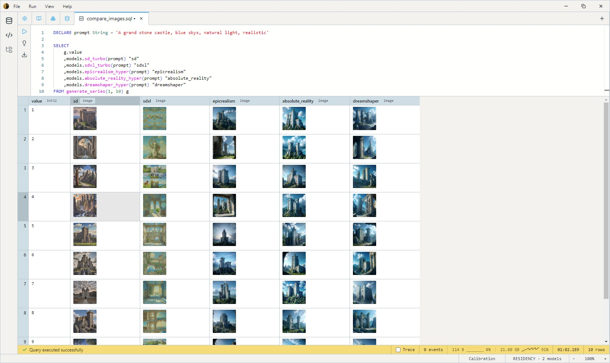

One prompt run through five text-to-image models in a single query. Adjust the number of rows by changing the TVF `generate_series`.

The prompt lives in a `DECLARE`, so it's bound once and reused across every model. Change it in one place and every render follows.

```sql
-- This will take a little while your first time as the models calibrate, expect 10-13GB of VRAM
DECLARE prompt String = 'A grand stone castle, blue skys, natural light, realistic'

SELECT
    g.value
    ,models.sd_turbo(prompt) "sd"
    ,models.sdxl_turbo(prompt) "sdxl"
    ,models.epicrealism_hyper(prompt) "epicrealism"
    ,models.absolute_reality_hyper(prompt) "absolute_reality"
    ,models.dreamshaper_hyper(prompt) "dreamshaper"
FROM generate_series(1, 10) g
```

The models:

- **`sd_turbo`** and **`sdxl_turbo`** are distilled Stable Diffusion variants tuned for single-step (or few-step) generation — fast, general-purpose baselines. SDXL Turbo is the larger, higher-fidelity of the two.
- **`epicrealism_hyper`**, **`absolute_reality_hyper`**, and **`dreamshaper_hyper`** are community fine-tunes accelerated with Hyper-SD. They push toward photorealism and stylized realism respectively, so the same prompt lands quite differently across the three.

Each model call takes the prompt String and returns an `Image` — a first-class typed column that renders inline in the results grid. `UNION ALL` stacks the five renders into one column named `img` (the name comes from the first `SELECT`; the others align positionally).

The first run is slow: each model has to download and calibrate its execution provider, and the diffusion models are VRAM-hungry — expect **10–13 GB** with all five loaded. Subsequent runs reuse the resident sessions and are much faster. Open the **Model Catalog** tab for the full set of text-to-image variants and their licenses; see [Models](../models.md) for the conceptual surface around `models.X(...)` dispatch and typed-media outputs.
