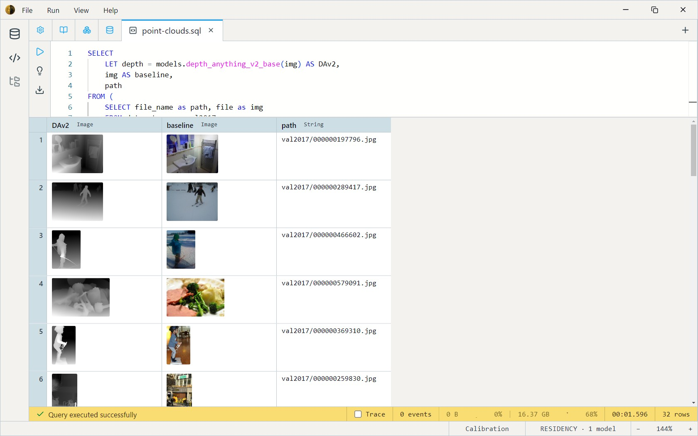
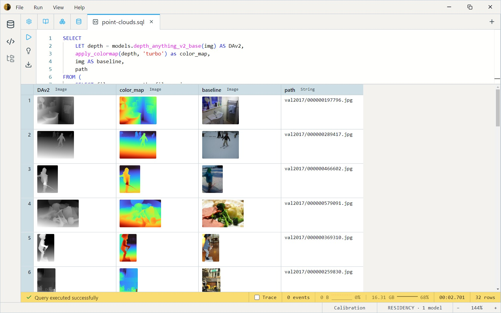
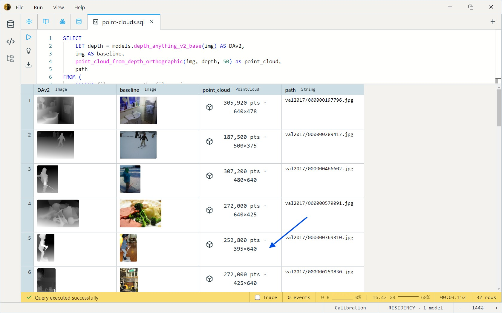
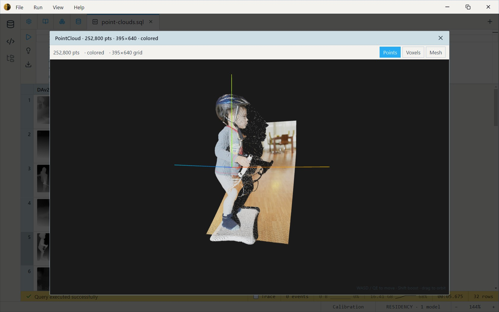
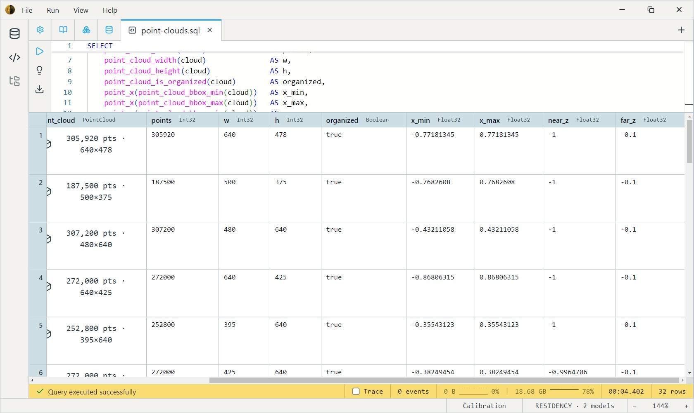

Turn a folder of photos into 3D point clouds with a single SQL pipeline:
ingest the images, run a depth-estimator model, unproject into 3D,
inspect the geometry, and re-render the depth as false-colour.

We'll be using `datasets.coco_val2017` due to it's variety and small footprint
on disk, but you could just as easily open a folder from physical media. Swap:

```sql
  SELECT file_name as path, file as img
  FROM datasets.coco_val2017
  LIMIT 32
  OFFSET 3849
```

With a path-based TVF:

```sql
  SELECT path, CAST(bytes AS Image) img
  FROM open_folder('path/to/images')
  WHERE get_filename_ext(path) = 'png'
      AND can_cast(bytes, Image) = true
```

## 1. Inspect a depth model's output

The depth-estimator models in the catalog (`models.depth_anything_v2_base`,
`models.midas_small`, `models.dpt_large`, …) all `IMPLEMENTS DepthEstimator`
and return a grayscale-as-RGBA Image — one pixel per input pixel, brighter
intensity = closer surface. Render one to see what you're working with:

```sql
SELECT
    LET depth = models.depth_anything_v2_base(img) AS DAv2,
    img AS baseline,
    path
FROM (
    SELECT file_name as path, file as img
    FROM datasets.coco_val2017
    LIMIT 32
    OFFSET 3849
) images
```



The output is a single-channel depth image at the source dimensions —
useful, but visually hard to read because grayscale collapses depth
differences into mid-tones the eye doesn't resolve well.

## 2. False-colour the depth map

`apply_colormap` maps the red-channel intensity through a perceptual
palette — depth becomes hue, which the eye reads instantly:

```sql
SELECT
    LET depth = models.depth_anything_v2_base(img) AS DAv2,
    apply_colormap(depth, 'turbo') as color_map,
    img AS baseline,
    path
FROM (
    SELECT file_name as path, file as img
    FROM datasets.coco_val2017
    LIMIT 32
    OFFSET 3849
) images
```



`turbo` is the default for depth (Google's perceptually-improved jet); `jet`
matches legacy MATLAB rainbow output; `gray` is the identity pass-through
useful for round-trip checks.

## 3. Build a point cloud

Two constructors unproject every pixel into a 3D point — they differ in
how (X, Y) positions scale with depth. The output cloud is always
**organized** — one point per pixel in row-major (u, v) order — so
consumers can derive implicit topology (implicit triangles per grid
cell) without extra metadata.

```sql
-- Orthographic projection (recommended for MiDaS / DPT / ZoeDepth / DAv2):
-- each pixel's (X, Y) is fixed by its image position; depth only
-- pushes points forward or back along Z. Reads as a tilted heightfield.
SELECT
    LET depth = models.depth_anything_v2_base(img) AS DAv2,
    img AS baseline,
    point_cloud_from_depth_orthographic(img, depth, 50) as point_cloud,
    path
FROM (
    SELECT file_name as path, file as img
    FROM datasets.coco_val2017
    LIMIT 32
    OFFSET 3849
) images
```



Don't forget to click on the point cloud to view the 3D representation:



```sql
-- Pinhole projection: angular position scales with depth (close pixels
-- cluster near the optical axis, far pixels spread to the frustum
-- edges). Physically correct when depth values are real-world
-- distances; for normalized inverse depth, the perspective effect is
-- a distortion artifact rather than honest geometry.
SELECT
    LET depth = models.depth_anything_v2_base(img) AS DAv2,
    img AS baseline,
    point_cloud_from_depth_pinhole(img, depth, 50) as point_cloud,
    path
FROM (
    SELECT file_name as path, file as img
    FROM datasets.coco_val2017
    LIMIT 32
    OFFSET 3849
) images
```

The 50° FOV here is a reasonable middle ground; phone wide cameras
run closer to 60°, portrait lenses around 40°, depth cameras
(RealSense, Kinect) 55–65°. The exact value scales X/Y proportionally
— it rarely matters for visualisation, more for cross-image
consistency.

## 4. Inspect the cloud's properties

Every `PointCloud` carries a header — point count, axis-aligned bounding
box, organisation flag, color flag, coordinate frame — readable through
single-arg accessors:

```sql
SELECT
    LET midas_depth = models.midas_small(img),
    LET cloud = point_cloud_from_depth_orthographic(img, midas_depth, 50),
    path,
    cloud as point_cloud,
    point_cloud_count(cloud)               AS points,
    point_cloud_width(cloud)               AS w,
    point_cloud_height(cloud)              AS h,
    point_cloud_is_organized(cloud)        AS organized,
    point_x(point_cloud_bbox_min(cloud))   AS x_min,
    point_x(point_cloud_bbox_max(cloud))   AS x_max,
    point_z(point_cloud_bbox_min(cloud))   AS near_z,
    point_z(point_cloud_bbox_max(cloud))   AS far_z
FROM (
    SELECT file_name as path, file as img
    FROM datasets.coco_val2017
    LIMIT 32
    OFFSET 3849
) images
```



`point_count` matches `width × height` for organized clouds. The X/Y
bbox widens with FOV; the Z bbox spans `[-1, -0.1]` in the normalized
inverse-depth space (closer surfaces near `-0.1`, farther near `-1`).
The `-0.1` near plane keeps closest-intensity pixels at their correct
angular position rather than collapsing them to the camera origin.
Cloud coordinates are in the OpenGL camera frame: right-handed, +y up,
−z forward.

## 5. Compare depth models side by side

Stack multiple depth-model outputs as parallel point clouds for the
same image — useful for spot-checking model quality differences:

```sql
SELECT
    LET midas_depth = models.midas_small(img),
    LET dpt_depth = models.dpt_large(img),
    LET dav3_struct = models.depth_anything_v3_large_full(img),
    point_cloud_from_depth_orthographic(img, midas_depth, 50)        AS midas_cloud,
    point_cloud_from_depth_orthographic(img, dpt_depth, 50)          AS dpt_cloud,
    point_cloud_from_depth_orthographic(img, dav3_struct.depth, 50)  AS dav3_cloud,
    path
FROM (
    SELECT file_name as path, file as img
    FROM datasets.coco_val2017
    LIMIT 1
    OFFSET 3849
) images
```

`models.midas_small` is fast and small (~70 MB); `models.dpt_large` is
heavier (~1.3 GB) but sharper. Their bboxes differ — DPT typically
gives a wider Z range because it preserves more dynamic range
before normalization. `models.depth_anything_v3_large_full` will probably
return the best looking point cloud nearly every time.

### Struct-output models

`models.midas_small` and `models.dpt_large` return a depth `Image`
directly. `models.depth_anything_v3_large_full` returns a `Struct`
instead — the depth tensor is one field of the struct, alongside
confidence, intrinsics, and extrinsics outputs the model produces.
The one consequence for the SQL: access the depth tensor via
`dav3_struct.depth` rather than treating the model call as a direct
Image. The struct's `depth` field is already aligned to the source
image dimensions, so it feeds the same `point_cloud_from_depth_*`
constructors as any other model's output without further reshaping.

See [Structs](../sql/struct.md) for the full surface — dot access,
destructuring, and the catalog of named shapes (`BoundingBox`,
`ScoredClass`, `Keypoint`, …) that models return.

## 6. Round-trip: cloud → depth → false colour

`point_cloud_depth(pc)` is the inverse of the depth-unprojection
constructors — it reconstructs a depth Image from an organized cloud by
reading each point's Z value and re-normalizing to grayscale. Useful for
verifying geometry, swapping colormap palettes after the fact, or
extracting just the depth channel from a coloured cloud.

```sql
SELECT
    path,
    apply_colormap(
        point_cloud_depth(
            point_cloud_from_depth_orthographic(img, models.dpt_large(img), 60.0)
        ),
        'turbo'
    ) AS depth_recovered
FROM (
    SELECT file_name as path, file as img
    FROM datasets.coco_val2017
    LIMIT 1
    OFFSET 3849
) images
```

The round-trip is lossy at the per-pixel level (Z is re-normalized
per-cloud, then re-packed to 8-bit) but geometrically faithful — a
cloud that's flat in Z produces a uniform grey image; a cloud with a
gradient produces a gradient.

## 7. Filter cloud collection by geometry

Use the accessors as predicates to filter a cloud collection:

```sql
SELECT
    LET cloud = point_cloud_from_depth_orthographic(img, models.midas_small(img), 60),
    path
FROM (
    SELECT file_name as path, file as img
    FROM datasets.coco_val2017
) images
WHERE point_cloud_count(cloud) > 500000           -- skip tiny thumbnails
  AND point_z(point_cloud_bbox_max(cloud)) - point_z(point_cloud_bbox_min(cloud)) > 0.5   -- skip near-flat scenes
ORDER BY point_cloud_count(cloud) DESC
```

This is the value proposition of `PointCloud` as a first-class kind —
geometry becomes a queryable column, not an opaque export blob. You
can sort by depth range, join clouds against classification labels,
or persist them to `.datum` and run analytics across thousands at a
time.

## 8. Promote to a Mesh and export as a real 3D asset

A `PointCloud` is renderable inside DatumV's viewer, but to share
the result — open in Blender, slice for 3D printing, hand to a colleague
who lives in Unity — you need a real 3D asset on disk. `mesh_from_organized`
promotes an organized cloud to an explicit triangle mesh (with per-vertex
normals computed from the topology, smooth shading included); the
`mesh_to_*` exporters serialize to industry-standard formats:

```sql
SELECT
    LET mesh = mesh_from_depth_orthographic(img, models.dpt_large(img), 60.0),
    path,
    -- Blender / Unity / Three.js / browser-built-in 3D viewer
    mesh_to_gltf(mesh) as gltf,
    -- 3D-printer slicer (Bambu Studio / PrusaSlicer / Cura / Lychee / ChiTuBox)
    mesh_to_stl(mesh) as stl,
    -- MeshLab / CloudCompare / Open3D (preserves per-vertex colors via OBJ extension)
    mesh_to_obj(mesh) as obj
FROM (
    SELECT file_name as path, file as img
    FROM datasets.coco_val2017
    LIMIT 1
    OFFSET 3849
) images
```

`mesh_from_depth_orthographic` is the fused shortcut for the common case
(unproject + triangulate in one call); `mesh_from_organized(point_cloud)`
is the two-step form when you want to keep the intermediate cloud
around too.

Mesh triangulation skips cells whose four corner depths span more than
5% of the cloud's bbox Z range — depth edges produce topology breaks
rather than rubber-sheet skirts at object boundaries. The result reads
correctly in any 3D viewer with the expected sharp silhouettes.

## 9. Inspect a mesh's geometry

```sql
SELECT
    LET midas_depth = models.midas_small(img),
    LET m = mesh_from_depth_orthographic(img, midas_depth, 50) AS mesh,
    path,
    mesh_vertex_count(m)        AS verts,
    mesh_triangle_count(m)      AS tris,
    mesh_has_color(m)           AS colored,
    mesh_has_normals(m)         AS shaded,
    point_z(mesh_bbox_max(m)) - point_z(mesh_bbox_min(m)) AS depth_range
FROM (
    SELECT file_name as path, file as img
    FROM datasets.coco_val2017
    LIMIT 32
    OFFSET 3849
) images
ORDER BY tris DESC
```

The mesh shares the cloud's coordinate frame and bbox conventions
(OpenGL right-handed, `[-1, -0.1]` Z range for Image-based depth
sources). The exporters automatically apply the standard glTF / STL /
OBJ +Y-up orientation regardless of the mesh's declared frame, so
saved files render correctly in any consumer.

For the full surface — every constructor, accessor, exporter, plus the
coordinate-frame rules — see [Spatial Types](../sql/spatial.md).

## See also

- [Type System](../sql/type-system.md) — full `PointCloud` reference: storage
  layout, organized vs unorganized, the full accessor table.
- [Image Functions](../functions/image.md) — `apply_colormap`,
  `depth_map_to_image`, and the broader image-manipulation surface.
- [Models](../models.md) — depth estimators, including the
  metric-vs-relative distinction across `models.midas_small`,
  `models.dpt_large`, and `models.zoedepth_nyu_kitti`.
