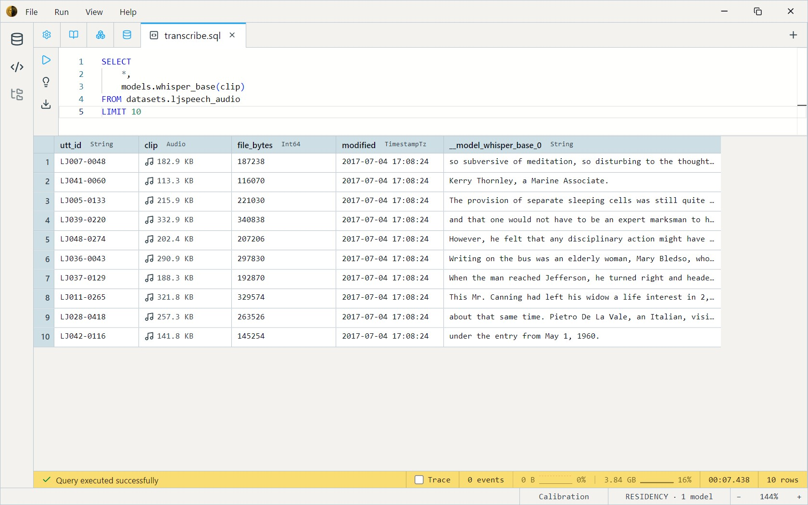

Whisper is OpenAI's speech-to-text model. Running it from SQL is a one-column projection — the model takes an audio clip and returns its transcription, so a single `SELECT` produces a transcribed copy of any audio dataset.

```sql
SELECT
    *,
    models.whisper_base(clip)
FROM datasets.ljspeech_audio
LIMIT 10
```

The pieces:

- `models.whisper_base(clip)` runs Whisper-Base on each clip and returns the transcription.
- `SELECT *` keeps the original columns alongside the new transcription column.
- `LIMIT 10` returns the first ten rows — raise or drop it to transcribe more.

Whisper-Tiny is the smallest catalog variant and comfortable on CPU. Larger variants (`whisper-base`, `whisper-small`, `whisper-large-v3-turbo`) trade speed for accuracy and broader multilingual coverage. See the [Models reference](../models.md) for the full set.

The transcription column composes with the rest of SQL — filter on contents, join against ground-truth labels, group by detected language, or feed the text into another model (an embedder, a classifier, a summariser) without leaving the query.
