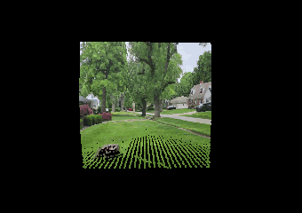
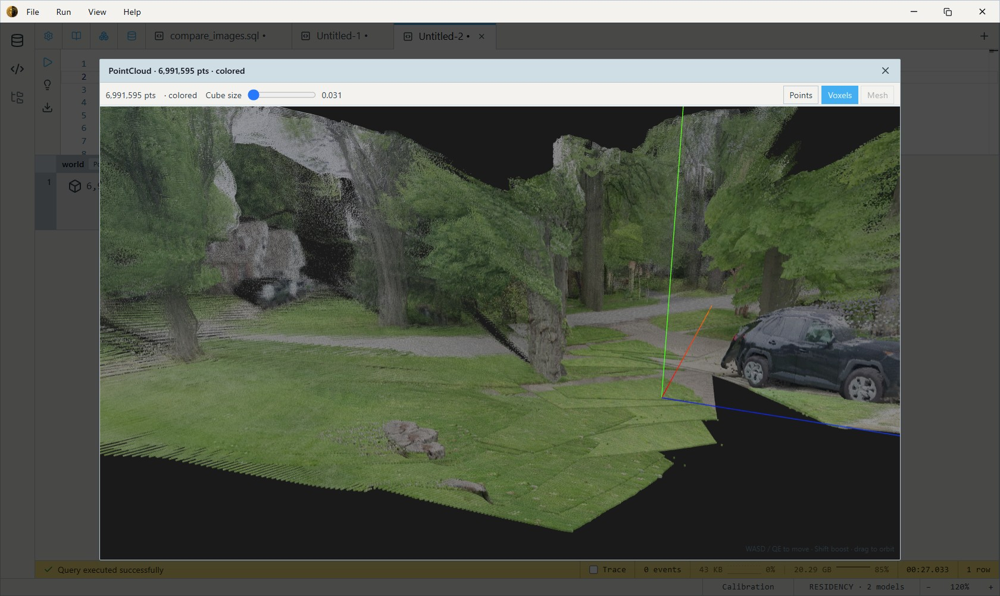

Walk through a space with your phone, feed the video to one SQL query, and
get back two things: a fused, colored 3D point cloud of the space, and an
animated GIF of the world building itself out frame by frame, seen from a
camera that flies your own recovered trajectory.

Everything happens inside the query — depth estimation, camera-pose
recovery, point-cloud fusion, and rendering are all ordinary functions
composed in SQL. No external tooling, no exports, no intermediate files.



## 1. Shoot a video the pipeline will love

The reconstruction is only as good as the footage. A few capture habits make
the difference between a crisp world and a fuzzy one:

- **Walk, don't pan.** The pipeline recovers camera motion by matching
  features between frames, and it is happiest when the camera *translates*
  through the scene. Move like you're giving someone a walking tour. When
  you need to turn, make it a slow, wide arc — ideally while still walking
  forward. Fast whip-pans blur frames and give the matcher nothing to hold
  onto.
- **Steady pace, good light.** A normal walking speed is fine — smoothness
  matters more than slowness. Good light means fast shutter speeds, which
  means sharp frames. If your camera app can lock exposure, lock it:
  auto-exposure swings between frames hurt feature matching.
- **Pick a textured, static, diffuse scene.** Feature matching needs visual
  detail everywhere — shelves, posters, brick, furniture are great; bare
  white walls are not. Mirrors, glass, and glossy floors confuse the depth
  model. A few people moving through the frame are fine (the pose estimator
  rejects them as outliers), but a scene that is mostly moving breaks the
  rigid-world assumption.
- **Keep the subject 1–4 metres away.** Metric depth error grows with
  distance, so aisles, rooms, and courtyards reconstruct beautifully;
  distant vistas don't.
- **Keep clips short.** Pose errors accumulate over the length of the walk,
  so 10–30 seconds of continuous movement produces a cleaner world than a
  three-minute tour.

## 2. The pipeline

The query below is the whole thing. It reads the video and runs two
models on every sampled frame: `da3_base_full` estimates the camera —
per-pixel confidence plus the intrinsics matrix K, a per-frame lens
estimate — and `da3metric_large_meters` measures the world through that
lens, returning depth in real metres with its field-of-view argument
derived from the predicted K, so no camera constant is ever typed in. It
then chains frame-to-frame poses into a trajectory, unprojects each frame
into a world-space point cloud, and aggregates two outputs: the fused
world and the movie.

```sql
DECLARE model_in_w Float32 = 504.0::Float32  -- DA3 native input width
DECLARE video_path String = '/path/to/your/video.mp4'

WITH RECURSIVE frames AS MATERIALIZED (
    -- Sample every 4th frame. At 30 fps walking pace that spaces the
    -- samples ~10-20 cm apart — comfortably above the pose estimator's
    -- noise floor while keeping plenty of visual overlap between steps.
    -- seq renumbers the sampled frames 0, 1, 2, ... so the joins below
    -- stay stride-agnostic.
    SELECT
        LET img = video_frame_to_image(vid.frame, model_in_w),
        LET cam = models.da3_base_full(img),
        ROW_NUMBER() OVER (ORDER BY vid.frame_index) - 1 AS seq,
        img,
        cam['intrinsics'] k,                 -- 3x3 K, already in img pixel coordinates
        cam['confidence'] confidence         -- per-pixel reliability, source-aligned
    FROM video_unnest_frames(video_path, 0, 4) vid
),
k0 AS MATERIALIZED (
    -- One camera, one K: pin the first frame's predicted intrinsics for
    -- the whole video — and the field of view derived from them, which
    -- anchors the metric scale. The model re-estimates K every frame with
    -- a little jitter, but the physical camera never changed — and the
    -- SAME K must drive pose recovery, unprojection, AND the metric
    -- conversion, or the geometry warps under rotation and the scale
    -- breathes from frame to frame.
    SELECT
        k,
        degrees(2.0 * atan(
            image_width(img)::Float64 / (2.0 * array_get(k, 1, 1)::Float64)
        ))::Float32 AS fov_deg
    FROM frames WHERE seq = 0
),
metric AS MATERIALIZED (
    -- Metric depth in real metres, scale set by the pinned fov. Two
    -- models, one camera story: DA3-Base estimated the lens above;
    -- DA3-Metric measures the world through it.
    SELECT
        f.seq, f.img, f.confidence,
        models.da3metric_large_meters(f.img, k0.fov_deg) AS depth
    FROM frames f
    CROSS JOIN k0
),
curr_prev AS MATERIALIZED (
    -- Frame-to-frame pose: ORB features + metric depth + RANSAC rigid
    -- alignment. on_failure => 'identity' treats the rare unmatchable
    -- pair (motion blur mid-turn, a featureless wall) as "camera held
    -- still" so one bad pair can't kill the whole reconstruction.
    SELECT
        f1.seq, f1.img, f1.depth, f1.confidence, k0.k,
        (CASE WHEN f2.img IS NULL
            THEN pose_identity()
            ELSE pose_from_rgbd(f2.img, f2.depth, f1.img, f1.depth, k0.k, 'identity')
        END) AS pose
    FROM metric f1
    CROSS JOIN k0
    LEFT JOIN metric f2 ON f2.seq = (f1.seq - 1)
),
accumulated AS MATERIALIZED (
    -- Chain the per-step poses into a cumulative trajectory:
    -- cumulative_N = cumulative_(N-1) * step_N.
    SELECT seq, img, depth, confidence, k, pose AS cumulative_pose
    FROM curr_prev WHERE seq = 0
    UNION ALL
    SELECT s.seq, s.img, s.depth, s.confidence, s.k,
           pose_compose(a.cumulative_pose, s.pose)
    FROM accumulated a
    JOIN curr_prev s ON s.seq = a.seq + 1
),
materialized_views AS MATERIALIZED (
    -- Unproject each frame with the SAME pinned K the poses were
    -- estimated with, gate out low-confidence pixels, and land the
    -- points in world space via the cumulative pose.
    SELECT
        seq, cumulative_pose,
        pc_transform(
            point_cloud_from_depth_pinhole_intrinsics_with_confidence(
                img, depth, confidence, k, 0.5),
            cumulative_pose) AS world_cloud
    FROM accumulated
),
movie_cam AS (
    -- The raw trajectory carries a little per-step noise (plus your own
    -- walking bob). Smooth the RENDER camera with a moving average over
    -- +-3 sampled frames — the reconstruction itself is untouched.
    SELECT
        seq,
        world_cloud,
        [
            AVG(array_get(cumulative_pose, 1))  OVER (ORDER BY seq ROWS BETWEEN 3 PRECEDING AND 3 FOLLOWING),
            AVG(array_get(cumulative_pose, 2))  OVER (ORDER BY seq ROWS BETWEEN 3 PRECEDING AND 3 FOLLOWING),
            AVG(array_get(cumulative_pose, 3))  OVER (ORDER BY seq ROWS BETWEEN 3 PRECEDING AND 3 FOLLOWING),
            AVG(array_get(cumulative_pose, 4))  OVER (ORDER BY seq ROWS BETWEEN 3 PRECEDING AND 3 FOLLOWING),
            AVG(array_get(cumulative_pose, 5))  OVER (ORDER BY seq ROWS BETWEEN 3 PRECEDING AND 3 FOLLOWING),
            AVG(array_get(cumulative_pose, 6))  OVER (ORDER BY seq ROWS BETWEEN 3 PRECEDING AND 3 FOLLOWING),
            AVG(array_get(cumulative_pose, 7))  OVER (ORDER BY seq ROWS BETWEEN 3 PRECEDING AND 3 FOLLOWING),
            AVG(array_get(cumulative_pose, 8))  OVER (ORDER BY seq ROWS BETWEEN 3 PRECEDING AND 3 FOLLOWING),
            AVG(array_get(cumulative_pose, 9))  OVER (ORDER BY seq ROWS BETWEEN 3 PRECEDING AND 3 FOLLOWING),
            AVG(array_get(cumulative_pose, 10)) OVER (ORDER BY seq ROWS BETWEEN 3 PRECEDING AND 3 FOLLOWING),
            AVG(array_get(cumulative_pose, 11)) OVER (ORDER BY seq ROWS BETWEEN 3 PRECEDING AND 3 FOLLOWING),
            AVG(array_get(cumulative_pose, 12)) OVER (ORDER BY seq ROWS BETWEEN 3 PRECEDING AND 3 FOLLOWING),
            0.0::Float64, 0.0::Float64, 0.0::Float64, 1.0::Float64
        ]::Float64[] AS smooth_pose
    FROM materialized_views
)
SELECT
    -- Output 1: the fused world. Every occupied 5 mm voxel survives, with
    -- centroid position and averaged color.
    pc_voxel_consensus_agg(world_cloud, 0.005, 1) AS world,

    -- Output 2: the movie. Each frame renders the union of everything
    -- reconstructed so far, first-person from the smoothed trajectory —
    -- the walk you took, through the world it built.
    frames_to_gif(
        pc_fuse_render_agg(
            pc_voxel_downsample(world_cloud, 0.005),
            smooth_pose,
            640, 360, 55.0, 2
        ) WITHIN GROUP (ORDER BY seq),
        12.0) AS movie
FROM movie_cam
```

## 3. The outputs

The `world` column is a PointCloud you can orbit and inspect directly in
the results grid:



The `movie` column is an animated GIF — the same world accreting point by
point while the camera flies the walk you actually took, first-person. The
camera path is just a SQL expression: compose an offset onto it with
`pose_compose(smooth_pose, pose_translate(0.0, 0.05, 0.15))` for a
third-person chase view, or replace it with a constant pose for a fixed
god's-eye view.

## 4. Tuning knobs

| Knob | Where | Effect |
|------|-------|--------|
| Frame stride | `video_unnest_frames(path, 0, N)` | Bigger steps = stronger pose signal and less drift, but less overlap. 4 suits 30 fps walking pace; use 8 for 60 fps footage, 2–3 if pose recovery struggles. |
| Confidence gate | `..._with_confidence(..., 0.5)` | Raise toward 0.7 to drop more of the depth model's uncertain pixels (object edges, reflections); lower to keep more coverage. |
| Sky (outdoor footage) | the `metric` CTE | Swap `da3metric_large_meters` for `da3metric_large_full` and zero out pixels where its `sky >= 0.5` — depth on sky pixels is extrapolation, and a "sky at 40 m" wall ruins the fused world. Indoors, skip it. |
| Voxel size | `0.005` in the fusion calls | 5 mm cells preserve close-up detail. If far surfaces render as fuzz, 0.01–0.02 reads cleaner. |
| Consensus votes | `pc_voxel_consensus_agg(..., 1)` | 1 keeps every observed voxel. Raise to 2–3 to cull single-frame ghosts if the viewer shows floating noise. |
| Movie camera | the `smooth_pose` argument | First-person by default. Compose an offset — `pose_compose(smooth_pose, pose_translate(0, 0.05, 0.15))` — for a third-person view; larger offsets swing wide on turns. |
| Splat size | trailing `2` in `pc_fuse_render_agg` | Raise to 3–4 to close holes when rendering sparse clouds at higher resolutions. |
| GIF pacing | `frames_to_gif(..., 12.0)` | Frames per second of playback, independent of how many frames were rendered — raise it for a faster, shorter GIF without re-rendering. |

## 5. When something looks wrong

- **`pose_from_rgbd(): RANSAC failed` / `too few ORB features`** — some
  frame pair couldn't be matched, usually a fast turn or a featureless
  stretch. With `on_failure => 'identity'` in place these pairs degrade to
  "camera held still" instead of failing; if too many pairs degrade, sample
  frames closer together (stride 2–3) or reshoot with a slower turn.
- **The world warps or the floor tilts when the video turns** — the poses
  and the unprojection are using different camera intrinsics. Keep the
  single pinned `k0.k` (and the `k0.fov_deg` derived from it) flowing to
  *all three* consumers — `pose_from_rgbd`,
  `point_cloud_from_depth_pinhole_intrinsics_with_confidence`, and
  `da3metric_large_meters` — exactly as in the script.
- **Everything is the right shape but the wrong size** — metric scale
  comes from the focal estimate. Depth scales with `tan(fov/2)⁻¹`, so a
  bad predicted K multiplies every distance by a constant without
  distorting anything. If measurements matter, sanity-check `k0.fov_deg`
  against the camera's spec (or EXIF) and substitute the real value.
- **The movie camera rocks or jitters** — widen the smoothing window
  (`3 PRECEDING AND 3 FOLLOWING` → `5` and `5`), or check that the stride
  isn't so small that each step falls below a few centimetres of real
  motion.
- **Fuzzy, doubled surfaces in the world** — accumulated drift over a long
  clip. Trim the video, or reconstruct it in shorter overlapping segments.
