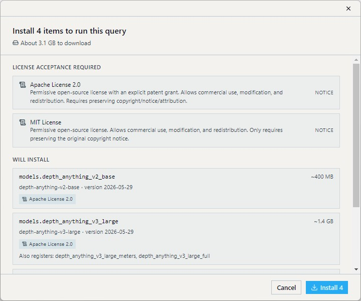
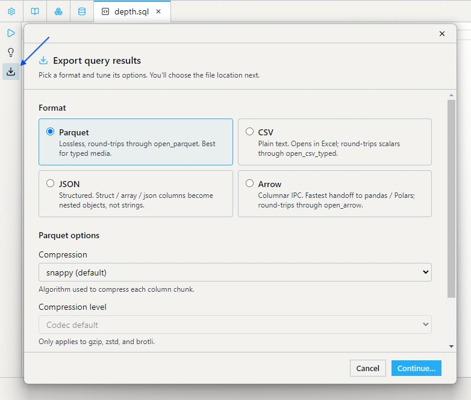

Welcome to DatumV — a SQL engine that runs ML models on your data, locally. This is the welcome tab; it's pinned, so you can come back to it any time.

Two example queries are already open in tabs alongside this one. Click Run on either to see DatumV in motion.

## The two starter tabs

**Person crops with YOLOX** runs `models.yolox_s` over the COCO val2017 dataset, takes every detection labeled `person`, and crops the original image to the bounding box. It shows model invocation inside `SELECT`, the `Array<Struct>` output shape that detection models return, and filtering / cropping based on what a model produced.

**Same input, four depth models** runs one image through Depth Anything v2, Depth Anything v3, MiDaS Small, and DPT Large in a single query. It shows that swapping models is a column-level concern, not a pipeline concern. See [Examples — Depth model comparison](examples.md#depth-model-comparison) for discussion of the differences.

The first time you click Run, DatumV prompts you to download the models and dataset that the query needs:

- Most models ship under MIT or Apache 2.0. A few — notably SDXL and Llama — require accepting their license first.
- Downloads stream into your catalog and surface as a progress chip in the bottom-left corner.
- An OS notification fires when each download completes.
- If a download fails, restart it manually from the chip, then re-run the query.



## Bringing your own data in

Every external file is read by a table-valued function — `FROM open_X(...)` lands typed columns in your query.

| I have... | Use |
|---|---|
| A CSV file | `open_csv_typed('path.csv')` |
| A Parquet file (HuggingFace, Spark, pandas) | `open_parquet('path.parquet')` |
| An Arrow / Feather file | `open_arrow('path.arrow')` |
| A JSON or JSONL document | `open_json('path.json')` / `open_jsonl('path.jsonl')` |
| An HDF5 file | `open_h5_dataset('path.h5', '/dataset')` |
| A FITS file (astronomy) | `open_fits_images('path.fits')` |
| A ZIP / TAR archive | `open_archive('path.zip')` |
| A folder of files | `open_folder('path/')` |

Each function reads the file's schema at plan time, so projections type-check before the query runs. See [Table-Valued Functions](functions/table-valued.md) for the full surface — additional arguments, supported types, and round-trip rules.

## Saving results

Save query results to disk with the `COPY (...) TO` statement:

```sql
COPY (
  SELECT file_name, models.yolox_s(file) AS detections
  FROM datasets.coco_val2017
  LIMIT 1000
) TO 'detections.parquet'
```

Or click the export icon in the per-tab toolbar to open a save dialog. The app builds the `COPY` statement for you, picks the format from the file extension, and runs it as a normal query — the summary cell shows how many rows and bytes landed on disk.



Supported formats: Parquet, CSV, JSON, JSONL, Arrow. Parquet round-trips typed media (images, audio, video, meshes, point clouds) losslessly; CSV and JSON are one-way for those columns. See [COPY and Export](technical/copy-and-export.md) for the full option surface and per-format details.

## What's next

The three other pinned tabs hold most of what you'll come back to:

- **Model Catalog** — every model that ships with DatumV, what it returns, and how to add your own.
- **Dataset Catalog** — datasets you've downloaded, datasets curated for download, and license details.
- **Settings** — catalog paths, GPU selection, model storage location.

When you need deeper reference material, follow the docs sidebar:

| I want to... | Read |
|---|---|
| Write more advanced SQL | [SQL Reference](sql/select.md) |
| Look up a function | [Functions Reference](functions/string.md) |
| Browse example queries | [Examples](examples.md) |
| Add my own model | [CREATE MODEL](sql/create-model.md) |
