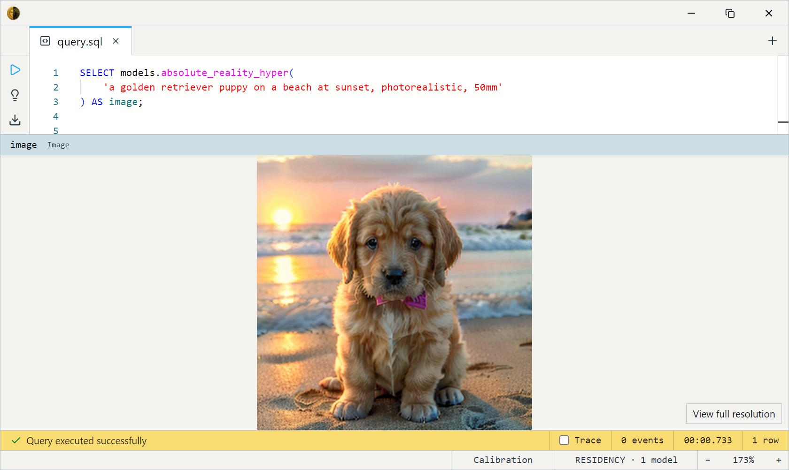
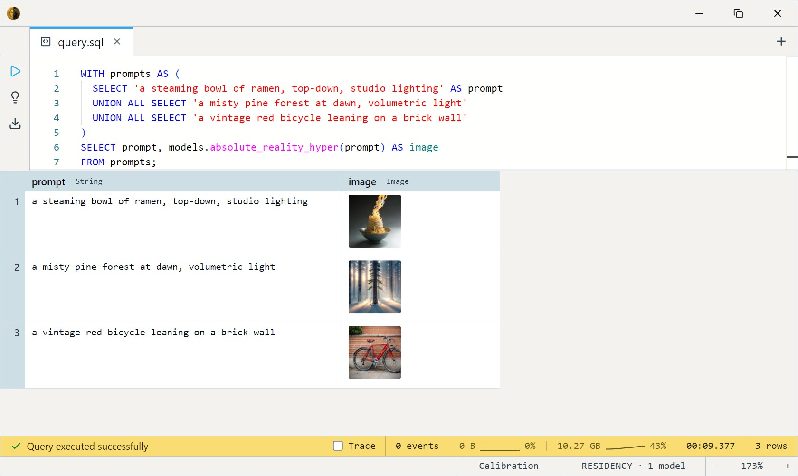
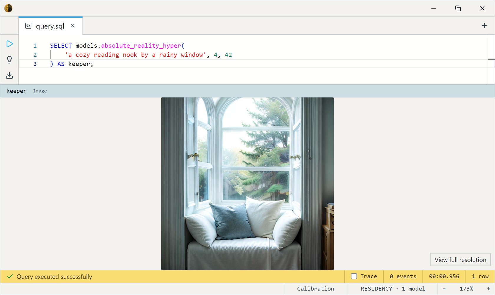

# AbsoluteReality + Hyper-SD (4-step)

Lykon's AbsoluteReality — a photoreal-leaning, general-purpose Stable
Diffusion 1.5 fine-tune — distilled to **4 sampling steps** with
ByteDance's Hyper-SD LoRA. The all-purpose, SFW workhorse of the SD 1.5
Hyper family: reach for it first when you want a believable image and
don't need a specific art style.

One SQL-visible model ships: `absolute_reality_hyper`. It takes a text
`prompt` (and an optional `steps` count) and returns a 512×512 `Image`.
It's a true text-to-image model — there's no input image and no dataset
involved; you describe what you want and it renders it.

This is a GPU model: it wants ~10 GB of VRAM and CUDA for usable speed.

## Example SQL

Generate a single image from a prompt:

```sql
SELECT models.absolute_reality_hyper(
    'a golden retriever puppy on a beach at sunset, photorealistic, 50mm'
) AS image;
```

Output:



Generate several prompts in one query:

```sql
WITH prompts AS (
  SELECT 'a steaming bowl of ramen, top-down, studio lighting' AS prompt
  UNION ALL SELECT 'a misty pine forest at dawn, volumetric light'
  UNION ALL SELECT 'a vintage red bicycle leaning on a brick wall'
)
SELECT prompt, models.absolute_reality_hyper(prompt) AS image
FROM prompts;
```

Output:



Trade quality for speed with the `steps` argument (1 is fastest, 4 is
the recommended minimum for face / detail quality):

```sql
SELECT models.absolute_reality_hyper(
    'a cozy reading nook by a rainy window', 2
) AS preview;
```

Lock the result with a `seed` so the same prompt reproduces the same image.
The `seed` argument is the third parameter (after `steps`):

```sql
SELECT models.absolute_reality_hyper(
    'a cozy reading nook by a rainy window', 4, 42
) AS keeper;
```

Output:



## Output shape

Returns a single 512×512 `Image`. There is no batch dimension — one call
produces one picture.

## Tips

- **4 steps is the sweet spot.** Hyper-SD was distilled for 1–4 steps;
  `steps` is capped at 8 and anything past 4 returns diminishing gains.
  Drop to 1–2 for fast previews, back to 4 for final renders.
- **Prompts are CLIP-limited to 77 tokens.** Roughly 50–60 words.
  Anything beyond that is silently truncated, so put the important
  descriptors first.
- **Reproducible with a seed; random without one.** Leave `seed` unset and
  each call samples fresh noise, so the same prompt yields a different image
  every time. Pass an integer `seed` to lock the initial noise and get the
  same image back for a given prompt and `steps` — handy once you land on a
  composition you like. The seed fixes this engine's noise only: results
  won't match other diffusion tools bit-for-bit, and GPU runs can still
  drift slightly.
- **No negative prompt in v1.** Steer entirely through the positive
  prompt; the classic `negative_prompt` channel isn't wired yet.

## License & attribution

CreativeML OpenRAIL-M — usable commercially, with use-based restrictions
(see the license). Fine-tune by Lykon; 4-step distillation via
ByteDance's Hyper-SD LoRA; built on CompVis / Stability AI's Stable
Diffusion 1.5.

- Base fine-tune: [Lykon/absolute-reality](https://huggingface.co/Lykon/absolute-reality)
- Distillation: [ByteDance/Hyper-SD](https://huggingface.co/ByteDance/Hyper-SD) — [paper](https://arxiv.org/abs/2404.13686)
- ONNX export: [Heliosoph/absolute-reality-hyper-onnx](https://huggingface.co/Heliosoph/absolute-reality-hyper-onnx)
