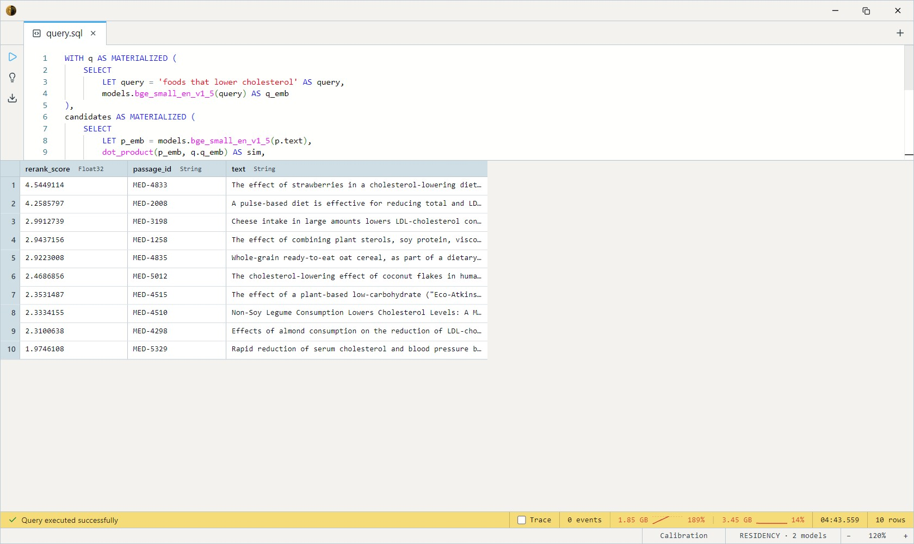

# BGE Reranker (Base)

An XLM-RoBERTa-base cross-encoder from the Beijing Academy of Artificial
Intelligence (BAAI), fine-tuned to score how well a passage answers a
query. Unlike a bi-encoder embedder — which produces one vector per text
and approximates relevance via cosine similarity — a cross-encoder reads
the query and the candidate passage together and emits a single
relevance logit. Materially more accurate per pair, materially slower
per pair: the standard pattern is to retrieve top-K candidates with a
fast embedder first, then re-order that short list with the reranker.
~280 MB on disk, CPU-viable for top-10 to top-100 rerank windows.

One SQL-visible model: `bge_reranker_base`. Takes two `String` inputs
(query, passage) and returns a single `Float32` relevance logit — higher
is more relevant. The raw logit is unbounded; ordering by it gives the
right ranking. Wrap in `sigmoid()` if you want a 0-1 probability (the
BAAI README's recommended mapping).

## Example SQL

Score a single query / passage pair:

```sql
SELECT models.bge_reranker_base(
    'how does photosynthesis work?',
    'Photosynthesis is the process by which green plants convert sunlight into chemical energy.'
) AS score;
```

Two-stage retrieve-then-rerank against the NFCorpus medical passages
(small enough to embed end-to-end on CPU in seconds — graduate to
`datasets.ms_marco_passages` once the recipe works):

```sql
WITH q AS MATERIALIZED (
    SELECT
        LET query = 'foods that lower cholesterol' AS query,
        models.bge_small_en_v1_5(query) AS q_emb
),
candidates AS MATERIALIZED (
    SELECT
        LET p_emb = models.bge_small_en_v1_5(p.text),
        dot_product(p_emb, q.q_emb) AS sim,
        p.passage_id,
        p.text,
        q.query
    FROM datasets.nfcorpus_passages p, q
    ORDER BY sim DESC
    LIMIT 50
)
SELECT
    models.bge_reranker_base(query, text) AS rerank_score,
    passage_id,
    text
FROM candidates
ORDER BY rerank_score DESC
LIMIT 10;
```

Output:



The bi-encoder cosine pass narrows 3,633 passages down to 50 cheap
candidates; the reranker then re-orders that short list with much
better accuracy than cosine alone.

## Output shape

`Float32` — a single relevance logit per (query, passage) pair. Unbounded
real number; higher = more relevant. Use directly for `ORDER BY`, or
wrap in `sigmoid()` for a 0-1 probability if you need a calibrated
threshold.

## Tips

- **Always pair with a fast first-stage retriever.** Cross-encoders are
  ~100× slower than bi-encoders per pair — running one over a million
  passages is not the intended workload. The pattern is embed-and-cosine
  for top-K, rerank for the final ordering.
- **Top-K window of 10-100 is the sweet spot.** Beyond ~100 the rerank
  cost dominates the query budget without changing the top-3 much; below
  ~10 there's not enough room for the reranker to fix mistakes from the
  embedder.
- **Context is 512 tokens** (SentencePiece) — covers query + passage
  combined. For long passages, truncate or chunk before reranking.
- **Chinese and English.** The XLM-RoBERTa backbone makes the base
  reranker bilingual (BAAI trains and documents it for Chinese + English);
  for broader cross-lingual rerank reach for `bge-reranker-v2-m3` upstream.
- **Logits are not calibrated across queries.** A score of 5 for one
  query is not directly comparable to a score of 5 for another. Use the
  reranker for *within-query* ordering, not cross-query thresholding.

## License & attribution

MIT. Original model by BAAI (Beijing Academy of Artificial Intelligence).
ONNX export by Joshua Lochner (Xenova).

- Paper: [C-Pack: Packed Resources For General Chinese Embeddings](https://arxiv.org/abs/2309.07597)
- Upstream: [BAAI/bge-reranker-base](https://huggingface.co/BAAI/bge-reranker-base)
- ONNX export: [Xenova/bge-reranker-base](https://huggingface.co/Xenova/bge-reranker-base)
