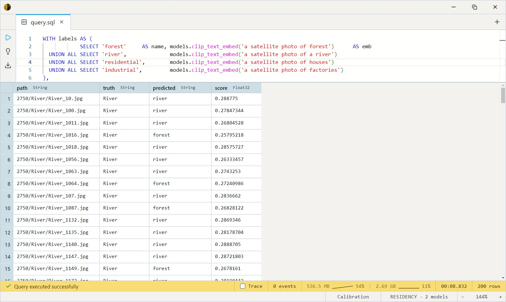
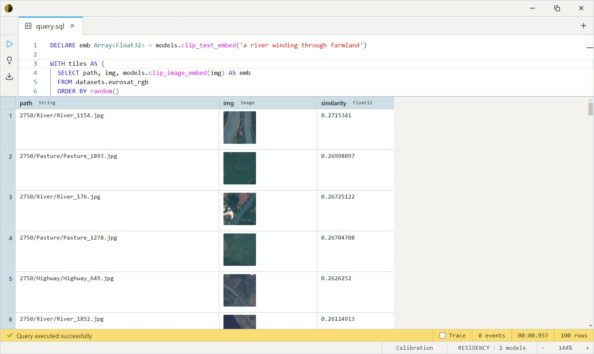

# CLIP ViT-B/32

OpenAI's CLIP — the original cross-modal model. It embeds **images and
text into the same 512-dimensional vector space**, so a picture and a
caption that match sit close together under cosine similarity. Search
images with words, label images without training a classifier, or
de-duplicate across modalities. The general-domain building block behind
half the multimodal stack.

Two SQL-visible models ship together: `clip_image_embed` for the vision
side, `clip_text_embed` for the text side. Both return a 512-d
**L2-normalised** `Float32[]` in the same space, so `dot_product` equals
cosine similarity (and is the faster of the two).

For biomedical figures specifically, [BiomedCLIP](../biomedclip/index.md)
is trained on the right distribution; use CLIP for everyday imagery.

## Example SQL

Embed an image, or a piece of text:

```sql
SELECT models.clip_image_embed(img) FROM datasets.eurosat_rgb LIMIT 1;
SELECT models.clip_text_embed('a photo of a forest') AS embedding;
```

Zero-shot classification — score each image against a fixed set of
candidate captions, keep the best match per image (no training needed):

```sql
WITH labels AS (
            SELECT 'forest'     AS name, models.clip_text_embed('a satellite photo of forest')      AS emb
  UNION ALL SELECT 'river',              models.clip_text_embed('a satellite photo of a river')
  UNION ALL SELECT 'residential',        models.clip_text_embed('a satellite photo of houses')
  UNION ALL SELECT 'industrial',         models.clip_text_embed('a satellite photo of factories')
),
images AS (
  SELECT path, class, models.clip_image_embed(img) AS emb
  FROM datasets.eurosat_rgb
  LIMIT 200
)
SELECT i.path, i.class AS truth, l.name AS predicted,
       dot_product(i.emb, l.emb) AS score
FROM images i
CROSS JOIN labels l
QUALIFY rank() OVER (PARTITION BY i.path ORDER BY dot_product(i.emb, l.emb) DESC) = 1
ORDER BY i.path;
```

Output:



Cross-modal search — given a text query, surface the images that look
most like it:

```sql
DECLARE emb Array<Float32> = models.clip_text_embed('a river winding through farmland')

WITH tiles AS (
  SELECT path, img, models.clip_image_embed(img) AS emb
  FROM datasets.eurosat_rgb
  ORDER BY random()
  LIMIT 200
)
SELECT t.path, t.img, dot_product(t.emb, emb) AS similarity
FROM tiles t
ORDER BY similarity DESC
LIMIT 100;
```

Output:



## Output shape

Both models return a length-512 L2-normalised `Float32[]` on the unit
sphere. Because every vector is unit-length, `dot_product` and
`cosine_similarity` give identical scores; `dot_product` is faster.

## Tips

- **Text is capped at 77 tokens.** The CLIP text encoder has position
  embeddings only for positions 0–76; keep prompts short (zero-shot
  labels are usually a dozen tokens). Longer prompts must be trimmed by
  the caller — there's no inline truncation yet.
- **"a photo of a ___" helps.** CLIP was trained on caption-like text;
  templating labels as short natural captions ("a satellite photo of a
  forest") scores better than bare class words.
- **CLIP preprocessing, not ImageNet.** The image side uses CLIP's own
  mean/std at 224×224 — handled inside the body; pass the raw `Image`
  column in.
- **Embed once, compare many.** The model call is the cost. Store
  embeddings as a `Float32[]` column and compare in SQL rather than
  re-embedding per query.

## License & attribution

MIT. Original model by OpenAI (CLIP — Radford, Kim, Hallacy et al.);
ONNX export by Xenova.

- Upstream: [openai/CLIP](https://github.com/openai/CLIP)
- Paper: [Learning Transferable Visual Models From Natural Language Supervision](https://arxiv.org/abs/2103.00020)
- ONNX export: [Xenova/clip-vit-base-patch32](https://huggingface.co/Xenova/clip-vit-base-patch32)
