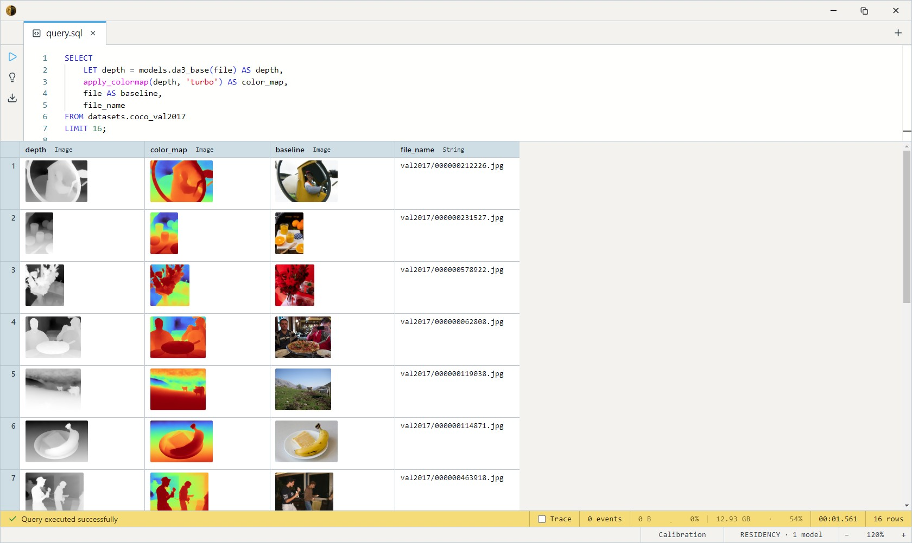

# Depth Anything 3 Base (Depth + Pose)

The Apache-licensed any-view model of the Depth Anything 3 family —
DINOv2 ViT-B with a dual-DPT head plus camera heads that estimate
**intrinsics (K)** per image and **relative camera pose** across views.
Comes in two cuts: a single-view build for depth + confidence + K, and a
**4-view build** where the pose head actually functions (pose is only
defined relative to the other views in the same forward pass).

Its depth is **up-to-scale, not meters** — shapes and relative geometry
are right, absolute size isn't. The metric companion is
[DA3 Metric Large](../da3metric-large/index.md); the two compose (see the
pose recipe below).

## Variants and output models

| Variant       | Disk    | Models                              |
| ------------- | ------- | ----------------------------------- |
| **fp32**      | ~394 MB | `da3_base`, `da3_base_full`         |
| fp16          | ~198 MB | `da3_base_fp16`, `da3_base_fp16_full` |
| **4-view fp32** | ~394 MB | `da3_base_4view`                  |
| 4-view fp16   | ~198 MB | `da3_base_4view_fp16`               |

| Model | Returns | Use |
| --- | --- | --- |
| `da3_base` | `Image` | Grayscale depth map for viewing. |
| `da3_base_full` | `Struct<depth, confidence, intrinsics>` | Source-aligned depth + confidence, plus K rescaled to source pixels — a per-image focal-length estimate. |
| `da3_base_4view` | `Struct<depth, confidence, extrinsics, intrinsics>` | 4 images of one scene → per-view depth/confidence/K + **relative poses** `[R \| t]` (view 1 = reference), at the native 504×504 grid. |

All builds are CPU-runnable; fp16 keeps fp32 I/O, so it's a drop-in swap.

## Example SQL

Depth-map visualization, false-coloured:

```sql
SELECT
    LET depth = models.da3_base(file) AS depth,
    apply_colormap(depth, 'turbo') AS color_map,
    file AS baseline,
    file_name
FROM datasets.coco_val2017
LIMIT 16;
```

Output:



Per-image focal length, no EXIF needed — K comes back rescaled to source
pixels, so `[1,1]` is fx:

```sql
SELECT
    LET r = models.da3_base_full(file),
    array_get(r.intrinsics, 1, 1) AS focal_px,
    file_name
FROM datasets.coco_val2017
LIMIT 8;
```

Pose across four frames of one scene (e.g. consecutive video frames):

```sql
SELECT models.da3_base_4view(f0, f1, f2, f3) AS window
FROM my_frame_quads;
```

`window.extrinsics` holds the four `[R | t]` poses relative to the first
frame; `window.intrinsics` the per-view K at the 504 grid.

## Recovering metric pose (compose with DA3 Metric Large)

The 4-view depth and pose translations share one unknown scale `s`.
Anchor it with the metric model on the same frame:

1. `d_m = models.da3metric_large_meters(f0, fov)` — meters (or feed the
   focal from this model's K into the ×focal/300 conversion).
2. `d_b` = view 1 of `window.depth`, resized to match.
3. `s = median(d_m / d_b)` over pixels where `window.confidence` is high.
4. Metric pose for view v: `[R_v | s · t_v]`. K and rotations unchanged.

Then unproject `d_m` with K and fuse clouds across windows with the
scaled poses.

## Tips

- **Exactly 4 views.** The view count is pinned in the ONNX graph
  (a mismatched count is rejected at the input — by design, since the
  graph would otherwise be silently wrong). Slide overlapping 4-frame
  windows over longer sequences; other window sizes are one re-export
  away (`scripts/export-da3metric.ps1 -Views N`).
- **Views should overlap.** Pose quality depends on shared scene content
  between frames — adjacent video frames or a slow orbit work well;
  unrelated photos don't.
- **Don't treat `da3_base` depth as meters.** For absolute scale use
  [DA3 Metric Large](../da3metric-large/index.md) or the recipe above.
- **K is per-view and grid-relative.** `da3_base_full` rescales K to
  source pixels for you; `da3_base_4view` returns it at the 504 grid —
  rescale by `diag(w/504, h/504, 1)` per view before unprojection.
- **504×504 input**, ImageNet mean/std, handled inside the bodies — pass
  raw `Image` columns straight in.

## License & attribution

Apache-2.0. Original model by ByteDance Seed (Depth Anything 3 — Lin,
Chen, Liew, Chen, Li, Shi, Feng, Kang); ONNX exports re-hosted on
HuggingFace under `Heliosoph`. The DA3 any-view Large/Giant checkpoints
are CC-BY-NC and are not shipped here — Base is the largest permissively
licensed any-view variant.

- Upstream: [ByteDance-Seed/Depth-Anything-3](https://github.com/ByteDance-Seed/Depth-Anything-3)
- Weights: [depth-anything/DA3-BASE](https://huggingface.co/depth-anything/DA3-BASE)
- Paper: [Depth Anything 3: Recovering the Visual Space from Any Views](https://arxiv.org/abs/2511.10647)
