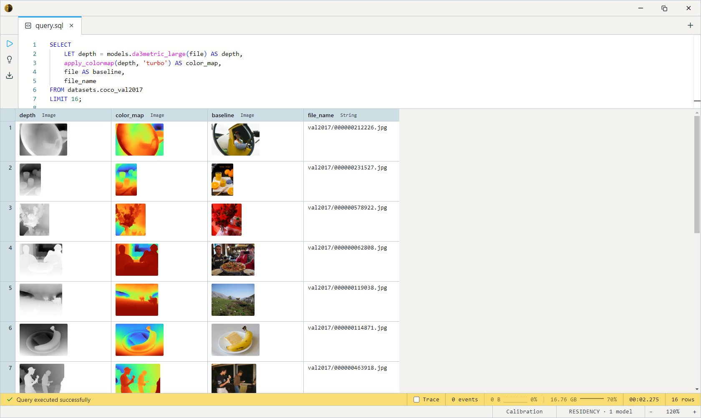
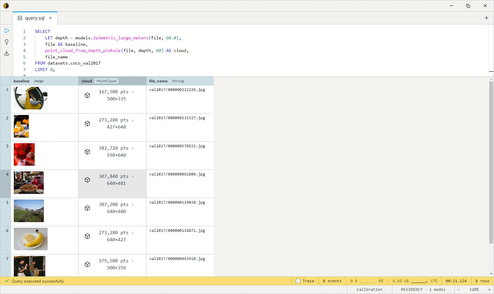

# Depth Anything 3 Metric Large (Metric Depth + Sky)

ByteDance's Depth Anything 3 metric monocular variant — DINOv2 ViT-L
encoder with a single-channel DPT head plus a **sky-segmentation head**.
The modern generalist metric estimator: trained on orders of magnitude
more data than the NYU+KITTI specialists, so it holds up on arbitrary
photographs where [ZoeDepth](../zoedepth-nyu-kitti/index.md)'s dual-head
router gets patchy. Apache-2.0 — the largest permissively-licensed model
in the DA3 family.

The network emits **canonical depth** (depth through a reference camera
with a 300-pixel focal length); the `_meters` and `_full` bodies convert
to real meters using the camera's field of view, which you pass as an
argument (default 60°).

## Variants and output models

Two precision builds, each with a visualization, a raw-meters, and a
depth+sky bundle body — `da3metric_large[_fp16][_meters|_full]`:

| Variant | Disk     | Models                                                                       |
| ------- | -------- | ---------------------------------------------------------------------------- |
| **fp32**| ~1.34 GB | `da3metric_large`, `da3metric_large_meters`, `da3metric_large_full`          |
| fp16    | ~670 MB  | `da3metric_large_fp16`, `da3metric_large_fp16_meters`, `da3metric_large_fp16_full` |

| Suffix    | Returns                                          | Use                                          |
| --------- | ------------------------------------------------ | -------------------------------------------- |
| *(none)*  | `Image`                                          | Grayscale depth map for viewing.             |
| `_meters` | `Array<Float32>`                                 | Real meters per pixel, source-aligned, for geometry. Takes `fov_deg` (default 60°). |
| `_full`   | `Struct<depth Array<Float32>, sky Array<Float32>>` | Meters **plus** the sky mask from the same forward pass. `sky >= 0.5` means sky. |

Both builds are CPU-runnable; the fp16 conversion keeps fp32 at the I/O
boundary, so it's a drop-in swap with ~0.15% depth difference.

## Example SQL

Depth-map visualization, false-coloured:

```sql
SELECT
    LET depth = models.da3metric_large(file) AS depth,
    apply_colormap(depth, 'turbo') AS color_map,
    file AS baseline,
    file_name
FROM datasets.coco_val2017
LIMIT 16;
```

Output:



Unproject real meters into a metric point cloud — pass the **same FOV**
to the model and the unprojection so the metric scale and the ray
geometry agree:

```sql
SELECT
    LET depth = models.da3metric_large_meters(file, 60.0),
    file AS baseline,
    point_cloud_from_depth_pinhole(file, depth, 60) AS cloud,
    file_name
FROM datasets.coco_val2017
LIMIT 8;
```

Output:




Outdoor scenes: mask the sky before reconstruction — monocular depth on
sky pixels is extrapolation, and a "sky at 40 m" wall ruins a cloud:

```sql
SELECT
    LET r = models.da3metric_large_full(file, 60.0),
    point_cloud_from_depth_pinhole(file, r.depth, 60) AS cloud,
    tensor_to_image_chw_gray(r.sky, image_height(file), image_width(file)) AS sky_mask,
    file_name
FROM datasets.coco_val2017
LIMIT 8;
```

## Output shape

- `da3metric_large` → `Image`, grayscale, **brighter = closer** (the body
  inverts since metric depth is bigger = farther), resized to the source
  dimensions. Min-max rescaled — visualization only, no absolute units.
- `da3metric_large_meters` → `Array<Float32>`, per-pixel meters,
  bilinear-resized to align 1:1 with the input.
- `da3metric_large_full` → struct of `depth` (meters, source-aligned) and
  `sky` (score in the same grid; `>= 0.5` is the upstream sky threshold).

## Tips

- **The FOV sets the absolute scale.** Depth scales by `tan(fov/2)⁻¹`, so
  a wrong FOV multiplies every distance by a constant factor — shapes stay
  right, sizes don't. 60° suits typical phone/webcam photos; use EXIF or
  calibration data when accuracy matters.
- **Use one FOV everywhere.** The value you pass to `_meters`/`_full` and
  the one you pass to `point_cloud_from_depth_pinhole` must match, or the
  cloud's scale and its ray geometry disagree.
- **Mask sky outdoors.** Reach for `_full` and drop pixels where
  `sky >= 0.5` before reconstruction.
- **In-domain specialists still exist.** For strictly indoor or
  driving-style scenes, [ZoeDepth](../zoedepth-nyu-kitti/index.md)'s
  calibrated heads remain competitive and need no FOV at all.
- **504×504 input**, ImageNet mean/std, handled inside the body — pass the
  raw `Image` column straight in. The ONNX trace pins this resolution
  (a ViT position-embedding constraint), so bodies resize in and out.

## License & attribution

Apache-2.0. Original model by ByteDance Seed (Depth Anything 3 — Lin,
Chen, Liew, Chen, Li, Shi, Feng, Kang); ONNX export re-hosted on
HuggingFace under `Heliosoph`. Note the license applies to this metric
monocular variant specifically — the DA3 any-view Large/Giant checkpoints
are CC-BY-NC and are not shipped here.

- Upstream: [ByteDance-Seed/Depth-Anything-3](https://github.com/ByteDance-Seed/Depth-Anything-3)
- Weights: [depth-anything/DA3METRIC-LARGE](https://huggingface.co/depth-anything/DA3METRIC-LARGE)
- Paper: [Depth Anything 3: Recovering the Visual Space from Any Views](https://arxiv.org/abs/2511.10647)
