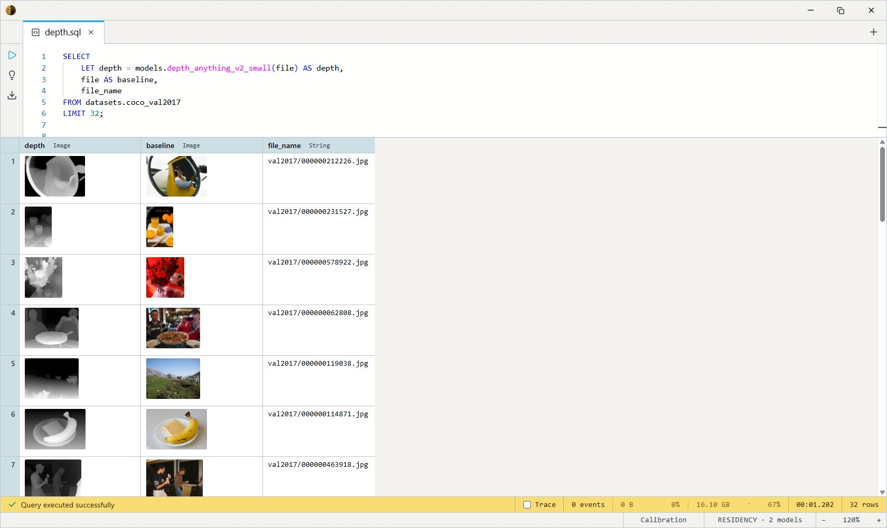

# Depth Anything V2

The current state of the art for permissively-licensed **relative** depth.
A DINOv2 ViT encoder + DPT-style decoder turns a single photo into a depth
map — one value per pixel, ordering the scene from near to far. Sharper
object boundaries and fewer artifacts than the older
[MiDaS](../midas-small/index.md) / [DPT](../dpt-large/index.md) generation, and small enough
to run on CPU.

One size ships: **Small** (`depth_anything_v2_small`, ~100 MB) — the only
V2 variant upstream licenses as Apache-2.0 (Base, Large, and Giant are
CC-BY-NC and not in the catalog). It takes an `Image` and returns a
depth-map `Image`, and it already beats the previous generation. For a
quality step up, the metric
[`da3metric_large`](../da3metric-large/index.md) is the move (real
metres, not just a relative map), or
[`da3_base`](../da3-base/index.md) for depth plus camera geometry.

## Example SQL

COCO 2017 val is images-only — `file` is the decoded JPEG, `file_name`
its path.

Estimate depth for each image alongside the original:

```sql
SELECT
    LET depth = models.depth_anything_v2_small(file) AS depth,
    file AS baseline,
    file_name
FROM datasets.coco_val2017
LIMIT 32;
```

Output:



The `LET … AS` form evaluates a model call once per row and names the
result column — see [LET bindings](../../../docs/sql/let-bindings.md).

## Output shape

Returns an `Image`: a grayscale depth map, **brighter = closer**,
per-image min-max normalized and resized back to the source image's
dimensions. The conversion (normalize + grayscale pack + resize) is done
by `depth_map_to_image` inside the model body.

## Tips

- **Relative depth is unitless and per-image.** Values order pixels near→
  far *within one frame*; `0.4` is not 0.4 metres, and the same value in
  two different images means nothing comparable. For real-world units use
  a metric estimator (`zoedepth_nyu_kitti`, `da3metric_large`).
- **518×518 DINOv2 preprocessing**, ImageNet mean/std, handled inside the
  body — pass the raw `Image` column straight in.
- **The depth map is aligned to the input.** Output H×W matches the source
  image, so you can overlay or feed it straight into point-cloud unprojection.
- **Estimate once, reuse.** The model call is the cost. Materialize the
  depth `Image` into a column rather than re-running per query.

## License & attribution

Apache-2.0. Original model by the Depth Anything team; ONNX export by
onnx-community. The license applies to the Small variant specifically —
upstream's Base/Large/Giant checkpoints are CC-BY-NC 4.0 and are not
shipped here.

- Upstream: [depth-anything/Depth-Anything-V2-Small](https://huggingface.co/depth-anything/Depth-Anything-V2-Small)
- Paper: [Depth Anything V2](https://arxiv.org/abs/2406.09414)
- Encoder: [DINOv2](https://arxiv.org/abs/2304.07193) (Meta AI)
