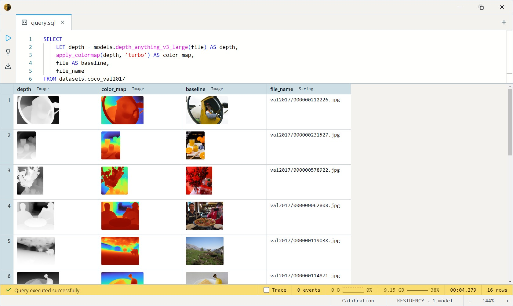
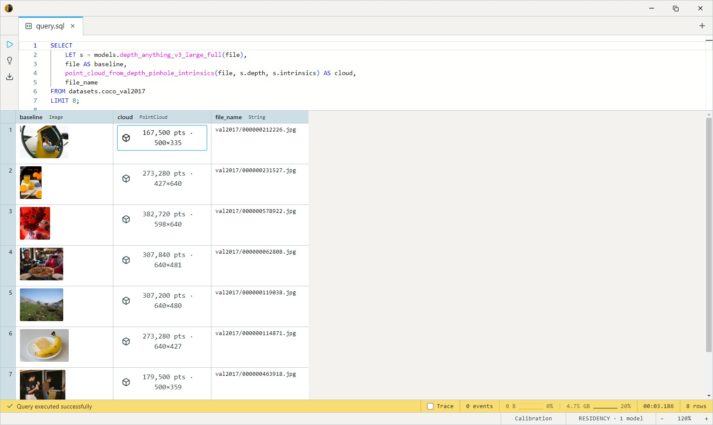
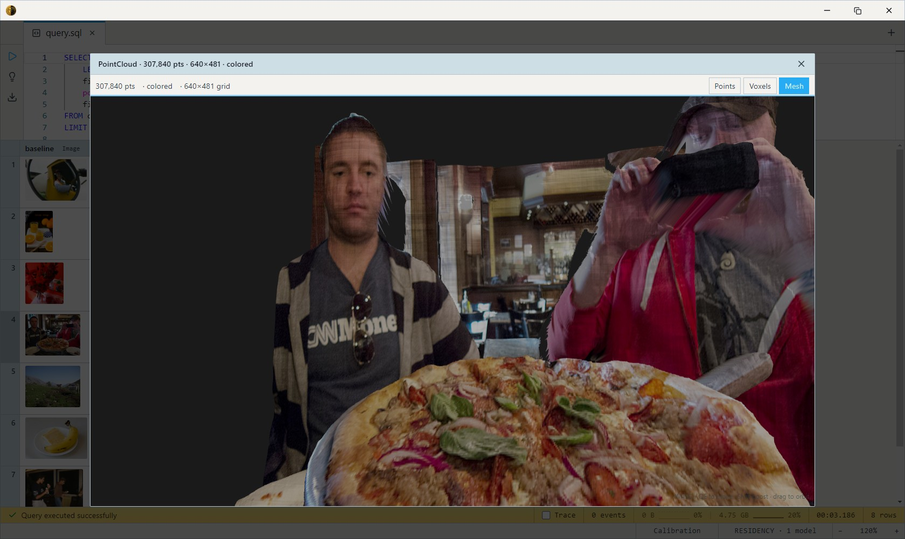

# Depth Anything V3 Large (Depth + Pose)

The latest Depth Anything generation, and the best general-purpose
**metric** depth model in the zoo. A DINOv2 ViT-L encoder + DPT-style
decoder retrained on a much larger metric-depth corpus, plus extra heads
that emit **camera pose, intrinsics, and a per-pixel confidence map** —
closer to a unified geometric-understanding model than a depth-only
network. Apache-2.0 across the board (V2-Large was CC-BY-NC and never
made the catalog).

Unlike [Depth Anything V2](../depth-anything-v2/index.md) — which is
*relative* (unitless, per-image) — V3 emits depth in **real metres**, so
its output carries absolute scale you can reconstruct geometry from.

## SQL-visible models

One forward pass, four ways to consume it:

| Model                                  | Returns                                  | Use                                                |
| -------------------------------------- | ---------------------------------------- | -------------------------------------------------- |
| `depth_anything_v3_large`              | `Image`                                  | Grayscale depth map for viewing / comparison.      |
| `depth_anything_v3_large_meters`       | `Array<Float32>`                         | Raw metres per pixel, source-aligned, for geometry.|
| `depth_anything_v3_large_full`         | `Struct{depth, confidence, extrinsics, intrinsics}` | Everything, aligned + rescaled to the source image. |
| `depth_anything_v3_large_full_native`  | same struct at native 518×518            | The unscaled bundle — for chaining at native res.  |

Single variant (~1.4 GB, CPU-runnable). The **recommended default when
absolute scale matters** — trained on far more data than the older
domain-specialist estimators, so it generalises across indoor, outdoor,
and everything between. For strictly indoor or driving-style scenes, the
specialist [ZoeDepth](../zoedepth-nyu-kitti/index.md) heads can still edge
it out.

## Example SQL

COCO 2017 val is images-only — `file` is the decoded JPEG, `file_name`
its path.

Depth-map visualization, false-coloured for readability:

```sql
SELECT
    LET depth = models.depth_anything_v3_large(file) AS depth,
    apply_colormap(depth, 'turbo') AS color_map,
    file AS baseline,
    file_name
FROM datasets.coco_val2017
LIMIT 16;
```

Output:



Unproject to a metric 3D point cloud — pinhole projection is physically
correct when depth is real metres:

```sql
SELECT
    LET depth = models.depth_anything_v3_large_meters(file),
    file AS baseline,
    point_cloud_from_depth_pinhole(file, depth, 50) AS cloud,
    file_name
FROM datasets.coco_val2017
LIMIT 8;
```

Output:





Use the **predicted camera intrinsics** instead of a guessed FOV — the
`_full` struct's `depth` and `intrinsics` are co-aligned, so they feed
the intrinsics constructor directly:

```sql
SELECT
    LET s = models.depth_anything_v3_large_full(file),
    file AS baseline,
    point_cloud_from_depth_pinhole_intrinsics(file, s.depth, s.intrinsics) AS cloud,
    file_name
FROM datasets.coco_val2017
LIMIT 8;
```

Mask low-confidence regions (sky, mirrors, specular surfaces) before
trusting the depth:

```sql
SELECT
    LET s = models.depth_anything_v3_large_full(file),
    file AS baseline,
    point_cloud_from_depth_pinhole_with_confidence(file, s.depth, s.confidence, 50, 0.5) AS cloud
FROM datasets.coco_val2017
LIMIT 8;
```

## Output shape

- `depth_anything_v3_large` → `Image`, grayscale, **brighter = closer**
  (the body inverts since metric depth is bigger = farther), resized to
  the source dimensions.
- `depth_anything_v3_large_meters` → `Array<Float32>`, per-pixel metres,
  bilinear-resized to align 1:1 with the input.
- `depth_anything_v3_large_full` → `Struct`:
  - `depth` — metres, source-aligned
  - `confidence` — per-pixel reliability, source-aligned
  - `intrinsics` — 3×3 camera matrix `[fx, 0, cx, 0, fy, cy, 0, 0, 1]`, rescaled to image coordinates
  - `extrinsics` — camera pose `[R | t]` (decorative for single-view input; meaningful once a multi-view body lands)
- `_full_native` → the same struct at the raw 518×518 grid, with the **unscaled** K.

## Tips

- **Pinhole, not orthographic, for metric depth.** When values are real
  metres, `point_cloud_from_depth_pinhole(_intrinsics)` is the honest
  geometry — flat planes stay flat. Orthographic curves them into
  "hills" (fine for relative depth, wrong here).
- **Intrinsics must match the depth resolution.** The `_full` struct
  already rescales K to image coords and resizes depth to match, so they
  pair directly. If you mix a native-res field with a resized one, scale
  fx/fy/cx/cy yourself.
- **518×518 DINOv2 preprocessing**, ImageNet mean/std, rank-5 input —
  all handled inside the body; pass the raw `Image` column straight in.
- **Confidence is free — use it.** Sky and reflective surfaces get low
  confidence; thresholding before reconstruction removes the worst
  geometry artifacts.

## License & attribution

Apache-2.0 (all variants). Original model by the Depth Anything V3 team
(Lin, Chen, Liew, Chen, Li, Shi, Feng, Kang); ONNX export by
onnx-community / Xenova.

- Upstream: [depth-anything/Depth-Anything-V3-Large](https://huggingface.co/depth-anything/Depth-Anything-V3-Large)
- Encoder: [DINOv2](https://arxiv.org/abs/2304.07193) (Meta AI)
