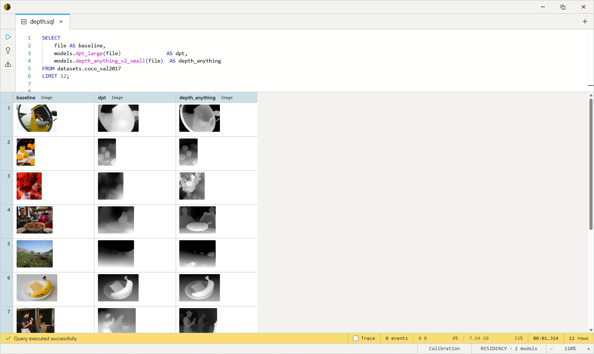

# DPT-Large (Monocular Depth)

Intel ISL's Dense Prediction Transformer — a high-capacity (~344M-param)
monocular depth estimator from the MiDaS line. Turns a single photo into a
**relative** depth map: one value per pixel ordering the scene near to far,
no real-world units.

A previous-generation model: visibly softer boundaries than
[Depth Anything V2](../depth-anything-v2/index.md), and the heaviest depth model in
the zoo (~1.3 GB, GPU-preferred). Worth reaching for when you want the
classic DPT result specifically, or for paper-comparison against the MiDaS
family; for general use, Depth Anything V2 is sharper and far lighter.

One SQL-visible model ships: `dpt_large`. It takes an `Image` and returns
a depth-map `Image`.

## Example SQL

COCO 2017 val is images-only — `file` is the decoded JPEG, `file_name`
its path.

Estimate depth for each image alongside the original:

```sql
SELECT
    LET depth = models.dpt_large(file) AS depth,
    file AS baseline,
    file_name
FROM datasets.coco_val2017
LIMIT 16;
```

Compare DPT against the current-generation model on the same images:

```sql
SELECT
    file AS baseline,
    models.dpt_large(file)               AS dpt,
    models.depth_anything_v2_small(file)  AS depth_anything
FROM datasets.coco_val2017
LIMIT 12;
```

Output:



## Output shape

Returns an `Image`: a grayscale depth map, **brighter = closer**,
per-image min-max normalized and resized back to the source image's
dimensions (`depth_map_to_image` handles this inside the body).

## Tips

- **Relative depth is unitless and per-image** — values order pixels
  near→far within a frame, but carry no metres and aren't comparable across
  images. For real units use a metric estimator (`zoedepth_nyu_kitti`,
  `da3metric_large`).
- **384×384, ±1 normalization** (mean/std = 0.5), handled inside the body
  — pass the raw `Image` column straight in.
- **GPU-preferred.** At ~344M params this is the slow, heavy option; on CPU
  it's usable but sluggish. [MiDaS Small](../midas-small/index.md) is the lightweight
  sibling.
- **Estimate once, reuse.** Materialize the depth `Image` into a column
  rather than re-running per query.

## License & attribution

Apache-2.0. Original model by Intel ISL (DPT / MiDaS — Ranftl,
Bochkovskiy, Koltun); ONNX export re-hosted on HuggingFace under
`Heliosoph`.

- Upstream: [isl-org/MiDaS](https://github.com/isl-org/MiDaS)
- Paper: [Vision Transformers for Dense Prediction](https://arxiv.org/abs/2103.13413)
- ONNX export: [Heliosoph/dpt-large-onnx](https://huggingface.co/Heliosoph/dpt-large-onnx)
