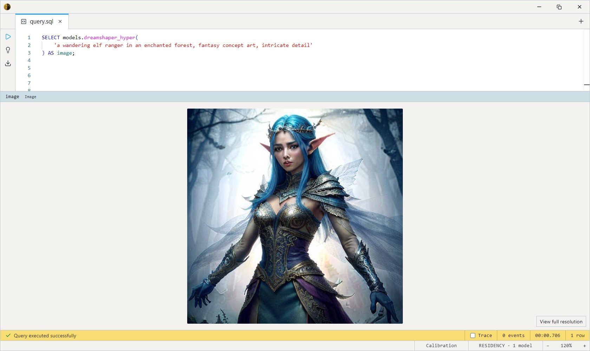
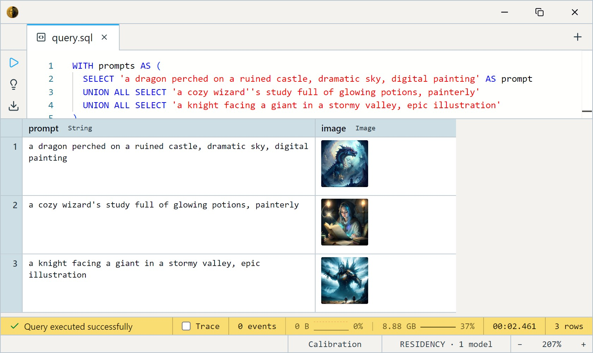

# DreamShaper + Hyper-SD (4-step)

Lykon's DreamShaper — a stylized, painterly Stable Diffusion 1.5
fine-tune — distilled to **4 sampling steps** with ByteDance's Hyper-SD
LoRA. The art-leaning sibling of [AbsoluteReality](../absolute-reality-hyper/index.md):
reach for it when you want fantasy, concept art, painterly, or
illustrated looks rather than photorealism. Great for D&D-style
characters, book covers, and concept illustration.

One SQL-visible model ships: `dreamshaper_hyper`. It takes a text
`prompt` (and an optional `steps` count) and returns a 512×512 `Image`.
It's a true text-to-image model — no input image, no dataset; you
describe the scene and it renders it.

This is a GPU model: it wants ~10 GB of VRAM and CUDA for usable speed.

> **What to expect from this model.** This is a **speed-first** text-to-image
> model built for fast, batched generation *inside SQL* — not a replacement
> for a dedicated image-generation app like Midjourney or a full Stable
> Diffusion UI. Two deliberate trade-offs buy that speed at the cost of
> per-image polish:
>
> - **4-step distillation.** ByteDance's Hyper-SD LoRA compresses the usual
>   ~30 denoising steps into 4. A big speed win, but it reduces fine detail
>   and output variety — you'll often get a similar face or composition
>   across different seeds.
> - **No classifier-free guidance (CFG) and no negative prompt.** The
>   pipeline runs the model once per step on your prompt alone. CFG (the
>   "guidance scale" ≈ 7 knob in other tools) and a negative prompt are what
>   give polished renders their strong prompt adherence, contrast, and clean
>   skin and tone. Without them, output is softer and follows the prompt more
>   loosely.
>
> The eye-catching examples you'll find online for the *same base model* are
> almost always the **full, non-distilled** model run with CFG, a negative
> prompt, and 20–50 steps — a slower, higher-fidelity path. These Hyper
> variants intentionally optimize for throughput and quick iteration across
> many rows instead. Match that setup before comparing output side by side.

## Example SQL

Generate a single image from a prompt:

```sql
SELECT models.dreamshaper_hyper(
    'a wandering elf ranger in an enchanted forest, fantasy concept art, intricate detail'
) AS image;
```

Output:



Generate several prompts in one query:

```sql
WITH prompts AS (
  SELECT 'a dragon perched on a ruined castle, dramatic sky, digital painting' AS prompt
  UNION ALL SELECT 'a cozy wizard''s study full of glowing potions, painterly'
  UNION ALL SELECT 'a knight facing a giant in a stormy valley, epic illustration'
)
SELECT prompt, models.dreamshaper_hyper(prompt) AS image
FROM prompts;
```

Output:



Trade quality for speed with the `steps` argument (1 is fastest, 4 is
the recommended minimum for detail quality):

```sql
SELECT models.dreamshaper_hyper(
    'a floating island city above the clouds', 2
) AS preview;
```

## Output shape

Returns a single 512×512 `Image`. There is no batch dimension — one call
produces one picture.

## Tips

- **4 steps is the sweet spot.** Hyper-SD was distilled for 1–4 steps;
  `steps` is capped at 8 and anything past 4 returns diminishing gains.
  Drop to 1–2 for fast previews, back to 4 for final renders.
- **Prompts are CLIP-limited to 77 tokens.** Roughly 50–60 words. Lead
  with the subject and style words; trailing detail gets truncated.
- **Style keywords pay off.** DreamShaper responds well to art-direction
  terms — `concept art`, `digital painting`, `intricate detail`,
  `dramatic lighting` — much more than the photoreal variants do.
- **Reproducible with a seed; random without one.** Leave `seed` unset and
  each call samples fresh noise, so the same prompt yields a different image
  every time. Pass an integer `seed` to lock the initial noise and get the
  same image back for a given prompt and `steps` — handy once you land on a
  composition you like. The seed fixes this engine's noise only: results
  won't match other diffusion tools bit-for-bit, and GPU runs can still
  drift slightly.
- **No negative prompt in v1.** Steer entirely through the positive
  prompt; the classic `negative_prompt` channel isn't wired yet.

## License & attribution

CreativeML OpenRAIL-M — usable commercially, with use-based restrictions
(see the license). Fine-tune by Lykon; 4-step distillation via
ByteDance's Hyper-SD LoRA; built on CompVis / Stability AI's Stable
Diffusion 1.5.

- Base fine-tune: [Lykon/dreamshaper](https://huggingface.co/Lykon/dreamshaper)
- Distillation: [ByteDance/Hyper-SD](https://huggingface.co/ByteDance/Hyper-SD) — [paper](https://arxiv.org/abs/2404.13686)
- ONNX export: [Heliosoph/dreamshaper-hyper-onnx](https://huggingface.co/Heliosoph/dreamshaper-hyper-onnx)
