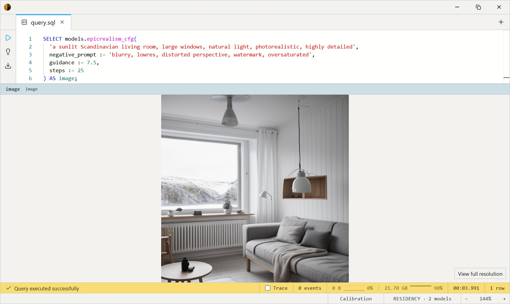

# epiCRealism (CFG, full quality)

emilianJR's epiCRealism — the same photoreal Stable Diffusion 1.5 fine-tune
as [the Hyper variant](../epicrealism-hyper/index.md), but exported
**without** the 4-step distillation LoRA and driven with **classifier-free
guidance (CFG)** over a normal ~25-step schedule. This is the **quality
tier**: it recovers the prompt adherence, detail, and contrast that the Hyper
variant trades away for speed, and it adds a **negative prompt**. epiCRealism
is tuned for *places* rather than people — landscapes, architecture,
interiors, cityscapes. Reach for it on final renders; reach for the Hyper
variant on fast previews and batch work.

One SQL-visible model ships: `epicrealism_cfg`. It takes a text `prompt`, an
optional `negative_prompt`, a `steps` count, a `guidance` scale, and an
optional `seed`, and returns a 512×512 `Image`.

This is a GPU model: it wants ~10 GB of VRAM and CUDA. It is **noticeably
slower** than the Hyper variant — it runs the UNet twice per step (for CFG)
across ~25 steps instead of 4, so expect roughly an order of magnitude more
compute per image. That is the trade for the quality.

## Example SQL

Generate an environment with guidance and a negative prompt:

```sql
SELECT models.epicrealism_cfg(
  'a sunlit Scandinavian living room, large windows, natural light, photorealistic, highly detailed',
  negative_prompt := 'blurry, lowres, distorted perspective, watermark, oversaturated',
  guidance := 7.5,
  steps := 25
) AS image;
```

Output:



Lock a composition you like with a seed:

```sql
SELECT models.epicrealism_cfg(
  'a foggy mountain lake at sunrise, photorealistic landscape',
  negative_prompt := 'blurry, lowres, jpeg artifacts',
  seed := 982943
) AS image;
```

## Parameters

- **`prompt`** — the positive description. Lead with the scene, then lighting
  and camera cues.
- **`negative_prompt`** *(default empty)* — what to steer away from.
  Realized through the guidance term, so it only bites when `guidance > 1`.
  A short list of artifact words (`blurry, lowres, distorted perspective`)
  is usually enough.
- **`guidance`** *(default 7.5)* — classifier-free guidance scale. `1.0`
  disables CFG (weak prompt adherence); `6`–`9` is the sweet spot; above
  `~12` tends to oversaturate and harden edges. This is the knob the Hyper
  variant does not have.
- **`steps`** *(default 25)* — denoising budget. `20`–`30` is the quality
  range; fewer than ~15 looks unfinished. Cost is roughly linear in steps.
- **`seed`** *(default random)* — fix the initial noise to reproduce an
  image for a given prompt, negative prompt, steps, and guidance.

## Output shape

Returns a single 512×512 `Image`. There is no batch dimension — one call
produces one picture.

## Tips

- **Built for places, not faces.** Environments, lighting, and architecture
  are its strength; for people-centric portraits pick
  [Realistic Vision (CFG)](../realistic-vision-cfg/index.md) instead.
- **Use a negative prompt.** `blurry, lowres, distorted perspective,
  watermark` cleans up most of the artifacts the Hyper variant can't escape.
- **Guidance is the main quality dial.** Start at 7.5. Raise toward 9–10 for
  stronger prompt adherence, lower toward 5–6 if results look harsh or
  oversaturated.
- **Steps buy detail, not style.** 25 is plenty for SD 1.5; going past 30
  rarely helps and just costs time.
- **Prompts are CLIP-limited to 77 tokens** *(each)*. Roughly 50–60 words
  for the positive prompt, and the negative prompt has its own 77-token
  budget.

## License & attribution

CreativeML OpenRAIL-M — usable commercially, with use-based restrictions
(see the license). Fine-tune by emilianJR; built on CompVis / Stability AI's
Stable Diffusion 1.5.

- Base fine-tune: [emilianJR/epiCRealism](https://huggingface.co/emilianJR/epiCRealism)
- ONNX export: [Heliosoph/epicrealism-cfg-onnx](https://huggingface.co/Heliosoph/epicrealism-cfg-onnx)
