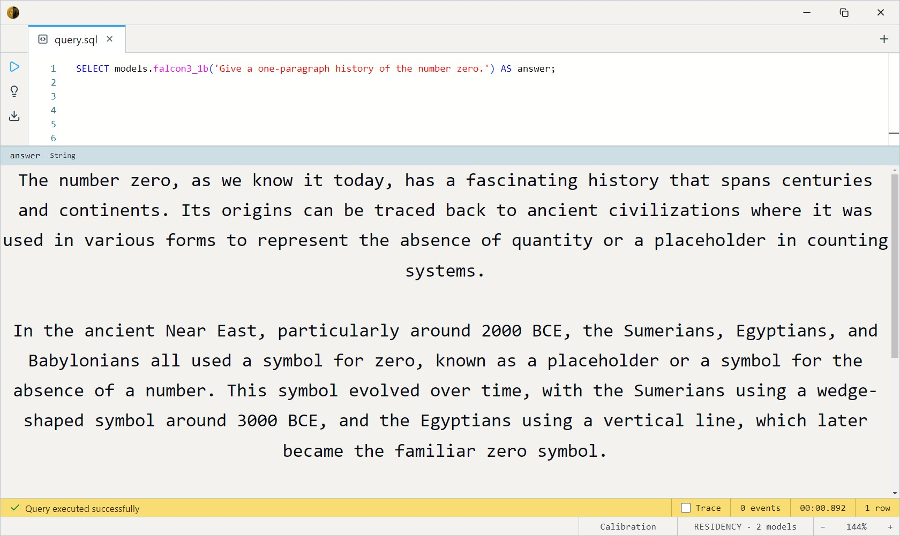

# Falcon3 1B Instruct (GGUF Q4_K_M)

TII (Technology Innovation Institute, UAE) 1B chat model — another corner
of the LLM design space, with a distinct vocabulary and style worth
comparing against the Meta / Microsoft / IBM / Alibaba entries. Small
(~750 MB) and CPU-friendly.

Two SQL surfaces share the weights: a **chat** entry (`ChatMessage` array)
and a **completion** entry (prompt string) that delegates to it.

- `falcon3_1b_chat(messages Array<ChatMessage>, max_tokens Int32 = 256, temperature Float32 = 0.7)`
- `falcon3_1b(prompt String, max_tokens Int32 = 256, temperature Float32 = 0.7)`

Both return `String`.

> **License is not Apache/MIT.** Falcon3 ships under the **Falcon LLM
> License 2.0** — broadly permissive but with an acceptable-use policy.
> Review it before commercial deployment; it's a different footing than
> the Apache-2.0 small models ([TinyLlama](../tinyllama/index.md),
> [Granite](../granite-3.1-1b/index.md)).

## Example SQL

One-shot completion:

```sql
SELECT models.falcon3_1b('Give a one-paragraph history of the number zero.') AS answer;
```

Output:



Multi-turn chat — a `ChatMessage` is `{role, content}` (`system` / `user` / `assistant`):

```sql
SELECT models.falcon3_1b_chat([
    { role: 'system', content: 'Answer in exactly one sentence.' },
    { role: 'user',   content: 'What is a vector database?' }
]) AS answer;
```

Output:


Control length and determinism:

```sql
SELECT models.falcon3_1b('Name five primary colors.', 32, 0.0) AS answer;
```

## Output shape

Returns a single `String`. `max_tokens` caps at 4096.

## Tips

- **A diversity pick.** Its value is a *different* voice for A/B
  comparison; for reliable general chat the larger
  [Mistral](../mistral-7b/index.md) / [Llama 3.1](../llama-3.1-8b/index.md)
  are stronger.
- **Mind the license** — Falcon LLM License 2.0, not Apache/MIT (see
  above).
- **`temperature = 0` for reproducibility**, 0.7 for balanced.
- **GGUF via llama.cpp.** Q4_K_M weights (ChatML template); GPU-preferred,
  CPU-runnable.

## License & attribution

Falcon LLM License 2.0. Original model by the Technology Innovation
Institute (TII), UAE (Falcon3).

- Upstream: [tiiuae/Falcon3-1B-Instruct](https://huggingface.co/tiiuae/Falcon3-1B-Instruct)
- GGUF: [tiiuae/Falcon3-1B-Instruct-GGUF](https://huggingface.co/tiiuae/Falcon3-1B-Instruct-GGUF)
