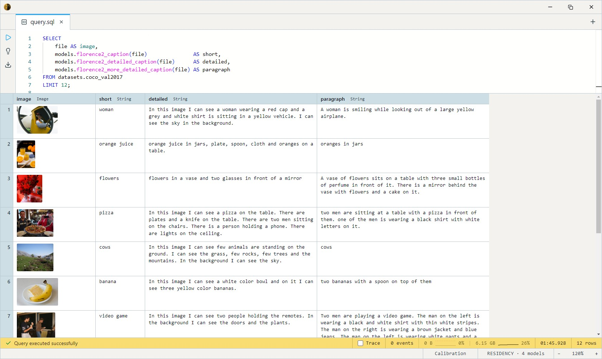
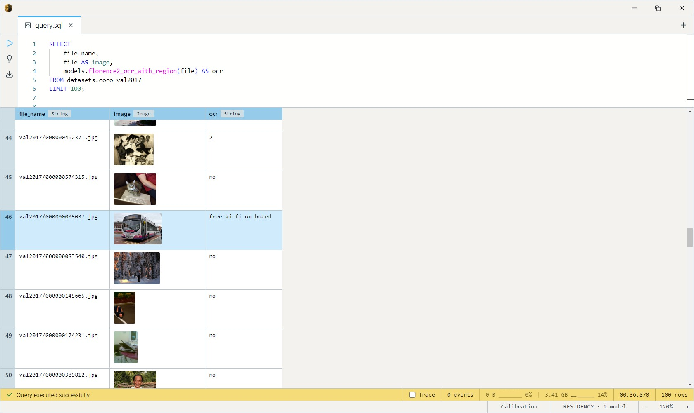

# Florence-2

Microsoft's unified vision-language model. One checkpoint, many vision
tasks: write a caption, describe a scene in detail, read text, detect
objects, ground a phrase to a box — all selected by a *task prompt*
passed at call time, not by loading a different model.

Florence-2 ships as **four** ONNX sub-models that run as a pipeline:
a DaViT vision encoder, a token-embedding lookup, a BART text encoder,
and an autoregressive decoder. The DatumV install wires all four behind
one `CREATE MODEL` body per task and registers a separate SQL-visible
name for each, so the front-end shows distinct entries that share the
same weights on disk.

Each task name is really the same model with a different default prompt
and decode budget. Override the `prompt` argument and any one of them
reaches Florence-2's wider task surface (`<OD>`, `<DENSE_REGION_CAPTION>`,
`<CAPTION_TO_PHRASE_GROUNDING>`, …) without switching variants.

## When to use which variant

| Variant       | Disk    | Runs on   | Best for                                                          |
| ------------- | ------- | --------- | ---------------------------------------------------------------- |
| **fp16 (GPU)**| ~520 MB | CUDA      | **Default on a GPU.** Maximum quality, sharpest OCR.             |
| INT8 (CPU)    | ~270 MB | CPU / NPU | No GPU, or you want half the disk. Modestly softer on text-heavy OCR. |

The two builds expose the same model names — the fp16 ones plus a `_q8`
suffix on the quantized build (`florence2_caption` vs
`florence2_caption_q8`). Swapping is a one-line change to the
`models.` prefix in your query; nothing else moves.

## SQL-visible models

All four return `String`. Each is the same network with a different
default instruction and token budget:

| Model                              | Default behavior                          | Implements      |
| ---------------------------------- | ----------------------------------------- | --------------- |
| `florence2_caption`                | One-sentence, COCO-style caption          | ImageCaptioner  |
| `florence2_detailed_caption`       | Multi-sentence description                | ImageCaptioner  |
| `florence2_more_detailed_caption`  | Full paragraph                            | ImageCaptioner  |
| `florence2_ocr_with_region`        | Text runs interleaved with `<loc_*>` boxes | TextRecognizer  |

## Example SQL

The COCO 2017 validation split is images-only — a `file` column carries
the decoded JPEG and `file_name` carries its path inside the source zip.

Caption every image in the val2017 split:

```sql
SELECT
    file_name,
    file AS image,
    models.florence2_caption(file) AS caption
FROM datasets.coco_val2017
LIMIT 100;
```

Compare the three caption granularities side by side on the same image:

```sql
SELECT
    file AS image,
    models.florence2_caption(file)               AS short,
    models.florence2_detailed_caption(file)      AS detailed,
    models.florence2_more_detailed_caption(file) AS paragraph
FROM datasets.coco_val2017
LIMIT 12;
```

Output:




Run object detection through the *captioner* by overriding the task
prompt:

```sql
SELECT
    file_name,
    file AS image,
    models.florence2_caption(file, 'What is in this picture?') AS detections
FROM datasets.coco_val2017
LIMIT 50;
```

Read any text that happens to appear in a photo (street signs, jerseys,
storefronts) with region boxes:

```sql
SELECT
    file_name,
    file AS image,
    models.florence2_ocr_with_region(file) AS ocr
FROM datasets.coco_val2017
LIMIT 100;
```

Output:



CPU box? Use the quantized build — identical query, `_q8` names:

```sql
SELECT
    file_name,
    models.florence2_caption_q8(file) AS caption
FROM datasets.coco_val2017
LIMIT 100;
```

## Output shape

Every model returns a single `String`. The caption variants return
plain prose. `florence2_ocr_with_region` (and the `<OD>` /
`<*_REGION_*>` prompts) return Florence-2's location-token stream: text
runs interleaved with four `<loc_N>` tokens per box, where each `N` is a
0–999 quantized coordinate against the image's pixel dimensions.
Structured `Array<Struct{text, bbox}>` parsing is a follow-up — for now
the string is meant for an LLM (or your own parser) downstream.

## Tips

- **Pick the budget, not just the prompt.** The three caption names
  differ only in decode length (50 / 150 / 300 tokens). For a long
  task token like `<OD>` or `<DENSE_REGION_CAPTION>`, call
  `florence2_ocr_with_region` (500-token budget) so the output isn't
  truncated mid-stream.
- **DaViT uses ImageNet normalization** at 768×768. The model body
  handles resize + mean/std internally via `image_to_tensor_chw`; pass
  the raw `Image` column straight in.
- **Coordinates are quantized, not pixels.** A `<loc_487>` is
  `487/1000 × dimension`. Multiply back by `file_width` / `file_height`
  to recover pixel positions.
- **Embed once if you reuse.** Each call runs the full four-model
  pipeline. If you need several caption granularities for the same
  image set, materialize them in one pass (the side-by-side query
  above) rather than re-scanning per granularity.

## License & attribution

MIT — same as upstream. Original model by Microsoft Research; ONNX
export and re-host on HuggingFace under `Heliosoph`.

- Upstream: [microsoft/Florence-2-base-ft](https://huggingface.co/microsoft/Florence-2-base-ft)
- Paper: [Florence-2: Advancing a Unified Representation for a Variety of Vision Tasks](https://arxiv.org/abs/2311.06242)
- fp16 export: [Heliosoph/florence-2-base-ft-fp16-onnx](https://huggingface.co/Heliosoph/florence-2-base-ft-fp16-onnx)
- INT8 export: [Heliosoph/florence-2-base-ft-quantized-onnx](https://huggingface.co/Heliosoph/florence-2-base-ft-quantized-onnx)
