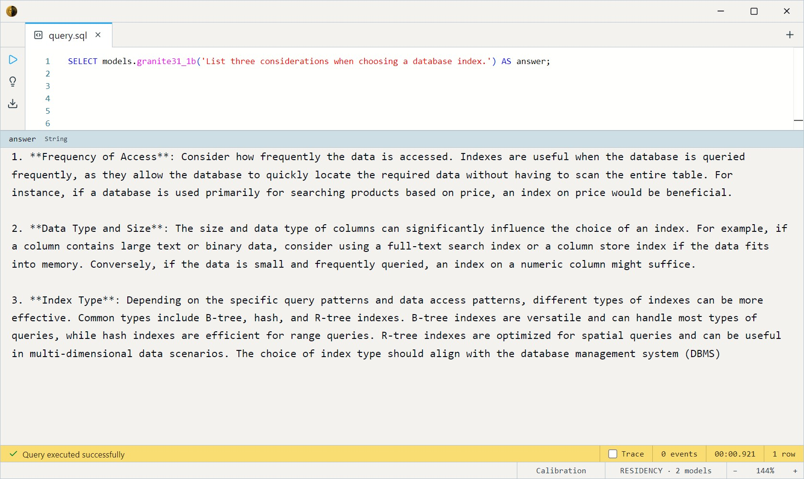

# IBM Granite 3.1 1B A400M Instruct (GGUF Q4_K_M)

IBM's small **mixture-of-experts** chat model: 1B total parameters, only
400M active per token, so it's cheap to run while carrying more knowledge
than a dense 400M model. A distinctly "enterprise-y" instruction-tuning
voice — frequently bullet-pointed, careful with caveats. Fully
unencumbered under Apache-2.0.

Two SQL surfaces share the weights: a **chat** entry (`ChatMessage` array)
and a **completion** entry (prompt string) that delegates to it.

- `granite31_1b_chat(messages Array<ChatMessage>, max_tokens Int32 = 256, temperature Float32 = 0.7)`
- `granite31_1b(prompt String, max_tokens Int32 = 256, temperature Float32 = 0.7)`

Both return `String`.

## Example SQL

One-shot completion:

```sql
SELECT models.granite31_1b('List three considerations when choosing a database index.') AS answer;
```

Output:



Multi-turn chat — a `ChatMessage` is `{role, content}` (`system` / `user` / `assistant`):

```sql
SELECT models.granite31_1b_chat([
    { role: 'system', content: 'You are a concise enterprise assistant.' },
    { role: 'user',   content: 'Summarise the risks of skipping database backups.' }
]) AS answer;
```

Output:


Compare instruction-tuning voices side by side:

```sql
SELECT
    models.granite31_1b('Explain rate limiting.') AS granite_enterprise,
    models.falcon3_1b('Explain rate limiting.')   AS falcon;
```

## Output shape

Returns a single `String`. `max_tokens` caps at 4096.

## Tips

- **MoE means efficient.** 400M active params per token keeps it fast for
  its knowledge level — a good small default when you want structured,
  bullet-y answers.
- **Enterprise tone.** It leans formal and caveated; great for
  documentation-style output, less so for casual chat.
- **`temperature = 0` for reproducibility**, 0.7 for balanced.
- **GGUF via llama.cpp.** Q4_K_M weights; GPU-preferred, CPU-runnable.

## License & attribution

Apache-2.0. Original model by IBM (Granite 3.1); GGUF quantization by
bartowski.

- Upstream: [ibm-granite/granite-3.1-1b-a400m-instruct](https://huggingface.co/ibm-granite/granite-3.1-1b-a400m-instruct)
- GGUF: [bartowski/granite-3.1-1b-a400m-instruct-GGUF](https://huggingface.co/bartowski/granite-3.1-1b-a400m-instruct-GGUF)
