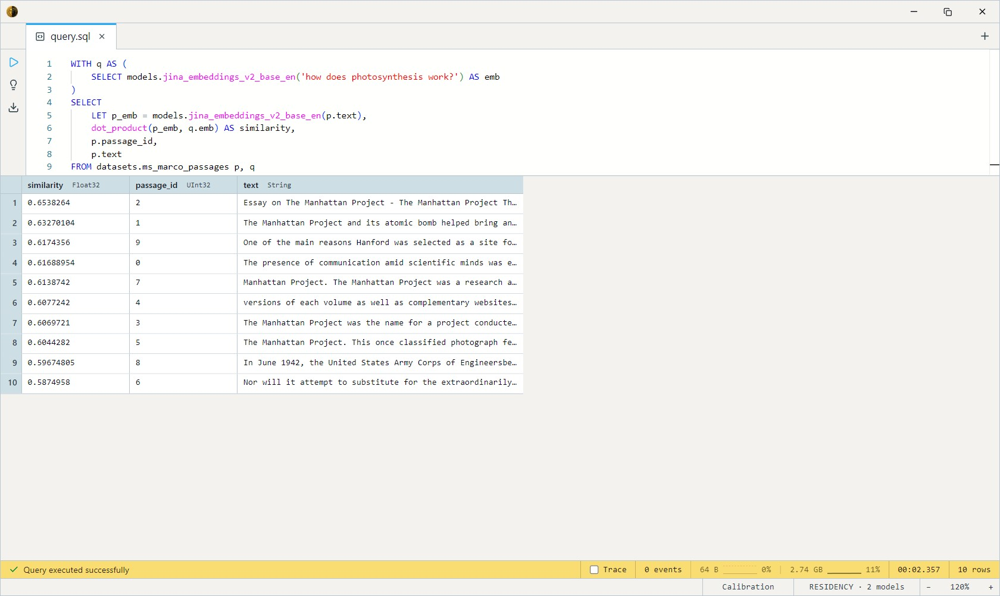

# Jina Embeddings v2 (Long Context)

Sentence embeddings from Jina AI. A BERT-family encoder with **ALiBi
positional encoding** in place of the usual learned positions — which
lets it extrapolate far past its training length and accept up to
**8,192 tokens** of input per call (roughly ten typical web pages).
768-dimensional output, ~330 MB on disk, CPU-viable. The reach-for
embedder when you want to retrieve whole documents instead of slicing
them into paragraphs first.

One SQL-visible model: `jina_embeddings_v2_base_en`. Takes a `String`,
returns a length-768 L2-normalised `Float32[]`. Because every vector
lies on the unit sphere, `dot_product` and `cosine_similarity` produce
identical scores; `dot_product` is the faster of the two.

## Example SQL

Embed a sentence:

```sql
SELECT models.jina_embeddings_v2_base_en('a quick brown fox jumps over the lazy dog') AS embedding;
```

Rank a real web corpus by similarity to a natural-language query — the
canonical dense-retrieval workload. Embed the query once, then dot
against the per-passage embedding for every row in the MS MARCO
passages corpus:

```sql
WITH q AS (
    SELECT models.jina_embeddings_v2_base_en('how does photosynthesis work?') AS emb
)
SELECT
    LET p_emb = models.jina_embeddings_v2_base_en(p.text),
    dot_product(p_emb, q.emb) AS similarity,
    p.passage_id,
    p.text
FROM datasets.ms_marco_passages p, q
ORDER BY similarity DESC
LIMIT 10;
```

Output:



For a real retrieval system you'd materialize `p_emb` into a stored
`Float32[]` column once and re-rank against the stored vectors per
query — see the "Embed once, compare many" tip below.

## Output shape

`Float32[]` — length 768, L2-normalised. Twice the dimensionality of
MiniLM / BGE Small, so vector indexes and on-disk embedding columns
will be ~2× larger for the same row count.

## Tips

- **Use the 8K context.** On short text (a sentence, a tweet, a
  one-line question) Jina is *more expensive* than MiniLM or BGE Small
  for similar accuracy — its advantage shows up when the input is a
  full paragraph, a long form post, or a whole document. If everything
  you embed is under 256 tokens, reach for a 384-d embedder instead.
- **English only.** This is the `base-en` variant; for multilingual
  retrieval reach for `jina-embeddings-v2-base-multilingual` or v3.
- **Embed once, compare many.** Long-context embedding is the most
  expensive call in any retrieval pipeline. Store the 768-d vector as
  a `Float32[]` column, refresh only when source documents change.
- **Don't mix dimensions.** Jina vectors are 768-d; MiniLM / BGE
  vectors are 384-d. Cosine similarity across the two is meaningless —
  pick one embedder per corpus and stay there.

## License & attribution

Apache-2.0. Original model by Jina AI.

- Paper: [Jina Embeddings 2: 8192-Token General-Purpose Text Embeddings for Long Documents](https://arxiv.org/abs/2310.19923)
- Upstream: [jinaai/jina-embeddings-v2-base-en](https://huggingface.co/jinaai/jina-embeddings-v2-base-en)
