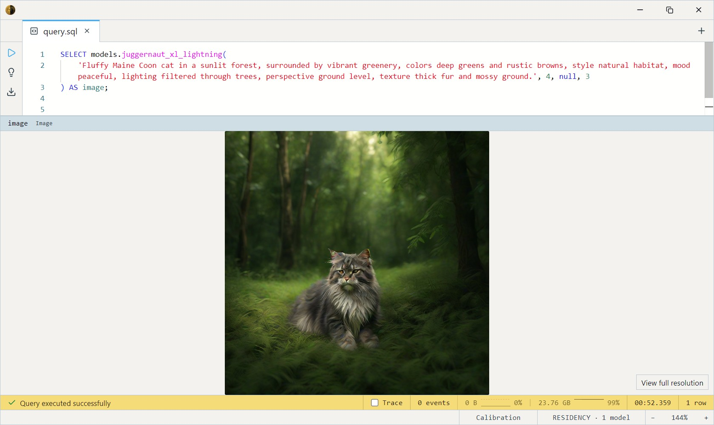
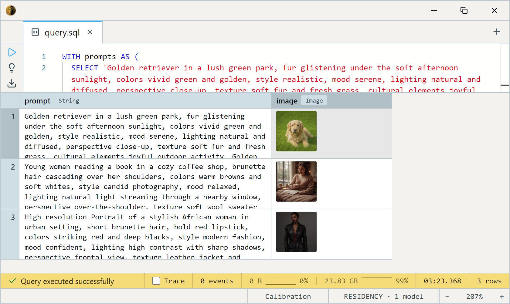
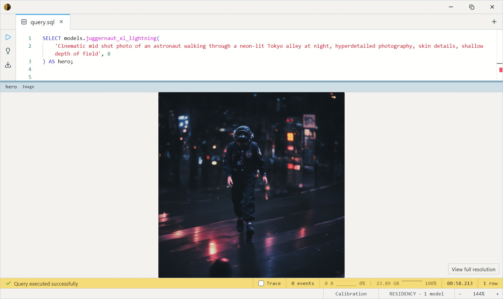

# JuggernautXL Lightning (4-step SDXL)

RunDiffusion's Juggernaut XL — a high-end SDXL fine-tune — distilled to
**4 sampling steps** with ByteDance's SDXL Lightning method. The
highest-resolution and highest-quality text-to-image model in the zoo:
native **1024×1024** output, photoreal and fantasy from a single
checkpoint. The "make it look great" pick when you have the GPU for it.

Unlike the Turbo models, this is a *fine-tune* — Juggernaut's aesthetic
is baked in, leaning cinematic and detailed. And unlike SD/SDXL Turbo
there's no `size` knob: the Lightning distillation was trained at full
SDXL resolution, so output is locked to 1024×1024.

One SQL-visible model ships: `juggernaut_xl_lightning`. It takes a text
`prompt` (and an optional `steps` count) and returns a 1024×1024 `Image`.
No input image, no dataset — you describe the scene and it renders it.

This is by far the heaviest model in the family. A single call holds four
ONNX sessions resident at once — two text encoders, the UNet, and the VAE
decoder — so it loads ~13 GB of weights and peaks past 20 GB of VRAM in
use. Plan for a 24 GB CUDA card (and ~13 GB on disk).

## Example SQL

Generate a single 1024×1024 image:

```sql
SELECT models.juggernaut_xl_lightning(
    'Fluffy Maine Coon cat in a sunlit forest, surrounded by vibrant greenery, colors deep greens and rustic browns, style natural habitat, mood peaceful, lighting filtered through trees, perspective ground level, texture thick fur and mossy ground.'
) AS image;
```

Output:



Generate several prompts in one query:

```sql
WITH prompts AS (
  SELECT 'Golden retriever in a lush green park, fur glistening under the soft afternoon sunlight, colors vivid green and golden, style realistic, mood serene, lighting natural and diffused, perspective close-up, texture soft fur and fresh grass, cultural elements joyful outdoor activity. Golden retriever in a green park with soft afternoon light and realistic fur detail.' AS prompt
  UNION ALL SELECT 'Young woman reading a book in a cozy coffee shop, brunette hair cascading over her shoulders, colors warm browns and soft whites, style candid photography, mood relaxed, lighting natural light streaming through a nearby window, perspective over-the-shoulder, texture soft wool sweater and glossy wooden table.'
  UNION ALL SELECT 'High resolution Portrait of a stylish African woman in urban setting, short brunette hair, bold red lipstick, colors striking red and deep blacks, style modern fashion, mood confident, lighting high contrast with sharp shadows, perspective frontal view, texture leather jacket and smooth skin'
)
SELECT prompt, models.juggernaut_xl_lightning(prompt) AS image
FROM prompts;
```

Output:



Push detail with more steps — Lightning accepts up to 8 (4 is the recommended minimum, 8 for hero outputs):

```sql
SELECT models.juggernaut_xl_lightning(
    'Cinematic mid shot photo of an astronaut walking through a neon-lit Tokyo alley at night, hyperdetailed photography, skin details, shallow depth of field', 8
) AS hero;
```

Output:



## Output shape

Returns a single 1024×1024 `Image` — fixed; there's no `size` argument.
One call produces one picture, no batch dimension.

## Tips

- **1024×1024 only.** The Lightning distillation was trained at full SDXL
  size, so output resolution is locked — no `size` parameter. If you need
  512, use [SDXL Turbo](../sdxl-turbo/index.md) instead.
- **4 steps minimum, 8 for hero shots.** Lightning was distilled for 1–8
  steps; 1 is fastest but soft, 4 is the recommended floor for faces /
  fine detail, 8 for the best quality.
- **It's a fine-tune — style is baked in.** Juggernaut leans cinematic,
  detailed, slightly stylized. For the neutral Stability baseline at this
  architecture, use SDXL Turbo.
- **Prompts are CLIP-limited to 77 tokens** (~50–60 words). The dual
  CLIP-L + OpenCLIP-G encoders share the same 77-token sequence; lead
  with subject and style.
- **Reproducible with a seed; random without one.** Leave `seed` unset and
  each call samples fresh noise, so the same prompt yields a different image
  every time. Pass an integer `seed` to lock the initial noise and get the
  same image back for a given prompt and `steps` — handy once you land on a
  composition you like. The seed fixes this engine's noise only: results
  won't match other diffusion tools bit-for-bit, and GPU runs can still
  drift slightly.
- **No negative prompt in v1.** Steer entirely through the positive
  prompt; the classic `negative_prompt` channel isn't wired yet.

## License & attribution

**CreativeML OpenRAIL-PP-M** — usable commercially, with use-based
restrictions (see the license). Fine-tune by RunDiffusion; 4-step
distillation via ByteDance's SDXL Lightning method; built on Stability
AI's Stable Diffusion XL base.

- Base fine-tune: [RunDiffusion/Juggernaut-XL-Lightning](https://huggingface.co/RunDiffusion/Juggernaut-XL-Lightning)
- Distillation method: [SDXL-Lightning](https://arxiv.org/abs/2402.13929) (Lin, Wang, Yang — ByteDance)
- ONNX export: [Heliosoph/juggernaut-xl-lightning-onnx](https://huggingface.co/Heliosoph/juggernaut-xl-lightning-onnx)
