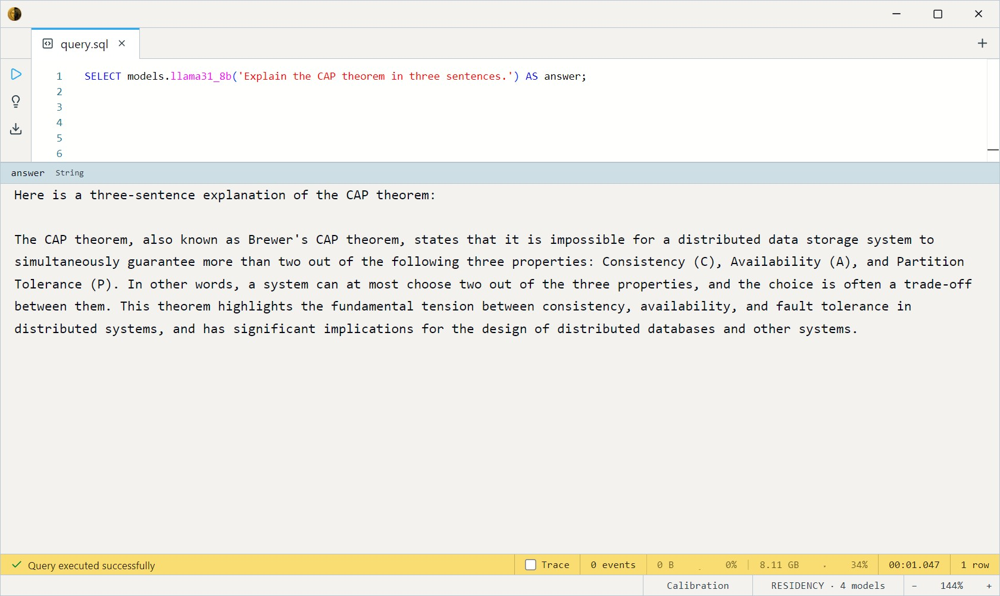

# Llama 3.1 8B Instruct (GGUF Q4_K_M)

Meta's 8B-parameter instruction-tuned model — the **most reliable chat
discipline in the zoo**. Its end-of-turn marker is consistently emitted
even on trivial prompts, so it rarely rambles past the answer. The
default when you want dependable, well-formatted responses. GPU-preferred
(~4.7 GB).

Two SQL surfaces share the weights: a **chat** entry (`ChatMessage` array)
and a **completion** entry (prompt string) that delegates to it.

- `llama31_8b_chat(messages Array<ChatMessage>, max_tokens Int32 = 8192, temperature Float32 = 0.7)`
- `llama31_8b(prompt String, max_tokens Int32 = 8192, temperature Float32 = 0.7)`

Both return `String`.

> **Gated license.** Llama 3.1 ships under the **Llama 3.1 Community
> License**, which you must accept before the weights download. It's
> permissive for most uses but has conditions (e.g. a monthly-active-user
> threshold) — review it. The Apache-2.0 models
> ([Mistral](../mistral-7b/index.md), [Qwen](../qwen2.5-coder/index.md))
> have no such gate.

## Example SQL

One-shot completion:

```sql
SELECT models.llama31_8b('Explain the CAP theorem in three sentences.') AS answer;
```

Output:



Multi-turn chat — a `ChatMessage` is `{role, content}`; Llama supports a native `system` role:

```sql
SELECT models.llama31_8b_chat([
    { role: 'system', content: 'You are a precise technical writer. Use no filler.' },
    { role: 'user',   content: 'Describe what a write-ahead log is and why it matters.' }
]) AS answer;
```

Output:


Process a table column — summarise each transcribed clip (`||`
concatenates the instruction with Whisper's output):

```sql
SELECT
    utt_id,
    models.llama31_8b('Summarise in one short sentence: ' || models.whisper_base(clip)) AS summary
FROM datasets.ljspeech_audio
LIMIT 10;
```

## Output shape

Returns a single `String`. Llama 3.1 has a 128K native context; here
`max_tokens` caps at 32768 (default 8192, sized for long-form / chained
prompting).

## Tips

- **Best chat discipline.** Cleanest turn-ending and formatting of the
  zoo's LLMs — the safest pick for structured, multi-step, or chained
  prompting.
- **Accept the license first.** The download is gated (see above).
- **Native `system` role** — put standing instructions there rather than
  in the user turn.
- **`temperature = 0` for reproducibility**, 0.7 for balanced.
- **GGUF via llama.cpp.** Q4_K_M weights; GPU-preferred, CPU-runnable at
  reduced speed.

## License & attribution

Llama 3.1 Community License (acceptance required). Original model by Meta
Platforms, Inc. (Llama 3.1); GGUF quantization by bartowski.

- Upstream: [meta-llama/Llama-3.1-8B-Instruct](https://huggingface.co/meta-llama/Llama-3.1-8B-Instruct)
- GGUF: [bartowski/Meta-Llama-3.1-8B-Instruct-GGUF](https://huggingface.co/bartowski/Meta-Llama-3.1-8B-Instruct-GGUF)
