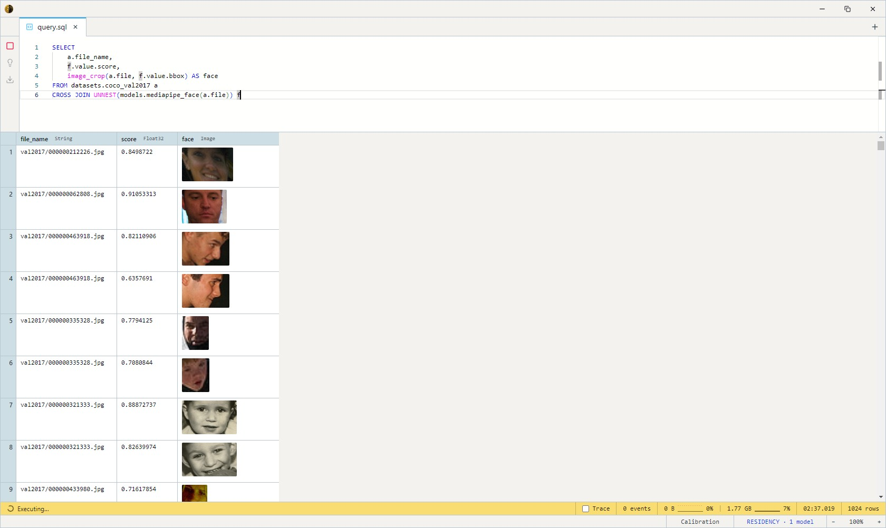

# MediaPipe Face Detector

Google's BlazeFace short-range face detector (via MediaPipe). Finds every
face in a photo and returns a bounding box, six keypoints (eyes, nose,
mouth, ear tragions), and a confidence score per face. Tiny (~2–3 MB) and
CPU-fast.

Both variants share the architecture, the `FaceDetector` task, and the
same signature — they differ only in weight precision.

## When to use which variant

| Variant  | Model name           | Disk  | Best for                                      |
| -------- | -------------------- | ----- | --------------------------------------------- |
| **fp32** | `mediapipe_face`     | ~3 MB | **Default.** Reference numerics.              |
| INT8     | `mediapipe_face_int8`| ~2 MB | CPU / NPU deployment; marginally smaller.     |

Each takes `(img Image, conf_thresh Float32 = 0.5, iou_thresh Float32 = 0.3)`
and returns `Array<FaceDetection>`.

## Example SQL

COCO 2017 val is images-only — `file` is the decoded JPEG, `file_name`
its path.

Count faces per image:

```sql
SELECT
    file_name,
    file AS baseline,
    cardinality(models.mediapipe_face(file)) AS faces
FROM datasets.coco_val2017
LIMIT 32;
```

Output:


Unnest to one row per face and crop each one out:

```sql
SELECT
    a.file_name,
    f.value.score,
    image_crop(a.file, f.value.bbox) AS face
FROM datasets.coco_val2017 a
CROSS JOIN UNNEST(models.mediapipe_face(a.file)) f
LIMIT 100;
```

Output:



Lower the confidence floor to catch small / turned faces (raise it for
strict precision):

```sql
SELECT
    file_name,
    cardinality(models.mediapipe_face(file, 0.3)) AS faces_low_thresh
FROM datasets.coco_val2017
LIMIT 32;
```

## Output shape

Returns `Array<FaceDetection>`; `UNNEST` exposes each as the `value`
column:

```
bbox:      BoundingBox        -- {x, y, w, h} in source-image pixels
label:     String             -- "face"
landmarks: Array<Point2D>     -- 6 BlazeFace keypoints (eyes, nose, mouth, ears)
score:     Float32            -- 0.0–1.0 detection confidence
```

## Tips

- **Two thresholds to tune.** `conf_thresh` (default 0.5) drops
  low-confidence anchors before NMS; `iou_thresh` (default 0.3) controls
  overlap dedup — lower is stricter. Loosen `conf_thresh` to ~0.3 for
  crowd / distant faces.
- **Short-range detector.** BlazeFace's short-range model targets faces
  that fill a decent fraction of the frame (selfie / portrait distance);
  it's weaker on tiny background faces than a full-range detector.
- **Detection only — no mesh in v1.** The bundle ships a 468-point
  FaceMesh model, but it isn't wired to SQL (per-face fan-out needs a
  LATERAL surface that's deferred). You get the box + 6 keypoints, not
  the dense mesh.
- **Detect once, reuse.** Materialize the `Array<FaceDetection>` column
  and unnest/crop from there rather than re-detecting per query.

## License & attribution

Apache-2.0. Original model by the Google MediaPipe team; PyTorch port by
Zak Murez (MediaPipePyTorch); ONNX export by Qualcomm AI Hub.

- Upstream: [google-ai-edge/mediapipe](https://github.com/google-ai-edge/mediapipe)
- Paper: [BlazeFace: Sub-millisecond Neural Face Detection on Mobile GPUs](https://arxiv.org/abs/1907.05047)
