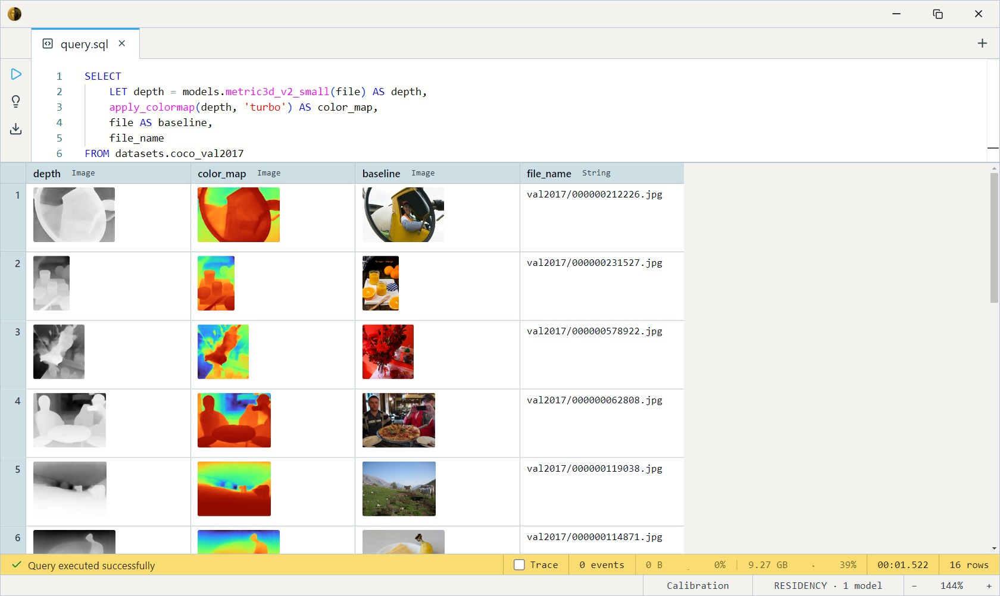
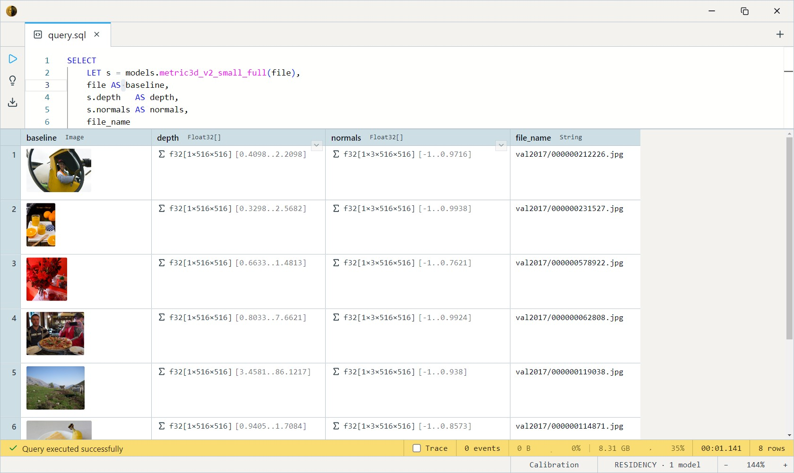

# Metric3D V2 (Metric Depth + Normals)

HKU + Shanghai AI Lab's Metric3D V2 — a metric depth estimator with a
headline feature unique in this catalog: it emits **surface normals**
alongside depth in a single forward pass. Trained on a large, diverse
outdoor corpus with a canonical-camera scheme that adapts to arbitrary
intrinsics. BSD-2-Clause.

The depth + normals combination makes it the pick for photogrammetry and
3D-reconstruction workflows that need oriented surfaces, not just a depth
map.

## Sizes and precision

Two axes: model size (accuracy vs speed) and weight precision (disk vs
GPU fp16 throughput).

| Size      | fp32 disk | fp16 disk | Runs on   | Notes                                  |
| --------- | --------- | --------- | --------- | -------------------------------------- |
| **Small** | ~151 MB   | ~151 MB   | CPU       | **Default.** ViT-S, ~22M params.       |
| Large     | ~1.6 GB   | ~825 MB   | CUDA      | Higher accuracy.                       |
| Giant     | ~5.5 GB   | ~2.7 GB   | CUDA      | Best accuracy; heaviest in the zoo.    |

## SQL-visible models

Each size (and its `_fp16` build) exposes three bodies — the model name
follows `metric3d_v2_<size>[_fp16][_meters|_full]`:

| Suffix    | Returns                                          | Use                                          |
| --------- | ------------------------------------------------ | -------------------------------------------- |
| *(none)*  | `Image`                                          | Grayscale depth map for viewing.             |
| `_meters` | `Array<Float32>`                                 | Raw depth per pixel, source-aligned.         |
| `_full`   | `Struct{depth, normals, normal_confidence}`      | Depth + per-pixel surface normals + reliability. |

So `metric3d_v2_small`, `metric3d_v2_small_meters`,
`metric3d_v2_small_full`, then the same with `_fp16`, and again for
`large` / `giant`.

> **"Pseudo-metric" caveat.** Metric3D calibrates scale against a
> canonical camera focal length derived from the input resolution.
> True real-world metres need a `focal_length_px` correction
> (`metric = predicted × canonical_focal / actual_focal`) — not yet
> exposed. Without the camera's actual focal, the output is correct *up to
> a per-image scalar*: great for visualization and within-image relative
> distance, not yet for absolute cross-image measurement. For true metric
> scale today, prefer [Depth Anything V3](../depth-anything-v3-large/index.md)
> or [ZoeDepth](../zoedepth-nyu-kitti/index.md).

## Example SQL

COCO 2017 val is images-only — `file` is the decoded JPEG, `file_name`
its path.

Depth-map visualization, false-coloured:

```sql
SELECT
    LET depth = models.metric3d_v2_small(file) AS depth,
    apply_colormap(depth, 'turbo') AS color_map,
    file AS baseline,
    file_name
FROM datasets.coco_val2017
LIMIT 16;
```

Output:



Depth + normals + confidence in one pass — access the struct fields:

```sql
SELECT
    LET s = models.metric3d_v2_small_full(file),
    file AS baseline,
    s.depth   AS depth,
    s.normals AS normals,
    file_name
FROM datasets.coco_val2017
LIMIT 8;
```

Output:



Unproject to a point cloud (the depth field feeds the constructors
directly):

```sql
SELECT
    LET depth = models.metric3d_v2_small_meters(file),
    file AS baseline,
    point_cloud_from_depth_pinhole(file, depth, 50) AS cloud
FROM datasets.coco_val2017
LIMIT 8;
```

## Output shape

- `metric3d_v2_<size>` → `Image`, grayscale depth, **brighter = closer**
  (inverted, since Metric3D emits bigger = farther), resized to source dims.
- `metric3d_v2_<size>_meters` → `Array<Float32>`, per-pixel depth,
  source-aligned.
- `metric3d_v2_<size>_full` → `Struct`:
  - `depth` — native 518×518 (resize with `array_resize_2d` for per-pixel alignment)
  - `normals` — per-pixel `(nx, ny, nz)` unit vectors
  - `normal_confidence` — per-pixel normals reliability

## Tips

- **Normals are the reason to pick this.** No other catalog depth model
  emits them. Use `normal_confidence` to drop unreliable normals before
  meshing or relighting.
- **`_full`'s depth is native resolution** (the decoder trims to ~516×516,
  read off the trailing axes), unlike the `_meters` variant which is
  pre-resized. Call `array_resize_2d(s.depth, image_height(file), image_width(file))`
  if you need pixel alignment with the source image.
- **518×518 input**, ImageNet mean/std, handled inside the body — pass
  the raw `Image` column straight in.
- **fp16 on GPU only helps if the runtime is fp16-native.** Same output;
  it buys disk + throughput on capable hardware, nothing on plain CPU.

## License & attribution

BSD-2-Clause. Original model by HKU + Shanghai AI Lab (Metric3D V2 — Hu,
Yin, Zhang, Cai, Long, Chen, Wang, Yu, Shen, Shen); ONNX export by
onnx-community.

- Upstream: [YvanYin/Metric3D](https://github.com/YvanYin/Metric3D)
- Paper: [Metric3D v2: A Versatile Monocular Geometric Foundation Model](https://arxiv.org/abs/2404.15506)
