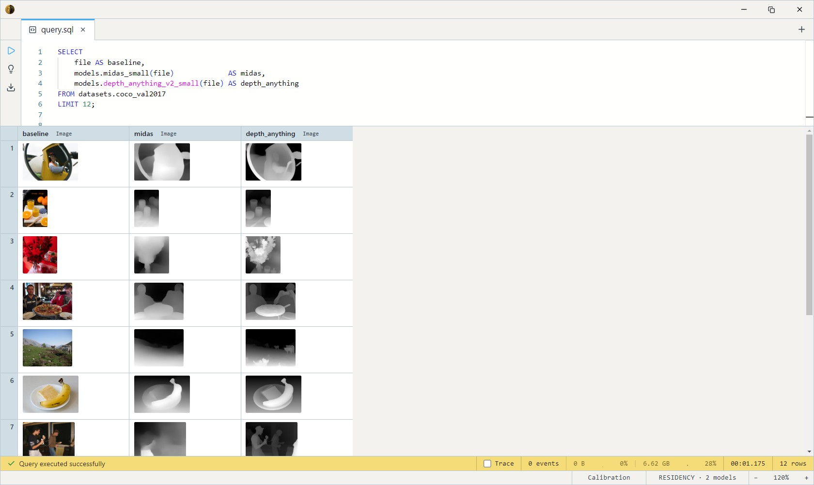

# MiDaS v2.1 Small (Monocular Depth)

Intel ISL's lightweight MiDaS — an EfficientNet-Lite3 encoder + depth
decoder (~21M params) that estimates **relative** depth from a single
image in ~50 ms on a consumer CPU. The tiny, fast end of the depth zoo:
~80 MB on disk, no GPU needed.

A previous-generation model — visibly softer than
[Depth Anything V2](../depth-anything-v2/index.md), which is also CPU-runnable and
much sharper. Reach for MiDaS Small when latency and disk are the hard
constraints (edge devices, real-time previews); otherwise prefer Depth
Anything V2.

One SQL-visible model ships: `midas_small`. It takes an `Image` and
returns a depth-map `Image`.

## Example SQL

COCO 2017 val is images-only — `file` is the decoded JPEG, `file_name`
its path.

Estimate depth for each image alongside the original:

```sql
SELECT
    LET depth = models.midas_small(file) AS depth,
    file AS baseline,
    file_name
FROM datasets.coco_val2017
LIMIT 32;
```

See the generation gap — MiDaS next to the current-generation model:

```sql
SELECT
    file AS baseline,
    models.midas_small(file)             AS midas,
    models.depth_anything_v2_small(file) AS depth_anything
FROM datasets.coco_val2017
LIMIT 12;
```

Output:



## Output shape

Returns an `Image`: a grayscale depth map, **brighter = closer**,
per-image min-max normalized and resized back to the source image's
dimensions (`depth_map_to_image` handles this inside the body).

## Tips

- **Relative depth is unitless and per-image** — values order pixels
  near→far within a frame, not in metres, and aren't comparable across
  images. For real units use a metric estimator (`zoedepth_nyu_kitti`,
  `da3metric_large`).
- **256×256 BGR input**, ImageNet mean/std — note this model takes **BGR**
  channel order (handled inside the body via `image_to_tensor_chw_bgr`);
  just pass the raw `Image` column in.
- **CPU-fast by design.** ~21M params, ~50 ms/image — the cheapest depth
  estimate available. [DPT-Large](../dpt-large/index.md) is the heavyweight sibling
  in the same MiDaS line.
- **Estimate once, reuse.** Materialize the depth `Image` into a column
  rather than re-running per query.

## License & attribution

MIT. Original model by Intel ISL (MiDaS — Ranftl, Lasinger, Hafner,
Schindler, Koltun); ONNX export re-hosted on HuggingFace under
`Heliosoph`.

- Upstream: [isl-org/MiDaS](https://github.com/isl-org/MiDaS)
- Paper: [Towards Robust Monocular Depth Estimation](https://arxiv.org/abs/1907.01341)
