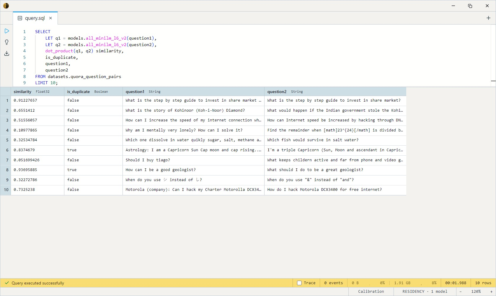

# MiniLM-L6 Embeddings

Sentence embeddings from the sentence-transformers project. A small
BERT-family encoder (6 layers, 384 hidden units) fine-tuned to map
English sentences into a shared vector space where cosine similarity
tracks meaning. ~90 MB on disk, CPU-friendly, and the standard "start
here" embedder for semantic search, clustering, and de-duplication.

One SQL-visible model: `all_minilm_l6_v2`. Takes a `String`, returns a
length-384 L2-normalised `Float32[]`. Because every vector lies on the
unit sphere, `dot_product` and `cosine_similarity` produce identical
scores; `dot_product` is the faster of the two.

## Example SQL

Embed a sentence:

```sql
SELECT models.all_minilm_l6_v2('a quick brown fox jumps over the lazy dog') AS embedding;
```

Compare similarity between two questions:

```sql
SELECT
    LET q1 = models.all_minilm_l6_v2(question1),
    LET q2 = models.all_minilm_l6_v2(question2),
    dot_product(q1, q2) similarity,
    is_duplicate,
    question1,
    question2
FROM datasets.quora_question_pairs
LIMIT 10;
```

Output:



## Output shape

`Float32[]` — length 384, L2-normalised.

## Tips

- **English only.** The training data is English; other languages
  embed, but quality drops sharply. Reach for a multilingual embedder
  if you need cross-lingual retrieval.
- **Context is 256 tokens** (WordPiece). Long documents need chunking
  before embedding; embed the chunks and aggregate at query time.
- **Embed once, compare many.** Store embeddings as a `Float32[]`
  column and rank in SQL — re-embedding per query is dramatically
  slower.

## License & attribution

Apache-2.0. Original model by Reimers & Gurevych
(sentence-transformers, UKP Lab, TU Darmstadt). ONNX export via
HuggingFace `optimum`.

- Paper: [Sentence-BERT: Sentence Embeddings using Siamese BERT-Networks](https://arxiv.org/abs/1908.10084)
- Upstream: [sentence-transformers/all-MiniLM-L6-v2](https://huggingface.co/sentence-transformers/all-MiniLM-L6-v2)
