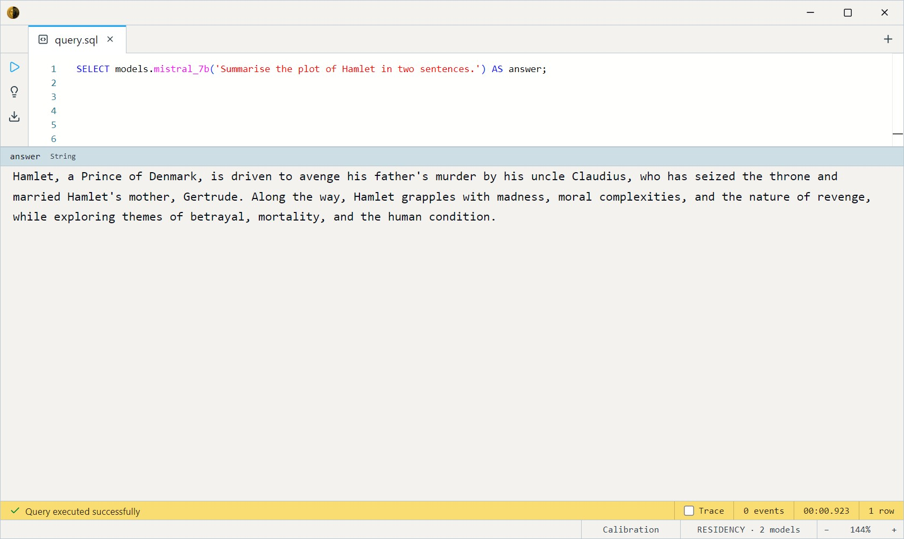
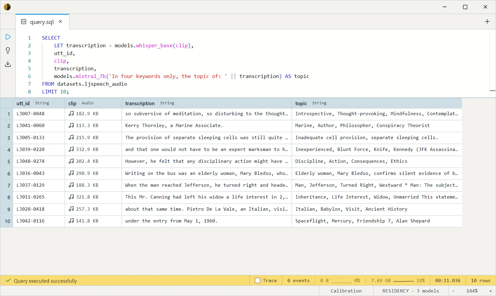

# Mistral 7B Instruct v0.3 (GGUF Q5_K_M)

Mistral AI's 7B-parameter instruction-tuned model at Q5_K_M (a touch
higher fidelity than the usual Q4 default). The **"just give me a good
general-purpose local LLM"** choice — a distinctive French-trained voice,
strong at everyday chat, summarisation, and extraction. Apache-2.0.

Two SQL surfaces share the weights: a **chat** entry (`ChatMessage` array)
and a **completion** entry (prompt string) that delegates to it.

- `mistral_7b_chat(messages Array<ChatMessage>, max_tokens Int32 = 4096, temperature Float32 = 0.7)`
- `mistral_7b(prompt String, max_tokens Int32 = 4096, temperature Float32 = 0.7)`

Both return `String`. GPU-preferred (~4.8 GB).

> **No system role.** Mistral's chat template historically **rejects
> `system` messages**. Put instructions in the first `user` message
> instead — or use a model with native system support
> ([Llama 3.1](../llama-3.1-8b/index.md), [Qwen](../qwen2.5-coder/index.md)).

## Example SQL

One-shot completion:

```sql
SELECT models.mistral_7b('Summarise the plot of Hamlet in two sentences.') AS answer;
```

Output:



Multi-turn chat — instructions go in the `user` message (no `system`):

```sql
SELECT models.mistral_7b_chat([
    { role: 'user', content: 'Reply in formal English. Explain what an index does in a database.' }
]) AS answer;
```

Process a table column — e.g. tag each transcribed clip. `||` concatenates
the instruction with another model's output:

```sql
SELECT
    utt_id,
    models.mistral_7b('In 3 words, the topic of: ' || models.whisper_base(clip)) AS topic
FROM datasets.ljspeech_audio
LIMIT 10;
```

Output:



## Output shape

Returns a single `String`. Mistral 7B v0.3 was trained at 32K context;
`max_tokens` caps at 32768 (default 4096).

## Tips

- **No `system` role** — see the note above; prepend instructions to the
  first user turn.
- **The general-purpose default.** Best all-round quality among the
  smaller models here; for the strongest chat discipline overall, Llama
  3.1 8B edges it.
- **`temperature = 0` for reproducibility**, 0.7 for balanced, higher for
  creativity.
- **GGUF via llama.cpp.** Q5_K_M weights; GPU-preferred, CPU-runnable at
  reduced speed.

## License & attribution

Apache-2.0. Original model by Mistral AI (Mistral 7B Instruct v0.3); GGUF
quantization by bartowski.

- Upstream: [mistralai/Mistral-7B-Instruct-v0.3](https://huggingface.co/mistralai/Mistral-7B-Instruct-v0.3)
- GGUF: [bartowski/Mistral-7B-Instruct-v0.3-GGUF](https://huggingface.co/bartowski/Mistral-7B-Instruct-v0.3-GGUF)
