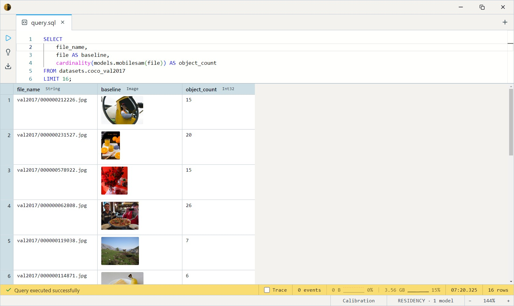

# MobileSAM (Segment Anything)

The phone-sized cousin of Meta's Segment Anything. A TinyViT image
encoder + SAM mask decoder: encode an image once, then carve out clean
object masks — either automatically across the whole frame, or for a
single thing you point at. ~60 MB total, CPU-runnable, Apache-2.0.

Unlike the salient-object models ([U²-Net](../u2net/index.md)) that emit
one foreground/background mask, SAM is *instance*-aware: it returns a
separate mask per object, and the point variant lets you pick exactly
which object.

## SQL-visible models

| Model              | Signature                              | Returns        | Mode                                            |
| ------------------ | -------------------------------------- | -------------- | ----------------------------------------------- |
| `mobilesam`        | `(img, grid_size Int32 = 16)`          | `Array<Image>` | **Everything** — auto-segment all objects.      |
| `mobilesam_point`  | `(img, x Float64, y Float64)`          | `Image`        | **Prompted** — segment the object at one click. |

Single variant (~60 MB, CPU). Each mask is a binary RGBA `Image` at the
source image's resolution.

> **No box-prompt body yet.** The catalog tags this as a box segmenter
> too, but the installed SQL ships only everything-mode and point-mode —
> box-prompted segmentation is a follow-up.

## Example SQL

COCO 2017 val is images-only — `file` is the decoded JPEG, `file_name`
its path.

Everything-mode: how many objects MobileSAM finds per image:

```sql
SELECT
    file_name,
    file AS baseline,
    cardinality(models.mobilesam(file)) AS object_count
FROM datasets.coco_val2017
LIMIT 16;
```

Output:



Prompted-mode: segment whatever sits at the image centre (coordinates
are original-image pixels — `(0, 0)` is top-left):

```sql
SELECT
    file_name,
    file AS baseline,
    models.mobilesam_point(file, image_width(file) / 2.0, image_height(file) / 2.0) AS mask
FROM datasets.coco_val2017
LIMIT 16;
```

Output:


Unnest the masks to one row per detected object:

```sql
SELECT
    a.file_name,
    a.file AS baseline,
    m.value AS mask
FROM datasets.coco_val2017 a
CROSS JOIN UNNEST(models.mobilesam(a.file)) m
LIMIT 100;
```

Trade speed for coverage with `grid_size` — more cells find more (and
smaller) objects, at grid_size² decoder passes per image:

```sql
SELECT
    file_name,
    cardinality(models.mobilesam(file, 32)) AS object_count
FROM datasets.coco_val2017
LIMIT 8;
```

## Output shape

- `mobilesam` → `Array<Image>`: one binary RGBA mask per surviving
  object, NMS-deduplicated, each at the source resolution. `UNNEST`
  exposes each as the `value` column.
- `mobilesam_point` → a single binary RGBA `Image` — the highest-
  confidence mask for the clicked object.

## Tips

- **Encode once, decode many.** The encoder runs a single pass per image;
  everything-mode then runs `grid_size²` decoder dispatches. Default
  `grid_size=16` is ~256 dispatches (~0.5–1 s on CPU) and finds the
  typical object set on COCO-class images.
- **`grid_size` is the recall/cost dial.** SAM's canonical 32 (~1024
  dispatches) finds more small objects but is ~3–5× slower; 16 is the
  default here to stay within memory limits. Range 4–128.
- **Point coordinates are original-image pixels** — `x` grows right, `y`
  grows down from the top-left. The 1024-space conversion is handled
  inside the body; pass raw pixel coords.
- **Masks compose like any Image.** Pair with `image_crop` /
  compositing to cut objects out. For plain foreground/background
  removal (one subject, no instances), [U²-Net](../u2net/index.md) is
  cheaper and simpler.

## License & attribution

Apache-2.0. Built on Meta AI Research's Segment Anything (Kirillov,
Mintun, Ravi et al.); distilled to MobileSAM by Chaoning Zhang et al.
(Kyung Hee University). ONNX export via samexporter.

- Paper (SAM): [Segment Anything](https://arxiv.org/abs/2304.02643)
- Paper (MobileSAM): [Faster Segment Anything](https://arxiv.org/abs/2306.14289)
- Source: [ChaoningZhang/MobileSAM](https://github.com/ChaoningZhang/MobileSAM)
