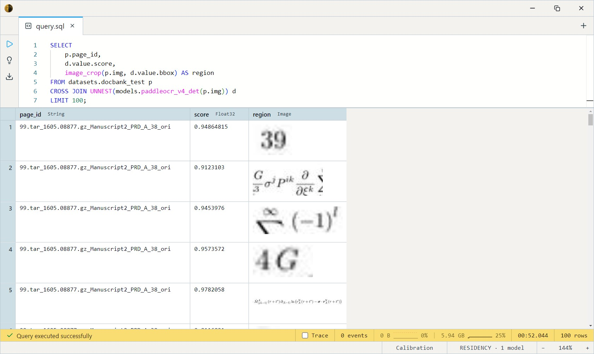

# PaddleOCR PP-OCRv4 Detection

Baidu's PP-OCRv4 text-region **detector** — a DBNet-style
binary-segmentation model that finds where text is in an image and
returns a box per region. It does *not* read the text; pair it with a
recognizer ([TrOCR](../trocr-base-printed/index.md) or Florence-2) on
each crop for end-to-end OCR. Tiny (~5 MB), CPU-fast, Apache-2.0.

One SQL-visible model ships:
`paddleocr_v4_det(img Image, …) RETURNS Array<RegionScore>`.

## Tuning parameters

`paddleocr_v4_det(img, pixel_threshold = 0.3, box_score_threshold = 0.6, min_size = 3, unclip_ratio = 1.5)`

| Param                 | Default | Effect                                                   |
| --------------------- | ------- | -------------------------------------------------------- |
| `pixel_threshold`     | 0.3     | Per-pixel probability cutoff for the binary mask.        |
| `box_score_threshold` | 0.6     | Mean-probability floor to keep a detected region.        |
| `min_size`            | 3       | Smallest accepted box side (resized-space pixels).       |
| `unclip_ratio`        | 1.5     | DBNet polygon expansion — higher keeps more margin.      |

Loosen the two thresholds on faded / low-contrast scans; tighten for
clean pages with dense text.

## Example SQL

DocBank pages are document images — `img` is the decoded page, `page_id`
its id, and `text` / `tokens` carry OCR ground truth.

Unnest to one row per region and crop each box out:

```sql
SELECT
    p.page_id,
    d.value.score,
    image_crop(p.img, d.value.bbox) AS region
FROM datasets.docbank_test p
CROSS JOIN UNNEST(models.paddleocr_v4_det(p.img)) d
LIMIT 100;
```

Output:



Loosen thresholds for a faded receipt scan (looser pixel mask + box
score):

```sql
SELECT
    receipt_id,
    cardinality(models.paddleocr_v4_det(img, 0.2, 0.5)) AS regions_loose
FROM datasets.cord_test
LIMIT 16;
```

Count text regions per page:

```sql
SELECT
    page_id,
    img AS baseline,
    cardinality(models.paddleocr_v4_det(img)) AS text_regions
FROM datasets.docbank_test
LIMIT 16;
```

End-to-end: detect here, then read each crop with TrOCR — see the
[TrOCR card](../trocr-base-printed/index.md) for the full two-stage query.

## Output shape

Returns `Array<RegionScore>`; `UNNEST` exposes each as the `value`
column:

```
bbox:  BoundingBox  -- {x, y, w, h} in source-image pixel coordinates
score: Float32      -- 0.0–1.0 mean region confidence
```

There's no text and no class label — this is detection only. Feed
`value.bbox` to `image_crop` and hand the crop to a recognizer.

## Tips

- **Detection, not recognition.** You get boxes, not characters. Chain a
  recognizer on the crops ([TrOCR](../trocr-base-printed/index.md),
  Florence-2's OCR task) to actually read the text.
- **Coordinates are source-image pixels** — already scaled back from the
  internal resize, so `image_crop(img, value.bbox)` works directly.
- **Longest side is capped at 960** (rounded to a multiple of 32)
  internally; very high-resolution scans are downsized before detection,
  which can merge tightly-spaced lines. Increase contrast / lower
  `pixel_threshold` if lines are missed.
- **Detect once, reuse.** Materialize the `Array<RegionScore>` column and
  unnest/crop from there rather than re-detecting per query.

## License & attribution

Apache-2.0. Original model by the PaddlePaddle authors / Baidu Inc.
(PaddleOCR contributors).

- Source: [PaddlePaddle/PaddleOCR](https://github.com/PaddlePaddle/PaddleOCR)
- Paper (DBNet): [Real-time Scene Text Detection with Differentiable Binarization](https://arxiv.org/abs/1911.08947)
