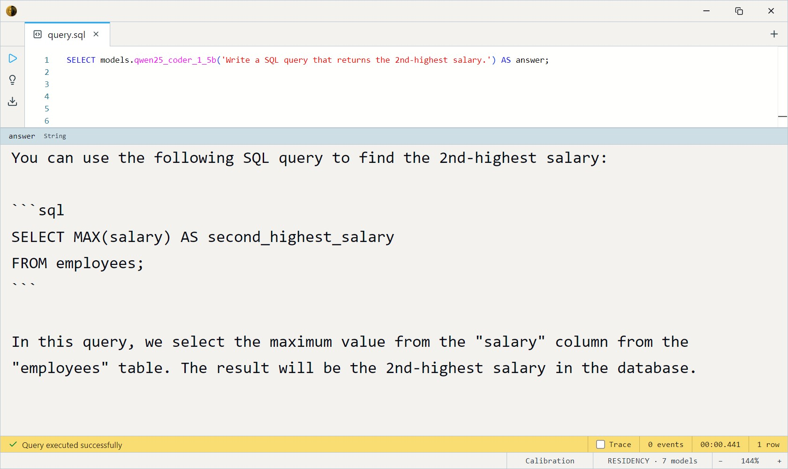
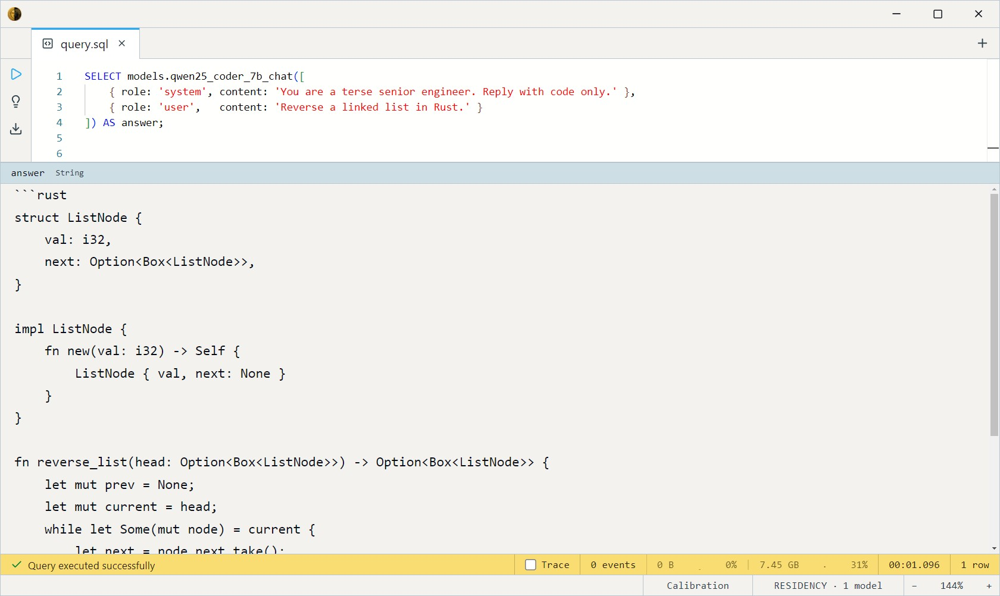

# Qwen2.5-Coder (GGUF)

Alibaba's coding-focused LLM family, quantized to GGUF for local
`llama.cpp` dispatch. Strong at code generation, explanation, and
transformation — the reach-for model when the task is *about code*. Two
sizes trade quality for VRAM. Apache-2.0.

Like every LLM in the zoo, each model registers two SQL surfaces: a
**chat** entry (multi-turn `ChatMessage` array) and a **completion** entry
(single prompt string) that delegates to it.

## Sizes and models

| Size | Chat model                | Completion model     | Disk    |
| ---- | ------------------------- | -------------------- | ------- |
| 1.5B | `qwen25_coder_1_5b_chat`  | `qwen25_coder_1_5b`  | ~1.1 GB |
| 7B   | `qwen25_coder_7b_chat`    | `qwen25_coder_7b`    | ~5.2 GB |

- `..._chat(messages Array<ChatMessage>, max_tokens Int32 = 1024, temperature Float32 = 0.7)`
- `...(prompt String, max_tokens Int32 = 1024, temperature Float32 = 0.7)`

Both return `String`. Start with **1.5B** for quick tasks; move up for
harder generation. All are GPU-preferred.

## Example SQL

One-shot completion — pass a prompt, get a string back:

```sql
SELECT models.qwen25_coder_1_5b('Write a SQL query that returns the 2nd-highest salary.') AS answer;
```

Output:



Multi-turn chat — a `ChatMessage` is `{role, content}`; roles are
`system` / `user` / `assistant`:

```sql
SELECT models.qwen25_coder_7b_chat([
    { role: 'system', content: 'You are a terse senior engineer. Reply with code only.' },
    { role: 'user',   content: 'Reverse a linked list in Rust.' }
]) AS answer;
```

Output:



Deterministic output — drop `temperature` to 0 for greedy decoding
(reproducible), and cap length with `max_tokens`:

```sql
SELECT models.qwen25_coder_1_5b('Explain what a CTE is, in one sentence.', 64, 0.0) AS answer;
```

## Output shape

Every model returns a single `String` — the generated text. Generation
stops at the model's end-of-turn marker or `max_tokens`, whichever comes
first.

## Tips

- **Chat vs completion is the same weights.** The completion model wraps
  your prompt as `[{role:'user', content:prompt}]` and calls the chat
  model — no extra VRAM. Use chat when you want a system prompt or
  multi-turn context.
- **`temperature = 0` for reproducibility.** 0.7 (default) is balanced;
  raise toward 1.5 for variety, drop to 0 for deterministic, testable
  output.
- **Coding specialist.** Tuned on code — strong at generation /
  refactoring / explanation, weaker at open-domain chat than the
  general models ([Mistral](../mistral-7b/index.md), [Llama 3.1](../llama-3.1-8b/index.md)).
- **GGUF via llama.cpp.** Quantized (Q4_K_M) weights; the runtime uses
  the GGUF's embedded chat template. GPU-preferred but CPU-runnable at
  reduced speed.

## License & attribution

Apache-2.0. Original model by Alibaba (Qwen 2.5 Coder); GGUF quantization
by bartowski. The license applies to the shipped 1.5B and 7B sizes — the
mid-size 3B is under the non-commercial Qwen Research License upstream
and is not in the catalog.

- Upstream: [Qwen2.5-Coder](https://huggingface.co/Qwen)
- GGUF: [bartowski/Qwen2.5-Coder-1.5B-Instruct-GGUF](https://huggingface.co/bartowski/Qwen2.5-Coder-1.5B-Instruct-GGUF)
