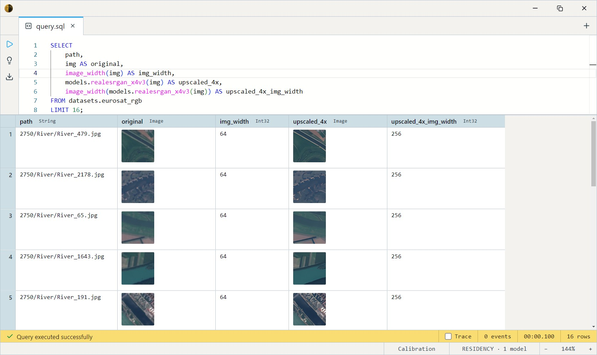
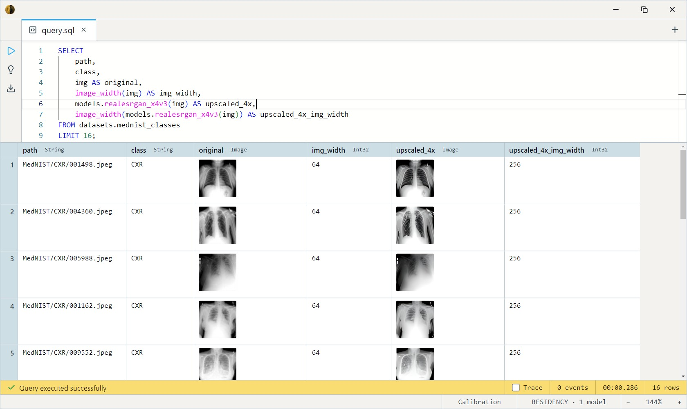

# Real-ESRGAN x4v3 (4× Upscaler)

Xintao Wang's Real-ESRGAN-Compact — a tiny (~5 MB, 1.2M-param) general
4× super-resolution network. Upscales a photo to 4× the resolution while
cleaning up real-world degradations (JPEG compression, sensor noise, mild
blur). Trained on real photographic degradations, not anime, and light
enough to run per-row in a SQL pipeline.

The default upscaler: small, fast, works on **any input size** (the ONNX
graph takes a dynamic shape). For higher transformer-quality results on
small tiles, see [SwinIR Real-World SR](../swinir-realsr-x4/index.md).

One SQL-visible model ships: `realesrgan_x4v3(img Image) RETURNS Image`.

## Example SQL

EuroSAT and MedNIST are 64×64 image corpora — `img` is the decoded image,
`path` its entry path, `class` its folder label.

Upscale EuroSAT's 64×64 satellite tiles to 256×256:

```sql
SELECT
    path,
    img AS original,
    image_width(img) AS img_width,
    models.realesrgan_x4v3(img) AS upscaled_4x,
    image_width(models.realesrgan_x4v3(img)) AS upscaled_4x_img_width
FROM datasets.eurosat_rgb
LIMIT 16;
```

Output:



Same on MedNIST's grayscale medical thumbnails:

```sql
SELECT
    path,
    class,
    img AS original,
    image_width(img) AS img_width,
    models.realesrgan_x4v3(img) AS upscaled_4x,
    image_width(models.realesrgan_x4v3(img)) AS upscaled_4x_img_width
FROM datasets.mednist_classes
LIMIT 16;
```

Output:




## Output shape

Returns an `Image` at exactly **4× the input dimensions** (a 64×64 input
becomes 256×256). RGB; the network output is already in [0, 1] so no
inverse normalization is applied.

## Tips

- **Fixed 4× — no scale knob.** There's no `outscale` parameter in v1
  (the engine has no generic image-resize primitive yet), so output is
  always 4×. Downsample yourself afterward if you need less.
- **Memory scales with output resolution.** A 1024×1024 input at 4×
  costs ~210 MB of intermediate floats; there's no tiling in v1, so very
  large inputs can be heavy. Small tiles (EuroSAT/MedNIST scale) are
  cheap.
- **General content, real degradations.** Tuned for real photos and
  screenshots, not illustration/anime. Pairs well with mildly compressed
  or noisy sources.
- **Upscale once, reuse.** The model call is the cost; materialize the
  upscaled `Image` into a column rather than re-running per query.

## License & attribution

BSD-3-Clause. Original model by Xintao Wang (Real-ESRGAN, Tencent ARC
Lab), © 2021.

- Source: [xinntao/Real-ESRGAN](https://github.com/xinntao/Real-ESRGAN)
- Paper: [Real-ESRGAN: Training Real-World Blind Super-Resolution with Pure Synthetic Data](https://arxiv.org/abs/2107.10833)
