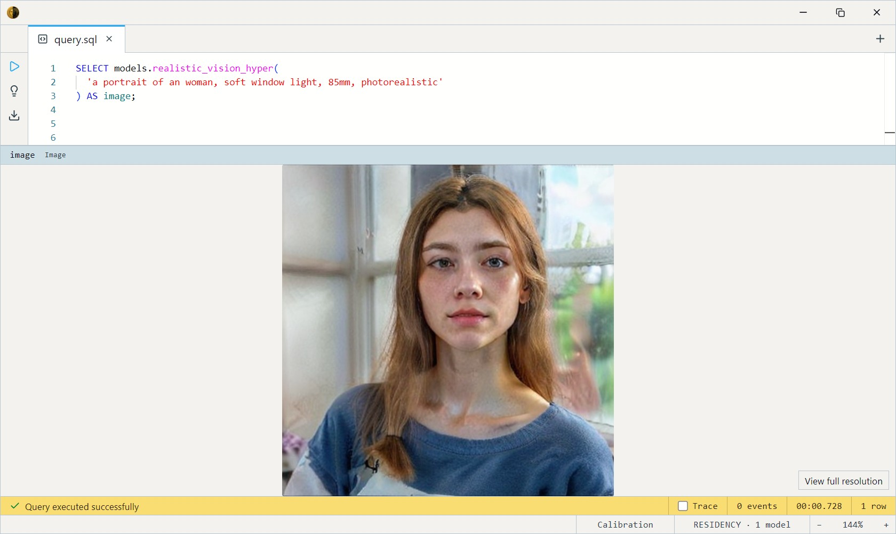
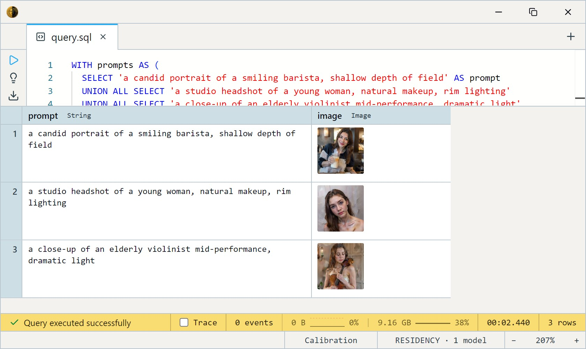

# Realistic Vision V6 + Hyper-SD (4-step)

SG161222's Realistic Vision V6 — a photoreal Stable Diffusion 1.5
fine-tune tuned for **people: faces, skin texture, portraits** — distilled
to **4 sampling steps** with ByteDance's Hyper-SD LoRA, and paired with
Stability's `sd-vae-ft-mse` VAE for cleaner decoding. Reach for it when
the subject is a person; it renders sharper faces than the other SD 1.5
Hyper variants. Its base is also more NSFW-permissive than the SFW
siblings — prompt accordingly.

One SQL-visible model ships: `realistic_vision_hyper`. It takes a text
`prompt` (and an optional `steps` count) and returns a 512×512 `Image`.
It's a true text-to-image model — no input image, no dataset; you
describe the subject and it renders it.

This is a GPU model: it wants ~4 GB of VRAM and CUDA for usable speed.

## Example SQL

Generate a single portrait from a prompt:

```sql
SELECT models.realistic_vision_hyper(
  'a portrait of an woman, soft window light, 85mm, photorealistic'
) AS image;
```

Output:



Generate several prompts in one query:

```sql
WITH prompts AS (
  SELECT 'a candid portrait of a smiling barista, shallow depth of field' AS prompt
  UNION ALL SELECT 'a studio headshot of a young woman, natural makeup, rim lighting'
  UNION ALL SELECT 'a close-up of an elderly violinist mid-performance, dramatic light'
)
SELECT prompt, models.realistic_vision_hyper(prompt) AS image
FROM prompts;
```

Output:



Trade quality for speed with the `steps` argument (1 is fastest, 4 is
the recommended minimum for face / detail quality):

```sql
SELECT models.realistic_vision_hyper(
  'a chef plating a dish in a busy kitchen', 2
) AS preview;
```

## Output shape

Returns a single 512×512 `Image`. There is no batch dimension — one call
produces one picture.

## Tips

- **Built for faces.** Portraits and skin are its strength; it'll render
  scenes too, but for landscapes / architecture
  [epiCRealism](../epicrealism-hyper/index.md) is the better photoreal pick.
- **NSFW-permissive base.** Unlike the SFW siblings, Realistic Vision's
  base can produce explicit content; there's no safety filter in the
  pipeline, so control it through your prompts.
- **4 steps is the sweet spot.** Hyper-SD was distilled for 1–4 steps;
  `steps` is capped at 8 and anything past 4 returns diminishing gains.
  Drop to 1–2 for fast previews, back to 4 for final renders.
- **Prompts are CLIP-limited to 77 tokens.** Roughly 50–60 words. Lead
  with the subject and the camera / lighting cues.
- **Reproducible with a seed; random without one.** Leave `seed` unset and
  each call samples fresh noise, so the same prompt yields a different image
  every time. Pass an integer `seed` to lock the initial noise and get the
  same image back for a given prompt and `steps` — handy once you land on a
  composition you like. The seed fixes this engine's noise only: results
  won't match other diffusion tools bit-for-bit, and GPU runs can still
  drift slightly.
- **No negative prompt in v1.** Steer entirely through the positive
  prompt; the classic `negative_prompt` channel isn't wired yet.

## License & attribution

CreativeML OpenRAIL-M — usable commercially, with use-based restrictions
(see the license). Fine-tune by SG161222; paired VAE `sd-vae-ft-mse` by
Stability AI; 4-step distillation via ByteDance's Hyper-SD LoRA; built on
CompVis / Stability AI's Stable Diffusion 1.5.

- Base fine-tune: [SG161222/Realistic_Vision_V6.0_B1_noVAE](https://huggingface.co/SG161222/Realistic_Vision_V6.0_B1_noVAE)
- Paired VAE: [stabilityai/sd-vae-ft-mse](https://huggingface.co/stabilityai/sd-vae-ft-mse)
- Distillation: [ByteDance/Hyper-SD](https://huggingface.co/ByteDance/Hyper-SD) — [paper](https://arxiv.org/abs/2404.13686)
- ONNX export: [Heliosoph/realistic-vision-hyper-onnx](https://huggingface.co/Heliosoph/realistic-vision-hyper-onnx)
