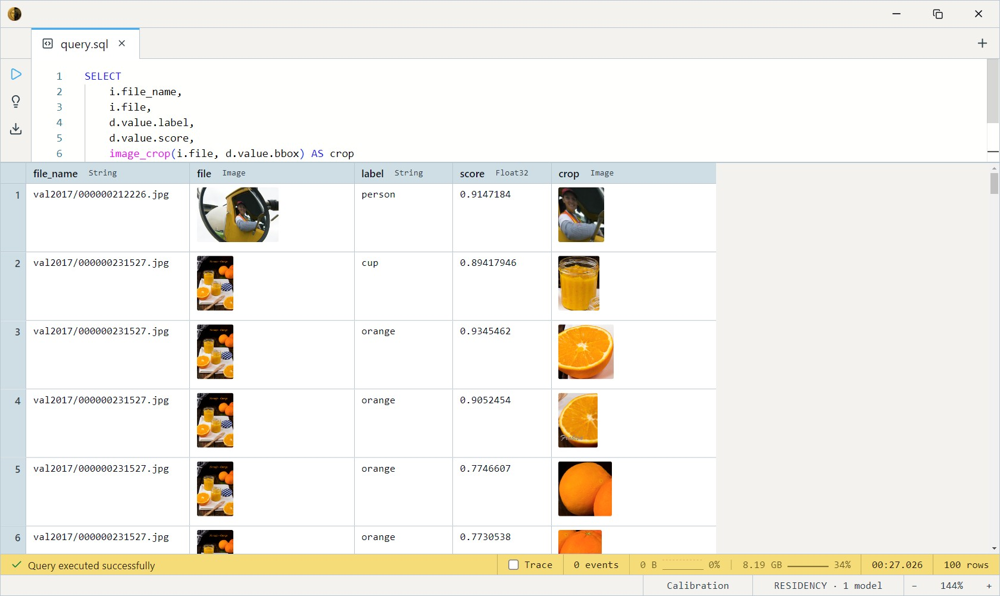

# RT-DETR-R18

Baidu's Real-Time DEtection TRansformer with a ResNet-18 backbone. Same
80 COCO categories as [YOLOX](../yolox/index.md), but with a transformer
detection head — it's *set-prediction*, so there's **no NMS**
post-processing step. Cleaner output pipeline, ~46 mAP at real-time
speed, Apache-2.0 throughout.

All three variants share the architecture, the COCO-80 label vocabulary,
and the decode path — they differ only in weight precision. Every
variant returns the same `Array<LabeledDetection>` shape, so swapping is
a one-line change to the `models.` name in your query.

## When to use which variant

| Variant | Model name        | Disk   | Runs on   | Best for                                                  |
| ------- | ----------------- | ------ | --------- | --------------------------------------------------------- |
| **fp32**| `rtdetr_r18`      | ~80 MB | CPU       | **Default / reference build.** Full-precision numerics.   |
| fp16    | `rtdetr_r18_fp16` | ~41 MB | CUDA      | GPUs with native fp16 — half the disk, no quality cost.   |
| INT8    | `rtdetr_r18_int8` | ~22 MB | CPU / NPU | Smallest footprint. Modest accuracy drop on small / crowded scenes. |

Start with **fp32** on CPU; drop to INT8 when deployment size matters,
or fp16 on a GPU. The examples below use `rtdetr_r18` — substitute the
name for another tier and nothing else changes.

## Confidence threshold

Every variant takes an optional second argument, `conf_thresh` (default
`0.5`), the per-query max-class-probability floor for emitting a box.
Lower it to surface more (and noisier) detections:

```sql
SELECT models.rtdetr_r18(file, 0.3) FROM datasets.coco_val2017 LIMIT 100;
```

## Example SQL

The COCO 2017 validation split is images-only — a `file` column carries
the decoded JPEG and `file_name` carries its path inside the source zip.

Detect objects and draw the boxes for spot-checking:

```sql
SELECT
    LET bboxes = models.rtdetr_r18(file),
    file_name,
    file AS baseline,
    image_draw_bounding_boxes(file, bboxes) AS annotated
FROM datasets.coco_val2017
LIMIT 12;
```

Unnest detections into one row per box, with a crop of each:

```sql
SELECT
    i.file_name,
    i.file,
    d.value.label,
    d.value.score,
    image_crop(i.file, d.value.bbox) AS crop
FROM datasets.coco_val2017 AS i
CROSS JOIN UNNEST(models.rtdetr_r18(i.file)) AS d
LIMIT 100;
```

Output:



Filter to a single class (people):

```sql
SELECT
    i.file_name,
    d.value.score,
    image_crop(i.file, d.value.bbox) AS crop
FROM datasets.coco_val2017 AS i
CROSS JOIN UNNEST(models.rtdetr_r18(i.file)) AS d
WHERE d.value.label = 'person'
LIMIT 100;
```

Count detections by class across the split:

```sql
SELECT d.value.label AS label, COUNT(*) AS hits
FROM datasets.coco_val2017 AS i
CROSS JOIN UNNEST(models.rtdetr_r18(i.file)) AS d
WHERE d.value.score > 0.4
GROUP BY d.value.label
ORDER BY hits DESC;
```

## Output shape

Every variant returns `Array<LabeledDetection>`:

```
bbox:  BoundingBox  -- {x, y, w, h} in pixel coordinates of the input image
label: String       -- COCO class name (e.g. "person", "car")
score: Float32      -- 0.0–1.0 max-class probability
```

`UNNEST` exposes each element as a single `value` column, so field
access is `value.label` / `value.score` / `value.bbox`. The 80 COCO
categories are the standard set — see the
[COCO label list](https://github.com/amikelive/coco-labels).

## Tips

- **No NMS knob — by design.** RT-DETR is set-prediction: the
  transformer head emits a fixed 300 queries and the post-process keeps
  the ones above `conf_thresh`. There's no IoU/overlap threshold to tune
  the way there is for YOLOX; control recall via `conf_thresh` alone.
- **Coordinates are pixels in the input image** — already denormalized
  back to the original resolution. No scaling needed before
  `image_crop` / `image_draw_bounding_boxes`.
- **Preprocessing is rescale-only** — pixel/255 to 640×640, *no*
  ImageNet mean/std (the upstream processor sets `do_normalize: false`).
  The model body handles this; pass the raw `Image` column straight in.
- **Detect once, filter many.** The model call is the expensive part.
  Materialize detections into an `Array<LabeledDetection>` column and
  unnest/filter over that rather than re-detecting per query.

## License & attribution

Apache-2.0. Original model by Baidu (RT-DETR — Lv, Xu, Zhao et al.,
PaddlePaddle team); ONNX export by onnx-community, re-hosted via the
HuggingFace mirror.

- Paper: [DETRs Beat YOLOs on Real-time Object Detection](https://arxiv.org/abs/2304.08069)
- Source: [lyuwenyu/RT-DETR](https://github.com/lyuwenyu/RT-DETR)
- ONNX export: [onnx-community/rtdetr_r18vd_coco_o365](https://huggingface.co/onnx-community/rtdetr_r18vd_coco_o365)
