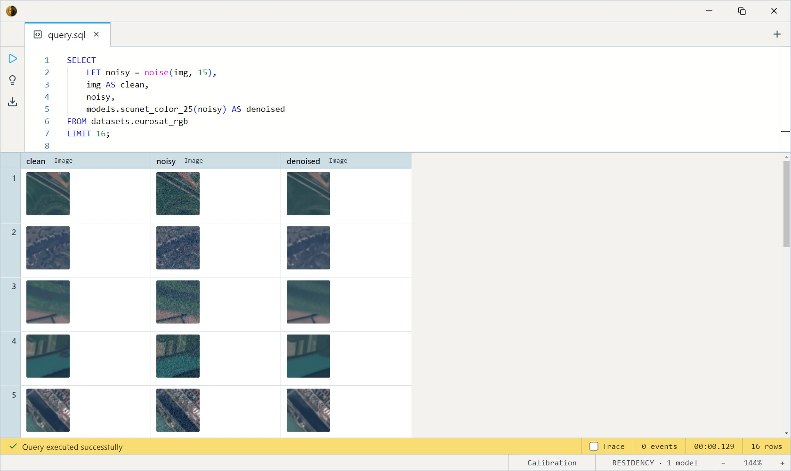
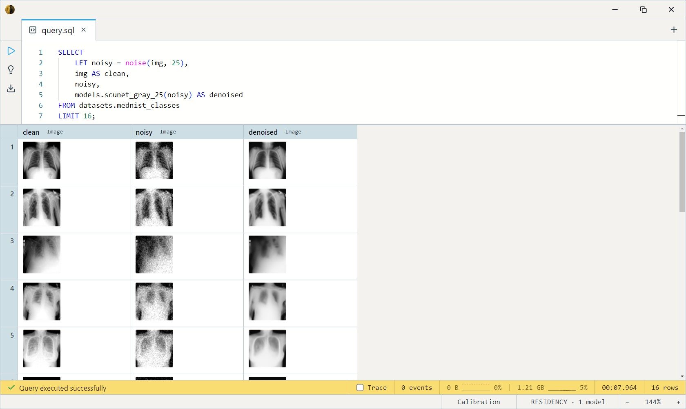

# SCUNet (Image Denoising)

A Swin-Conv UNet for image denoising — the recommended general denoiser in
the catalog. Unlike the pinned-size [SwinIR denoiser](../swinir-denoising-color-25/index.md),
SCUNet runs **full-frame** (aspect-preserving resize to a /64 stride, with
a memory dial), and ships both synthetic-noise specialists and two
real-photo blind variants.

All variants share the architecture, the `ImageRestorer` task, and the
same `(img, max_side)` signature — they differ in colour vs grayscale,
the noise level they're tuned for, and synthetic vs real-photo training.

## SQL-visible models

Name scheme: `scunet_<color|gray>_<15|25|50>` for synthetic-Gaussian
specialists, `scunet_color_real_<psnr|gan>` for real-photo blind denoising.

| Model                      | Tuned for                                              |
| -------------------------- | ----------------------------------------------------- |
| `scunet_color_15/25/50`    | Colour, synthetic Gaussian noise at σ = 15 / 25 / 50. |
| `scunet_gray_15/25/50`     | Grayscale, same three σ levels.                       |
| `scunet_color_real_psnr`   | **Real** photo noise — PSNR-tuned (high fidelity).    |
| `scunet_color_real_gan`    | **Real** photo noise — GAN-tuned (perceptually crisp).|

Each takes `(img Image, max_side Int32 = 1024)` and returns an `Image`.
`max_side` caps the long edge after resize — the memory dial (~1 GB
activations at 1024, ~4 GB at 2048, ~12 GB at 4096).

Pick the σ that matches your noise; for unknown real-world noise use a
`_real_` variant (PSNR for fidelity, GAN for perceptual sharpness).

## Example SQL

EuroSAT and MedNIST are 64×64 image corpora — `img` is the decoded image,
`path` its entry path, `class` its folder label.

Add σ=15 noise, then denoise it — bind the noisy image with `LET`
so the *same* noise is shown and removed (`noise()` draws fresh randomness
on every call):

```sql
SELECT
    LET noisy = noise(img, 25),
    img AS clean,
    noisy,
    models.scunet_color_25(noisy) AS denoised
FROM datasets.eurosat_rgb
LIMIT 16;
```

Output:



Grayscale denoising on MedNIST's medical thumbnails:

```sql
SELECT
    LET noisy = noise(img, 25),
    img AS clean,
    noisy,
    models.scunet_gray_25(noisy) AS denoised
FROM datasets.mednist_classes
LIMIT 16;
```

Output:



Real-photo blind denoising — no synthetic noise, run straight on the
source (compare PSNR vs GAN tuning):

```sql
SELECT
    path,
    img AS original,
    models.scunet_color_real_psnr(img) AS psnr,
    models.scunet_color_real_gan(img)  AS gan
FROM datasets.eurosat_rgb
LIMIT 12;
```

## Output shape

Returns an `Image` at the resized resolution (long edge ≤ `max_side`,
both sides snapped to a multiple of 64). RGB for `color` / `_real_`
variants; grayscale models denoise the luma.

## Tips

- **`LET` is mandatory with `noise()`.** It's a non-pure function —
  calling `noise(img, 25)` twice yields *different* noise, so without a
  `LET` binding the "noisy" column and the denoiser's input wouldn't
  match. Bind once, reference twice.
- **Match σ to your noise.** `_15` ≈ light, `_25` ≈ moderate (typical
  night phone photo), `_50` ≈ heavy. Mismatched σ over- or under-smooths.
  For unknown noise, the `_real_` blind variants are safer.
- **`max_side` is the memory/quality dial.** Default 1024 fits ~1 GB of
  activations; raise toward 4096 for full-resolution restoration if you
  have the RAM/VRAM, lower it to bound cost.
- **Full-frame, not pinned.** Unlike SwinIR's fixed 128×128 denoiser,
  SCUNet preserves aspect ratio — the better choice for real images of
  arbitrary shape.

## License & attribution

Apache-2.0. Original model by Zhang, Li, Liang, Cao, Zhang, Tang, Fan,
Timofte, Van Gool (SCUNet); ONNX export re-hosted under `Heliosoph`.

- Source: [cszn/SCUNet](https://github.com/cszn/SCUNet)
- Paper: [Practical Blind Image Denoising via Swin-Conv-UNet and Data Synthesis](https://arxiv.org/abs/2203.13278)
