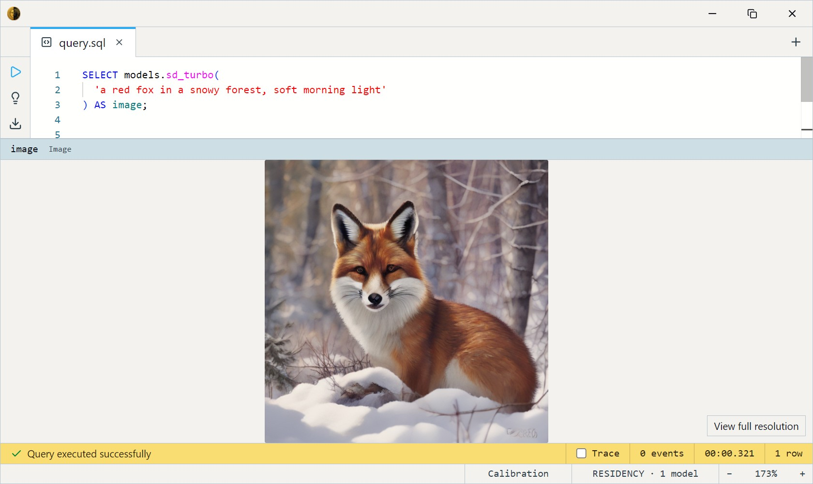
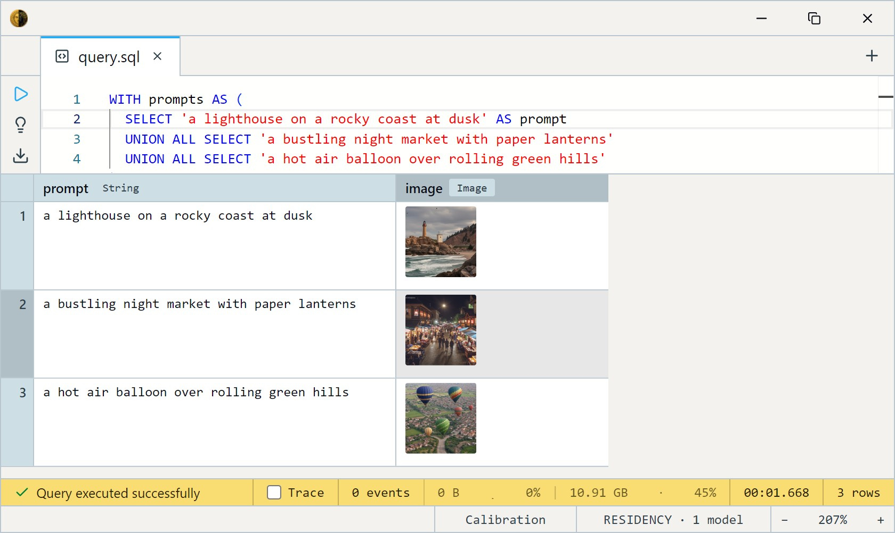

# SD Turbo (1-4 step)

Stability AI's SD Turbo — an Adversarial Diffusion Distillation (ADD) of
**Stable Diffusion 2.1**, built for 1–4 step text-to-image at 512×512.
The reference small-and-fast diffusion model: faster than the SD 1.5
Hyper variants and, crucially, **not a fine-tune** — no style bias, no
activator phrase, just the broadly-capable Stability baseline.

Pick it over the SD 1.5 Hyper variants when you want the canonical model
rather than someone's aesthetic fine-tune; pick it over
[SDXL Turbo](../sdxl-turbo/index.md) when 512×512 is enough and you want faster
renders from a much smaller UNet. In practice both land near ~10 GB of
VRAM — the runtime's workspace dominates either way — so the win here is
speed, not footprint.

One SQL-visible model ships: `sd_turbo`. It takes a text `prompt`, an
optional `steps` count, and an optional output `size`, and returns an
`Image`. No input image, no dataset — you describe the scene and it
renders it.

This is a GPU model: it wants ~10 GB of VRAM and CUDA for usable speed.

## Example SQL

Generate a single image — SD Turbo's design point is a **single step**:

```sql
SELECT models.sd_turbo(
  'a red fox in a snowy forest, soft morning light'
) AS image;
```

Output:



The fastest possible render — one step:

```sql
SELECT models.sd_turbo('a bowl of fresh strawberries on a wooden table', 1) AS image;
```

Generate several prompts in one query:

```sql
WITH prompts AS (
  SELECT 'a lighthouse on a rocky coast at dusk' AS prompt
  UNION ALL SELECT 'a bustling night market with paper lanterns'
  UNION ALL SELECT 'a hot air balloon over rolling green hills'
)
SELECT prompt, models.sd_turbo(prompt) AS image
FROM prompts;
```

Output:



Render larger than the 512 default — `size` is the third argument (a
multiple of 8; quality drifts above 512, VRAM cost grows ~quadratically):

```sql
SELECT models.sd_turbo(
  'a detailed fantasy map of an island kingdom', 4, 768
) AS image;
```

## Output shape

Returns a single `Image`, `size`×`size` (default 512×512). One call
produces one picture — no batch dimension.

## Tips

- **One step is the design target.** ADD distillation optimizes for
  single-step generation; `steps` defaults to 4 (the quality sweet spot)
  but `1` is genuinely usable and the fastest. Past 4 returns diminishing
  gains.
- **512 is the sweet spot.** `size` accepts 256–1024 in multiples of 8,
  but the model was distilled at 512 — bigger sizes cost roughly
  quadratic VRAM and drift in quality. Use 512 unless you specifically
  need more.
- **No fine-tune bias, no activator.** Unlike the SD 1.5 variants there's
  no trained trigger phrase to include and no built-in style — describe
  the look you want explicitly.
- **Prompts are CLIP-limited to 77 tokens** (~50–60 words). SD Turbo uses
  the CLIP-H text encoder, but the 77-token cap is the same; lead with
  what matters.
- **Reproducible with a seed; random without one.** Leave `seed` unset and
  each call samples fresh noise, so the same prompt yields a different image
  every time. Pass an integer `seed` to lock the initial noise and get the
  same image back for a given prompt, `steps`, and `size` — handy once you
  land on a composition you like. The seed fixes this engine's noise only:
  results won't match other diffusion tools bit-for-bit, and GPU runs can
  still drift slightly.
- **No negative prompt in v1.** Steer entirely through the positive
  prompt; the classic `negative_prompt` channel isn't wired yet.

## License & attribution

**Stability AI Community License** — free for individuals and for
commercial use below $1M annual revenue; above that threshold an
enterprise license is required. Review the license before commercial
deployment.

- Upstream: [stabilityai/sd-turbo](https://huggingface.co/stabilityai/sd-turbo)
- Method: [Adversarial Diffusion Distillation](https://arxiv.org/abs/2311.17042) (Sauer, Lorenz, Blattmann, Rombach, 2023)
- ONNX export: [Heliosoph/sd-turbo-onnx](https://huggingface.co/Heliosoph/sd-turbo-onnx)
