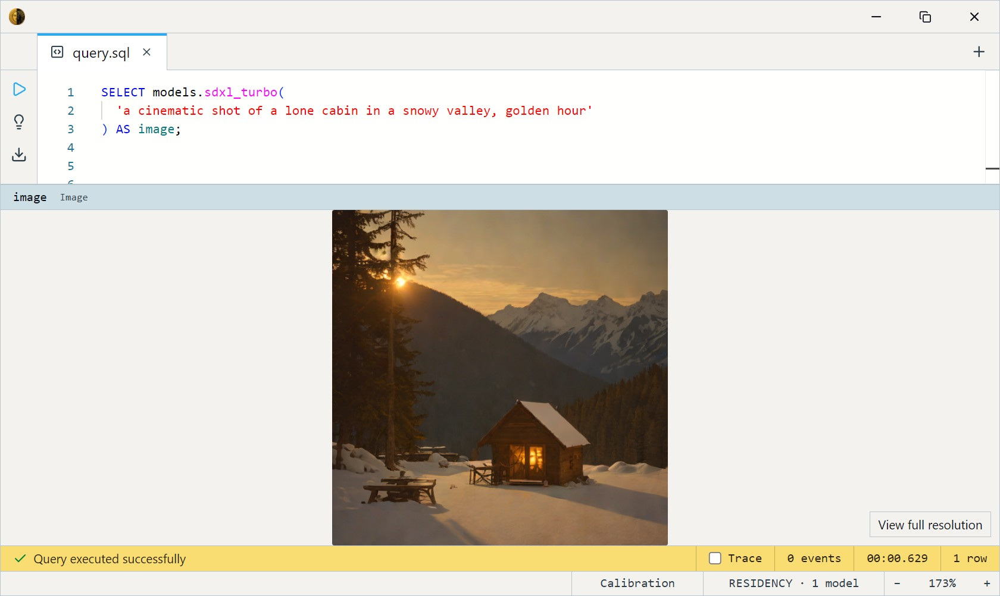
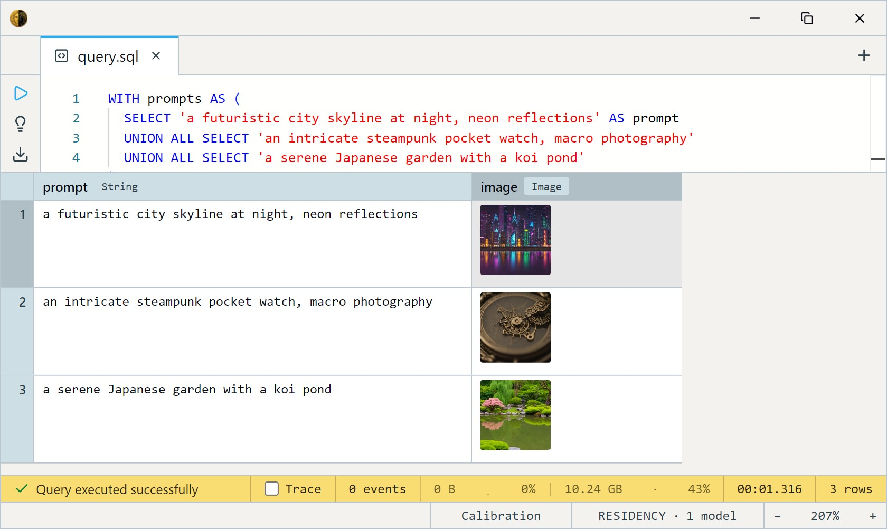

# SDXL Turbo (1-4 step)

Stability AI's SDXL Turbo — an Adversarial Diffusion Distillation (ADD)
of **SDXL base**, built for 1–4 step text-to-image. The step up from
[SD Turbo](../sd-turbo/index.md): SDXL's dual text encoders and larger UNet give
stronger prompt adherence and a better aesthetic baseline, at the cost of
slower renders. VRAM is similar — both land near ~10 GB at 512×512.
Like SD Turbo it's the Stability baseline, **not a fine-tune** — no style
bias, no activator phrase.

Pick it over SD Turbo when prompt adherence and compositional quality
matter more than throughput; pick it over
[JuggernautXL Lightning](../juggernaut-xl-lightning/index.md) when you want the
Stability baseline rather than a community fine-tune and 512×512 output
is enough.

One SQL-visible model ships: `sdxl_turbo`. It takes a text `prompt`, an
optional `steps` count, and an optional output `size`, and returns an
`Image`. No input image, no dataset — you describe the scene and it
renders it.

This is a heavier GPU model: plan for ~10 GB of VRAM and CUDA at the
default 512×512 (it grows ~quadratically with `size`).

## Example SQL

Generate a single image — SDXL Turbo's design point is a **single step**:

```sql
SELECT models.sdxl_turbo(
  'a cinematic shot of a lone cabin in a snowy valley, golden hour'
) AS image;
```

Output:



The fastest possible render — one step:

```sql
SELECT models.sdxl_turbo('a still life of citrus fruit, studio lighting', 1) AS image;
```

Generate several prompts in one query:

```sql
WITH prompts AS (
  SELECT 'a futuristic city skyline at night, neon reflections' AS prompt
  UNION ALL SELECT 'an intricate steampunk pocket watch, macro photography'
  UNION ALL SELECT 'a serene Japanese garden with a koi pond'
)
SELECT prompt, models.sdxl_turbo(prompt) AS image
FROM prompts;
```

Output:



Render larger than the 512 default — `size` is the third argument (a
multiple of 8; quality drifts above 512 since the distillation target is
512, and VRAM grows ~quadratically):

```sql
SELECT models.sdxl_turbo(
  'a sweeping fantasy landscape with floating islands', 4, 1024
) AS image;
```

## Output shape

Returns a single `Image`, `size`×`size` (default 512×512). One call
produces one picture — no batch dimension.

## Tips

- **One step is the design target.** ADD distillation optimizes for
  single-step generation; `steps` defaults to 4 (the quality sweet spot)
  but `1` is genuinely usable and fastest. Past 4 returns diminishing
  gains.
- **512 is the distillation point.** `size` accepts 256–1024 in multiples
  of 8. Unlike full SDXL (1024-native), Turbo was distilled at 512 — so
  512 is fastest and most faithful; 768 / 1024 work (the UNet is full
  SDXL) but cost ~quadratic VRAM and drift in quality.
- **Stronger prompt adherence than SD Turbo.** The dual CLIP-L +
  OpenCLIP-G encoders track complex / compositional prompts better — it's
  the main reason to pick it over SD Turbo.
- **No fine-tune bias, no activator.** No trained trigger phrase, no
  built-in style — describe the look you want explicitly.
- **Prompts are CLIP-limited to 77 tokens** (~50–60 words). Both encoders
  share the same 77-token sequence; lead with what matters.
- **Reproducible with a seed; random without one.** Leave `seed` unset and
  each call samples fresh noise, so the same prompt yields a different image
  every time. Pass an integer `seed` to lock the initial noise and get the
  same image back for a given prompt, `steps`, and `size` — handy once you
  land on a composition you like. The seed fixes this engine's noise only:
  results won't match other diffusion tools bit-for-bit, and GPU runs can
  still drift slightly.
- **No negative prompt in v1.** Steer entirely through the positive
  prompt; the classic `negative_prompt` channel isn't wired yet.

## License & attribution

**Stability AI Community License** — free for individuals and for
commercial use below $1M annual revenue; above that threshold an
enterprise license is required. Review the license before commercial
deployment.

- Upstream: [stabilityai/sdxl-turbo](https://huggingface.co/stabilityai/sdxl-turbo)
- Method: [Adversarial Diffusion Distillation](https://arxiv.org/abs/2311.17042) (Sauer, Lorenz, Blattmann, Rombach, 2023)
- ONNX export: [Heliosoph/sdxl-turbo-onnx](https://huggingface.co/Heliosoph/sdxl-turbo-onnx)
