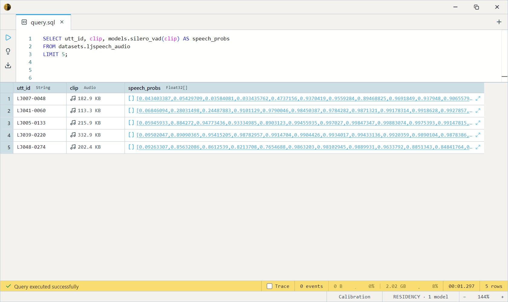

# Silero VAD (Voice Activity Detection)

Silero's tiny (~2 MB) voice-activity detector. Given an audio clip, it
returns a **speech probability for every 32 ms frame** — a curve of "is
someone talking right now" across the recording. The standard front-end
for gating ASR: run VAD first, keep the speech, skip the silence before
feeding [Whisper](../whisper/index.md).

It's recurrent (LSTM): each frame's prediction threads hidden state from
the previous frame, so the model body loops over 512-sample (32 ms @
16 kHz) windows internally. You just pass an `Audio` clip.

## Variants

| Variant  | Model name        | Disk  | Notes                          |
| -------- | ----------------- | ----- | ------------------------------ |
| **fp32** | `silero_vad`      | ~2 MB | **Default.**                   |
| fp16     | `silero_vad_fp16` | ~1 MB | Half the disk, same behaviour. |

Each takes `(clip Audio)` and returns `Array<Float32>` — one P(speech) ∈
[0, 1] per 32 ms frame. Both are CPU models.

## Example SQL

LJSpeech is single-speaker English audio — `clip` is the decoded WAV,
`utt_id` its utterance id.

Per-frame speech probabilities for a clip:

```sql
SELECT utt_id, clip, models.silero_vad(clip) AS speech_probs
FROM datasets.ljspeech_audio
LIMIT 5;
```

Output:



Summarise each clip — mean speech probability and frame count (bind the
call once with `LET`):

```sql
SELECT
    LET vad = models.silero_vad(clip),
    clip,
    utt_id,
    array_avg(vad) AS mean_speech_prob,
    cardinality(vad) AS frames
FROM datasets.ljspeech_audio
LIMIT 20;
```

Output:


Find the clips that are almost entirely speech (little leading/trailing
silence):

```sql
SELECT utt_id, mean_speech
FROM (
    SELECT utt_id, array_avg(models.silero_vad(clip)) AS mean_speech
    FROM datasets.ljspeech_audio
    LIMIT 200
) t
WHERE mean_speech > 0.9
ORDER BY mean_speech DESC;
```

## Output shape

Returns `Array<Float32>` — one entry per 32 ms window, each the
probability that the window contains speech (higher = speech, lower =
silence / noise). A trailing partial frame (< 512 samples) is dropped.
Threshold at ≥ 0.5 conventionally to turn the curve into speech/silence
segments.

## Tips

- **16 kHz mono internally.** The body downmixes to mono and resamples to
  16 kHz (`audio_to_mono` + `audio_samples`), so pass any `Audio` column
  — stereo, 44.1 kHz, whatever — straight in.
- **Frames are 32 ms.** Multiply a frame index by 0.032 s to get a
  timestamp; `cardinality(probs) × 32 ms` ≈ clip duration (minus the
  dropped trailing partial frame).
- **Pairs with Whisper.** Use the probability curve to trim silence or
  chunk long recordings into speech segments before transcription —
  cheaper and cleaner than feeding raw audio to ASR.
- **Threshold, then smooth.** A hard 0.5 cut can flicker on breaths /
  pauses; downstream pipelines usually merge gaps shorter than a few
  hundred ms into contiguous speech.

## License & attribution

MIT. Original model by the Silero Team (silero.ai); ONNX export by
onnx-community.

- Upstream: [snakers4/silero-vad](https://github.com/snakers4/silero-vad)
