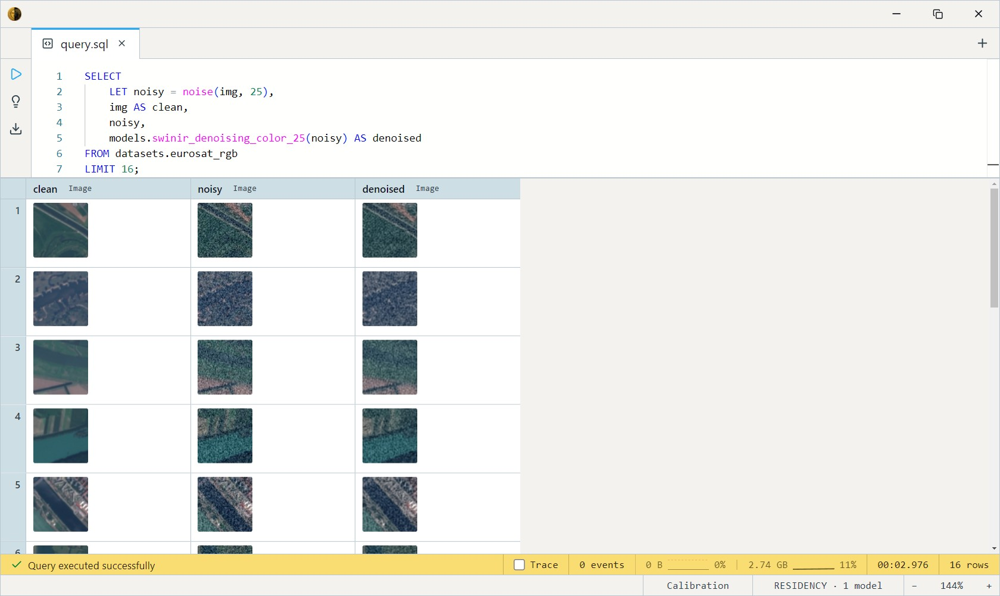
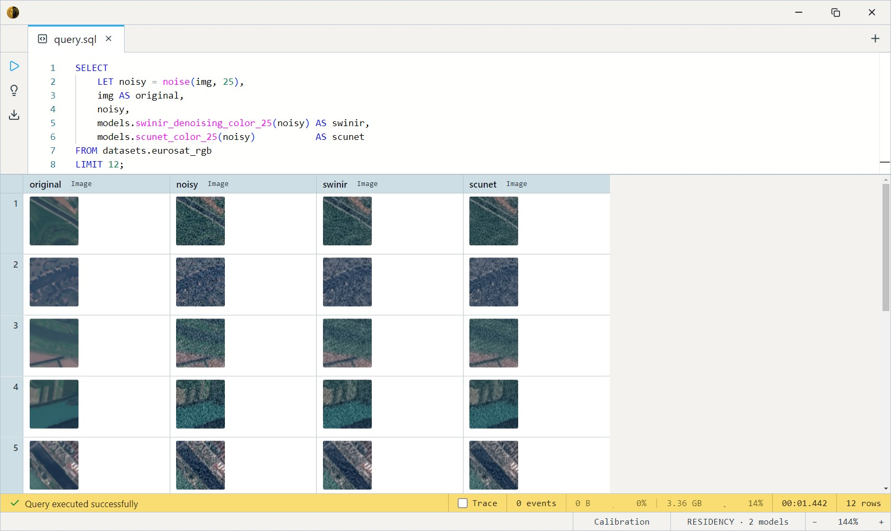

# SwinIR Color Denoising (σ=25)

The Swin Transformer for Image Restoration, colour-denoising variant,
specialised on Gaussian noise at **σ=25** — the standard
denoising-benchmark reference level. Pick it for σ≈25 matched conditions
or benchmark reproduction; for full-frame real-world noise, the
[SCUNet](../scunet/index.md) family is the better general choice.

One SQL-visible model ships: `swinir_denoising_color_25(img Image) RETURNS Image`.

> **Pinned 128×128.** This export hard-codes a 128×128 input/output. Any
> other size is stretch-resized to 128×128 on the way in, which aliases
> non-square / larger inputs. Best on small or already-square sources;
> for arbitrary-shape full-frame denoising use SCUNet (aspect-preserving).
> Tiled full-frame denoising is a follow-up.

## Example SQL

EuroSAT and MedNIST are 64×64 image corpora — `img` is the decoded image,
`path` its entry path, `class` its folder label.

Add σ=25 noise, then denoise — bind the noisy image with `LET` so
the *same* noise is shown and removed (`noise()` draws fresh randomness on
every call):

```sql
SELECT
    LET noisy = noise(img, 25),
    img AS clean,
    noisy,
    models.swinir_denoising_color_25(noisy) AS denoised
FROM datasets.eurosat_rgb
LIMIT 16;
```

Output:



Compare the σ=25 specialists — SwinIR (pinned 128×128) vs SCUNet
(full-frame) on the same noisy input:

```sql
SELECT
    LET noisy = noise(img, 25),
    noisy,
    models.swinir_denoising_color_25(noisy) AS swinir,
    models.scunet_color_25(noisy)           AS scunet
FROM datasets.eurosat_rgb
LIMIT 12;
```

Output:



## Output shape

Returns a 128×128 RGB `Image` (the pinned output size). Because the input
is resized to 128×128, output is always 128×128 regardless of source
dimensions.

## Tips

- **`LET` is mandatory with `noise()`.** It's non-pure — two calls give
  different noise, so bind the noisy image once and reference it for both
  display and denoising.
- **σ=25 is the sweet spot — and the only level.** This is a fixed-σ
  specialist; feeding it much lighter or heavier noise over- or
  under-smooths. SCUNet offers σ=15/25/50 plus blind real-photo variants.
- **Pinned 128×128.** Great for small/square sources; for real photos of
  arbitrary shape, SCUNet preserves aspect ratio and won't alias.

## License & attribution

Apache-2.0. Original model by Liang, Cao, Sun, Zhang, Van Gool, Timofte
(SwinIR, ETH Zürich and others); ONNX export re-hosted under `Heliosoph`.

- Source: [JingyunLiang/SwinIR](https://github.com/JingyunLiang/SwinIR)
- Paper: [SwinIR: Image Restoration Using Swin Transformer](https://arxiv.org/abs/2108.10257)
