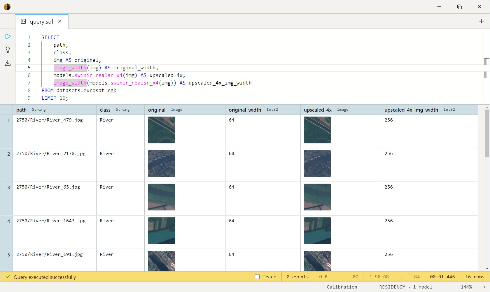
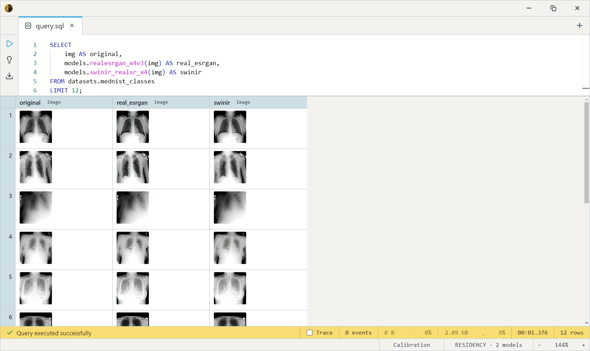

# SwinIR Real-World SR (4×)

The Swin Transformer for Image Restoration, real-world super-resolution
variant. Upscales by 4× while cleaning compression artifacts, sensor
noise, and mild blur — higher quality than
[Real-ESRGAN](../realesrgan-x4v3/index.md) on its native tile size, at the
cost of being heavier (~110 MB, GPU-preferred).

One SQL-visible model ships: `swinir_realsr_x4(img Image) RETURNS Image`.

> **Pinned 64×64 input → 256×256 output.** This ONNX export hard-codes a
> 64×64 input. Images of any other size are stretch-resized to 64×64
> first, which **strongly aliases** non-64×64 inputs. It's at its best on
> images that are *already* ~64×64 — which makes EuroSAT and MedNIST
> (both native 64×64) ideal, and arbitrary-size photos a poor fit (use
> Real-ESRGAN there instead). Tiled full-frame SR is a follow-up.

## Example SQL

EuroSAT and MedNIST are native 64×64 corpora — `img` is the decoded
image, `path` its entry path, `class` its folder label. No aliasing here:
the input already matches the model's pinned size.

Upscale EuroSAT's 64×64 satellite tiles to a crisp 256×256:

```sql
SELECT
    path,
    class,
    img AS original,
    image_width(img) AS original_width,
    models.swinir_realsr_x4(img) AS upscaled_4x,
    image_width(models.swinir_realsr_x4(img)) AS upscaled_4x_img_width
FROM datasets.eurosat_rgb
LIMIT 16;
```

Output:



Compare SwinIR against Real-ESRGAN on the same tiles — both take 64×64 to 256×256, SwinIR usually sharper:

```sql
SELECT
    img AS original,
    models.realesrgan_x4v3(img) AS real_esrgan,
    models.swinir_realsr_x4(img) AS swinir
FROM datasets.mednist_classes
LIMIT 12;
```

Output:



## Output shape

Returns a 256×256 RGB `Image` (4× the pinned 64×64 input). Fixed size —
because the input is pinned, the output always lands at 256×256.

## Tips

- **Feed it ~64×64 inputs.** On native-64×64 data (EuroSAT, MedNIST,
  thumbnails) it shines. On larger images the internal squash-to-64
  throws away detail before upscaling — there [Real-ESRGAN](../realesrgan-x4v3/index.md)
  (dynamic input size) is the right tool.
- **GPU-preferred.** The SwinIR-L config (240-dim embeddings) is far
  heavier than Real-ESRGAN's Compact backbone; CPU works but is slow.
- **SR + restoration in one pass.** It denoises and de-artifacts while
  upscaling, so a slightly degraded 64×64 source comes out cleaner as
  well as larger.

## License & attribution

Apache-2.0. Original model by Liang, Cao, Sun, Zhang, Van Gool, Timofte
(SwinIR, ETH Zürich and others); ONNX export re-hosted under `Heliosoph`.

- Source: [JingyunLiang/SwinIR](https://github.com/JingyunLiang/SwinIR)
- Paper: [SwinIR: Image Restoration Using Swin Transformer](https://arxiv.org/abs/2108.10257)
