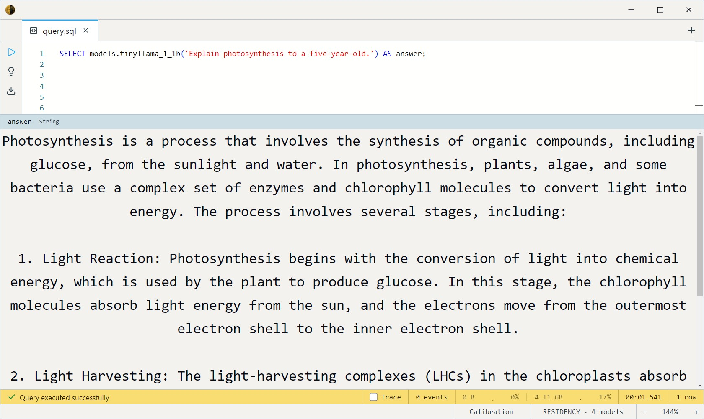
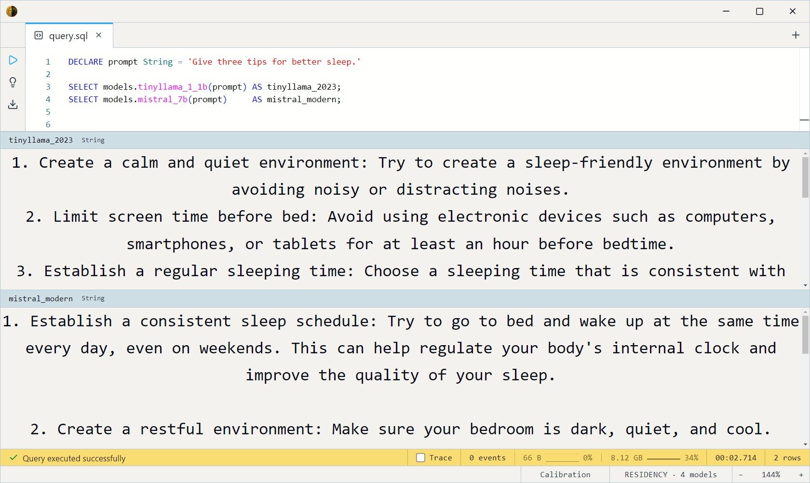

# TinyLlama 1.1B Chat v1.0 (GGUF Q4_K_M)

A small (1.1B-parameter) Apache-2.0 chat model with a distinctly
**2023-era voice**. Its value in the zoo is as a *tonal reference point*:
run the same prompt through TinyLlama and a modern instruction-tuned
model and the difference in prose, hedging, and formatting is immediate.
Tiny (~700 MB) and fast.

Two SQL surfaces share the weights: a **chat** entry (`ChatMessage` array)
and a **completion** entry (prompt string) that delegates to it.

- `tinyllama_1_1b_chat(messages Array<ChatMessage>, max_tokens Int32 = 256, temperature Float32 = 0.7)`
- `tinyllama_1_1b(prompt String, max_tokens Int32 = 256, temperature Float32 = 0.7)`

Both return `String`.

## Example SQL

One-shot completion:

```sql
SELECT models.tinyllama_1_1b('Explain photosynthesis to a five-year-old.') AS answer;
```

Output:



Multi-turn chat — a `ChatMessage` is `{role, content}` (`system` /
`user` / `assistant`):

```sql
SELECT models.tinyllama_1_1b_chat([
    { role: 'system', content: 'You are a cheerful assistant.' },
    { role: 'user',   content: 'Suggest a name for a pet turtle.' }
]) AS answer;
```

A/B the eras — same prompt, old voice vs modern:

```sql
DECLARE prompt String = 'Give three tips for better sleep.'

SELECT models.tinyllama_1_1b(prompt) AS tinyllama_2023;
SELECT models.mistral_7b('Give three tips for better sleep.') AS mistral_modern;
```

Output:



## Output shape

Returns a single `String`. Keep `max_tokens` modest — TinyLlama was
trained at a 2K context (cap 2048), so long generations degrade.

## Tips

- **A comparison tool, not a workhorse.** Reach for it to *demonstrate*
  how far instruction tuning has come, not for production-quality
  answers. For real chat use [Mistral](../mistral-7b/index.md) or
  [Llama 3.1](../llama-3.1-8b/index.md).
- **Short outputs.** The 2K training context means `max_tokens` caps at
  2048; keep prompts and answers brief.
- **`temperature = 0` for reproducibility**, 0.7 for balanced, higher for
  variety.
- **GGUF via llama.cpp.** Q4_K_M weights; GPU-preferred, CPU-runnable.

## License & attribution

Apache-2.0. Original model by the TinyLlama community; GGUF quantization
by TheBloke.

- Upstream: [TinyLlama/TinyLlama-1.1B-Chat-v1.0](https://huggingface.co/TinyLlama/TinyLlama-1.1B-Chat-v1.0)
- GGUF: [TheBloke/TinyLlama-1.1B-Chat-v1.0-GGUF](https://huggingface.co/TheBloke/TinyLlama-1.1B-Chat-v1.0-GGUF)
