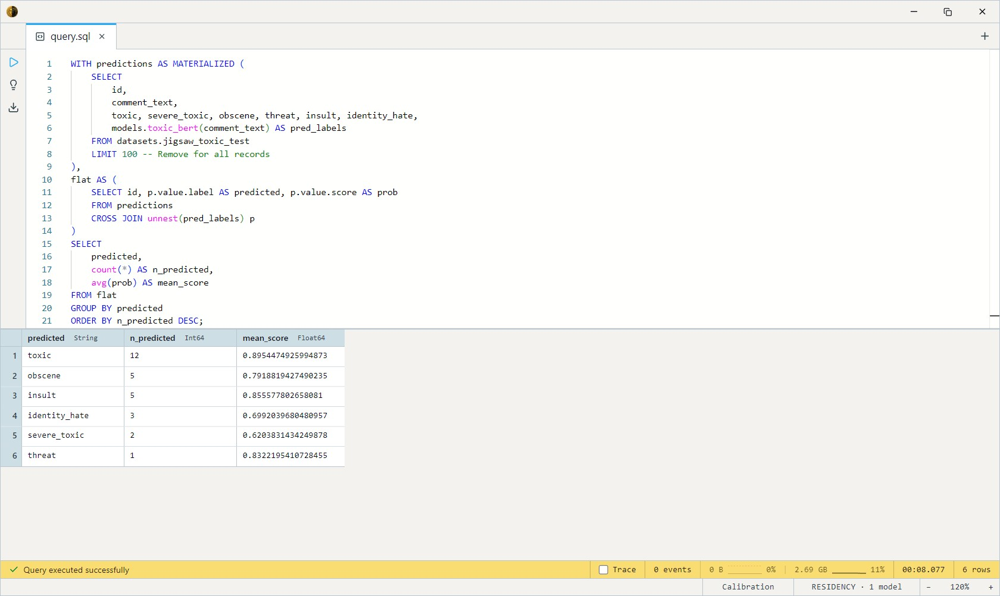

# Toxic-BERT

A BERT-base multi-label classifier from Unitary, fine-tuned on the
Jigsaw Toxic Comment Classification dataset. Scores English text on six
**independent** toxicity dimensions — `toxic`, `severe_toxic`, `obscene`,
`threat`, `insult`, `identity_hate` — and emits any label whose sigmoid
probability clears a per-label threshold. The default reach-for English
content-moderation classifier. ~440 MB on disk, CPU-viable, and the
canonical baseline every newer moderation model reports against.

One SQL-visible model: `toxic_bert`. Takes a `String` (the text to
classify) and an optional `Float32` threshold (default 0.5, bounded
0.0-1.0). Returns `Array<ScoredLabel>` — zero to six
`{label, score}` structs, one per label whose probability cleared the
threshold. Surviving labels keep input order
(`toxic, severe_toxic, obscene, threat, insult, identity_hate`); add
`ORDER BY score DESC` downstream if you want them sorted by confidence.

## Example SQL

Classify a single comment at default threshold:

```sql
SELECT models.toxic_bert('you are such an idiot') AS labels;
-- [{"label":"toxic","score":0.9858262},{"label":"obscene","score":0.749213},{"label":"insult","score":0.95798457}]
```

Classify with a stricter threshold — only labels above 0.9 probability
survive:

```sql
SELECT models.toxic_bert('you are such an idiot', 0.9) AS labels;
```

Score the Jigsaw test split and measure per-label precision/recall
against the gold flags. The cross join + unnest turns the
`Array<ScoredLabel>` into one row per (comment, predicted label):

```sql
WITH predictions AS MATERIALIZED (
    SELECT
        id,
        comment_text,
        toxic, severe_toxic, obscene, threat, insult, identity_hate,
        models.toxic_bert(comment_text) AS pred_labels
    FROM datasets.jigsaw_toxic_test
    LIMIT 100 -- Remove for all records
),
flat AS (
    SELECT id, p.value.label AS predicted, p.value.score AS prob
    FROM predictions
    CROSS JOIN unnest(pred_labels) p
)
SELECT
    predicted,
    count(*) AS n_predicted,
    avg(prob) AS mean_score
FROM flat
GROUP BY predicted
ORDER BY n_predicted DESC;
```

Output:



## Output shape

`Array<ScoredLabel>` — zero to six entries, each `{label: String,
score: Float32}` where the score is the sigmoid probability of that
label and the label is one of the six canonical Jigsaw classes:

```
toxic            -- any kind of toxicity (the umbrella label)
severe_toxic     -- aggressive, very-likely-to-make-someone-leave-the-conversation
obscene          -- obscene language
threat           -- contains a threat
insult           -- directed insult at a person
identity_hate    -- targets identity (race, religion, gender, orientation, ...)
```

Empty array = the text cleared every label's threshold from below
(i.e. the model judged it non-toxic on every axis).

## Tips

- **Labels are not mutually exclusive.** A single comment can carry any
  combination — `[toxic, insult, obscene]` is normal. Don't pick the
  highest-scoring label and discard the rest; that throws away the
  multi-label signal the model was trained to give you.
- **Threshold-tune per label, not globally.** `severe_toxic`, `threat`,
  and `identity_hate` are all <1% positive in the training data — their
  default 0.5 cutoff is conservative. If recall on those rare labels
  matters, drop the threshold (call with `threshold => 0.2`) and accept
  more false positives.
- **`toxic` is the umbrella label.** Most flagged comments carry
  `toxic` plus zero or more of the more specific labels. If you only
  need a binary "flag or pass" decision, looking at the `toxic` axis
  alone matches the Kaggle leaderboard's headline AUC.
- **Wikipedia talk-page vocabulary is the design point.** The model was
  trained on long-ish discussion comments; it works on tweets, support
  tickets, and forum posts but isn't sized for them specifically.
- **Context is 512 tokens** (WordPiece). Long comments get truncated —
  the head of the comment dominates the decision.
- **English only.** For multilingual moderation reach for
  `unitary/multilingual-toxic-xlm-roberta` upstream.

## License & attribution

Apache-2.0. Original model by Unitary. Trained on the Jigsaw / Google
Toxic Comment Classification Challenge data (Wikipedia talk-page
revisions). ONNX export by Joshua Lochner (Xenova).

- Paper: [Detoxify (model card)](https://github.com/unitaryai/detoxify)
- Upstream: [unitary/toxic-bert](https://huggingface.co/unitary/toxic-bert)
- ONNX export: [Xenova/toxic-bert](https://huggingface.co/Xenova/toxic-bert)
