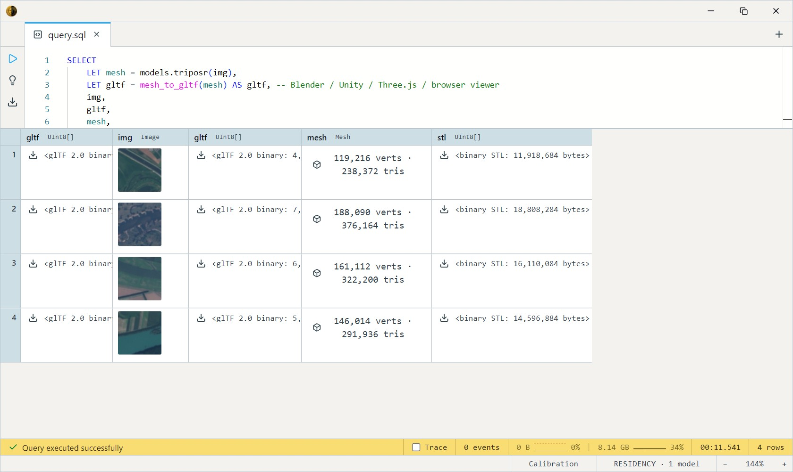
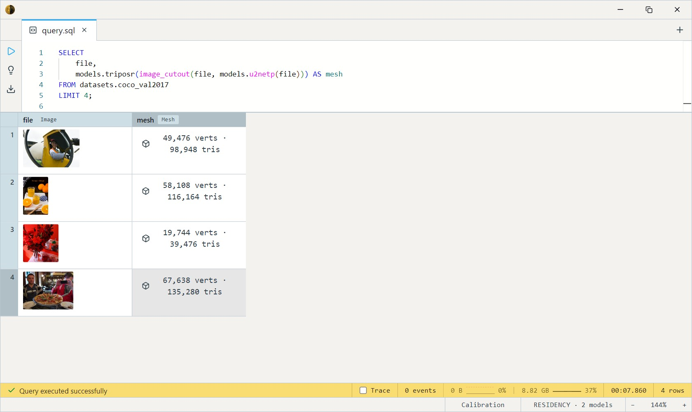
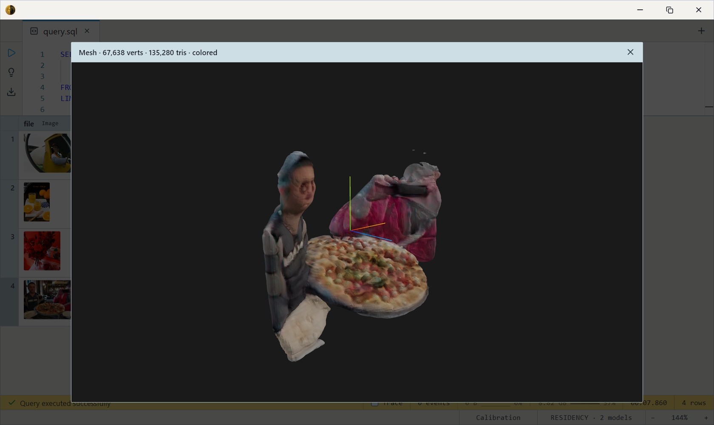

# TripoSR (Single-Image to 3D Mesh)

Stability AI + Tripo AI's TripoSR turns a **single photo of one object**
into a full 3D mesh in one feedforward pass — it hallucinates the back and
occluded surfaces the camera never saw, using its training prior. The
complement to the depth→mesh pipeline (which only reconstructs what's
visible): TripoSR gives you a complete, watertight-ish object you can
rotate, render, or 3D-print.

One SQL-visible model ships: `triposr(img Image, …) RETURNS Mesh`. It's a
GPU model — ~3.3 GB, CUDA-preferred.

## Parameters

`triposr(img, resolution = 256, isolevel = 25.0, chunk_size = 65536, fg_ratio = 0.85)`

| Param        | Default | Effect                                                                 |
| ------------ | ------- | ---------------------------------------------------------------------- |
| `resolution` | 256     | Voxel grid per axis (resolution³ queries). 128 ≈ 8× faster preview; 384 sharper but ~3× slower. |
| `isolevel`   | 25.0    | Marching-cubes surface threshold. Higher = tighter skin; lower = puffier. |
| `chunk_size` | 65536   | Query points per NeRF dispatch — VRAM dial.                            |
| `fg_ratio`   | 0.85    | Fraction of frame the subject fills after centring. Lower (0.7–0.8) gives extremities room. |

## Example SQL

Reconstruct a mesh from a single-object photo and export it:

```sql
SELECT
    path,
    LET mesh = models.triposr(img) as mesh,
    mesh_to_gltf(mesh) AS gltf,   -- Blender / Unity / Three.js / browser viewer
    mesh_to_stl(mesh)  AS stl     -- 3D-printer slicer
FROM datasets.eurosat_rgb   -- swap in any single-object image source
LIMIT 4;
```

Output:



Clean the background first — TripoSR expects one centred subject, so
compose with [U²-Net](../u2net/index.md) to cut clutter before
reconstruction:

```sql
SELECT
    file,
    models.triposr(image_cutout(file, models.u2netp(file))) AS mesh
FROM datasets.coco_val2017
LIMIT 4;
```

Output:




Fast preview vs quality — drop `resolution` for iteration, raise it for
the final asset:

```sql
SELECT
    path,
    models.triposr(img, 128) AS preview_mesh,
    models.triposr(img, 384) AS hires_mesh
FROM datasets.eurosat_rgb
LIMIT 2;
```

## Output shape

Returns a `Mesh` — triangles with per-vertex colours, already rotated
into the glTF / Three.js coordinate frame (+X right, +Y up, +Z toward
viewer). Render it directly in the viewer, or serialize with
`mesh_to_gltf` / `mesh_to_stl` / `mesh_to_obj`.

## Tips

- **One centred object, clean background.** TripoSR is trained on single
  subjects composited over gray. Cluttered / multi-object scenes produce
  garbled geometry — cut the subject out first (`image_cutout` +
  `u2netp`). The body auto-centres and flattens against mid-gray, but it
  can't separate a subject from a busy scene for you.
- **`resolution` is the speed/quality dial.** 256 is the reference; 128
  is a fast preview, 384 is slow but sharper. Cost scales with
  resolution³.
- **Tune `isolevel` per subject.** If the mesh looks bloated, raise it;
  if surfaces are eaten away, lower it.
- **It invents the unseen side.** The back of the object is a plausible
  guess, not a measurement — great for assets and visualisation, not for
  metrology.

## License & attribution

MIT. Original model by Stability AI + Tripo AI / VAST-AI-Research (TripoSR
— Tochilkin, Pankratz, Liu, Huang, Letts, Li, Liang, Laforte, Jampani,
Cao, 2024); ONNX export re-hosted under `Heliosoph`.

- Upstream: [stabilityai/TripoSR](https://huggingface.co/stabilityai/TripoSR)
- Source: [VAST-AI-Research/TripoSR](https://github.com/VAST-AI-Research/TripoSR)
- Paper: [TripoSR: Fast 3D Object Reconstruction from a Single Image](https://arxiv.org/abs/2403.02151)
