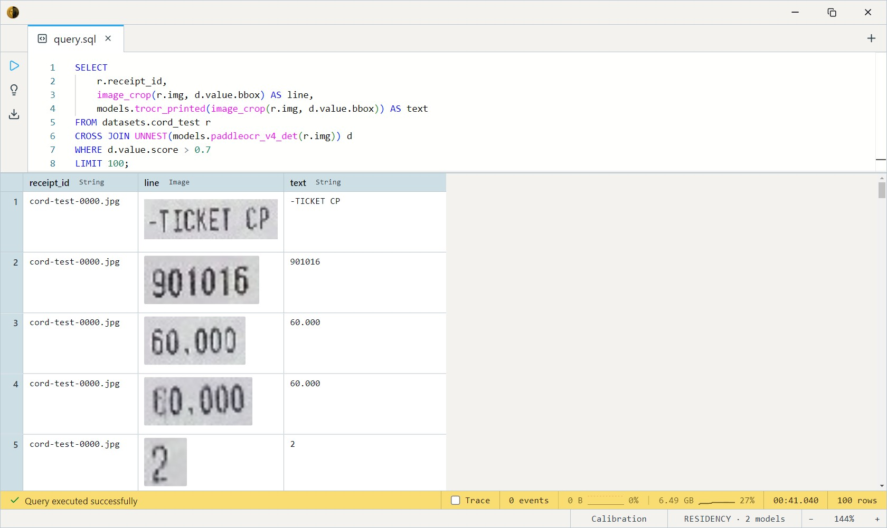
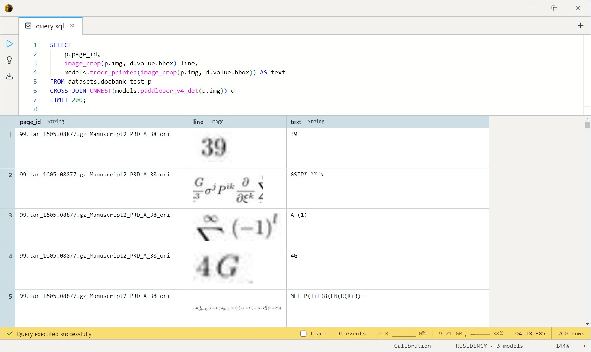

# TrOCR Base Printed

Microsoft's TrOCR — a ViT image encoder feeding a RoBERTa-style
autoregressive decoder — **reads printed text** from a tightly-cropped
image region and returns it as a string. It's a *recognizer*, not a
detector: it expects a single cropped line, not a full page. Pair it with
a text-region detector ([PaddleOCR](../paddleocr-v4-det/index.md) or
Florence-2) for end-to-end OCR.

Both variants share the architecture, the `TextRecognizer` task, and the
same signature — they differ only in weight precision.

## When to use which variant

| Variant  | Model name            | Disk    | Best for                                  |
| -------- | --------------------- | ------- | ----------------------------------------- |
| **fp32** | `trocr_printed`       | ~1.4 GB | **Default.** Reference numerics.          |
| fp16     | `trocr_printed_fp16`  | ~700 MB | Half the disk; same output on fp16 GPUs.  |

Each takes `(img Image)` and returns `String`. Both are CPU-runnable.

## Example SQL

The realistic use is two-stage: detect regions with PaddleOCR, crop each,
then read it with TrOCR. CORD receipts are photographed real-world text —
`img` is the decoded receipt, `receipt_id` its id.

Read every detected line on a receipt:

```sql
SELECT
    r.receipt_id,
    image_crop(r.img, d.value.bbox) AS line,
    models.trocr_printed(image_crop(r.img, d.value.bbox)) AS text
FROM datasets.cord_test r
CROSS JOIN UNNEST(models.paddleocr_v4_det(r.img)) d
WHERE d.value.score > 0.7
LIMIT 100;
```

Output:



Same pipeline on DocBank document pages:

```sql
SELECT
    p.page_id,
    image_crop(p.img, d.value.bbox) line,
    models.trocr_printed(image_crop(p.img, d.value.bbox)) AS text
FROM datasets.docbank_test p
CROSS JOIN UNNEST(models.paddleocr_v4_det(p.img)) d
LIMIT 200;
```

Output:



Use the fp16 build — identical query, `_fp16` name:

```sql
SELECT
    r.receipt_id,
    image_crop(p.img, d.value.bbox) line,
    models.trocr_printed_fp16(image_crop(r.img, d.value.bbox)) AS text
FROM datasets.cord_test r
CROSS JOIN UNNEST(models.paddleocr_v4_det(r.img)) d
WHERE d.value.score > 0.7
LIMIT 100;
```

## Output shape

Returns a single `String` — the recognized text of the cropped region.
Generation is capped at 20 tokens, matching the model's short-line
design.

## Tips

- **Crop tight, one line at a time.** TrOCR was trained on single lines
  of printed text. Feed it a whole page or receipt and it reads only a
  fragment — always crop to a detected region first (that's why the
  examples pair it with PaddleOCR).
- **Printed, not handwritten.** This is the *printed*-text checkpoint;
  handwriting needs the handwritten variant (not in the catalog). Works
  on clean printed / typeset text.
- **20-token cap.** Lines are short by design; very long lines get
  truncated. Detect at line granularity so each crop is a single short
  span.
- **ViT normalization**, 384×384, `[0.5, 0.5, 0.5]` mean/std (not
  ImageNet) — handled inside the body; pass the crop straight in.
- **For OCR-with-layout in one model**, Florence-2's OCR task returns
  text with region tokens; TrOCR is the lighter recognizer when you
  already have boxes.

## License & attribution

MIT. Original model by Microsoft Research (TrOCR — Li, Lv, Yu, Cui, Lu,
Wei, 2021); ONNX export re-hosted under `Heliosoph`.

- Upstream: [microsoft/trocr-base-printed](https://huggingface.co/microsoft/trocr-base-printed)
- Paper: [TrOCR: Transformer-based Optical Character Recognition with Pre-trained Models](https://arxiv.org/abs/2109.10282)
