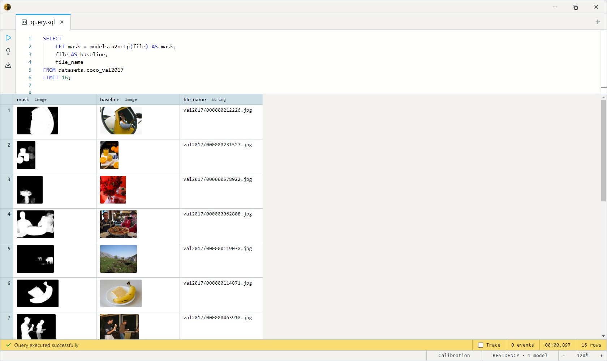

# U²-Net (Salient Object Segmentation)

University of Alberta's U²-Net — a nested U-structure network that finds
the **salient object** in an image and returns a foreground/background
mask. The standard reach-for model for background removal: one subject,
clean cutout, no class labels or prompts needed.

Both variants share the architecture, the `BackgroundRemover` task, and
320×320 I/O — they differ only in size. Each takes an `Image` and returns
a single-channel foreground mask `Image`, so swapping is a one-line change
to the `models.` name.

This is *salient-object* segmentation, not instance segmentation: it
emits one mask for "the subject," not a separate mask per object. For
per-object masks or click-to-segment, use [MobileSAM](../mobile-sam/index.md).

## When to use which variant

| Variant   | Model name | Disk    | Params | Best for                                                        |
| --------- | ---------- | ------- | ------ | --------------------------------------------------------------- |
| **Lite**  | `u2netp`   | ~5 MB   | 4.7M   | **Default.** ~10× faster, fits anywhere. Great general cutouts. |
| Full      | `u2net`    | ~170 MB | 176M   | Sharper edges on hair / fur / lace / thin structures.           |

Start with **Lite** — it handles most cutouts well. Move to Full only
when fine-boundary precision (flyaway hair, foliage) is the bottleneck.

## Example SQL

COCO 2017 val is images-only — `file` is the decoded JPEG, `file_name`
its path.

Generate the foreground mask for each image:

```sql
SELECT
    LET mask = models.u2netp(file) AS mask,
    file AS baseline,
    file_name
FROM datasets.coco_val2017
LIMIT 16;
```

Output:



Remove the background — `image_cutout` sets the image's alpha from the mask, leaving the subject on transparency:

```sql
SELECT
    file_name,
    file AS baseline,
    models.u2netp(file), -- Common subexpression elimination means this model is executed only once per row
    image_cutout(file, models.u2netp(file)) AS cutout
FROM datasets.coco_val2017
LIMIT 16;
```

Output:


Compare Lite vs Full on the same images — look at edge quality:

```sql
SELECT
    file AS baseline,
    image_cutout(file, models.u2netp(file)) AS lite,
    image_cutout(file, models.u2net(file))  AS "full"
FROM datasets.coco_val2017
LIMIT 12;
```

Output:


## Output shape

Both variants return an `Image`: a grayscale saliency mask at the source
resolution, **brighter = more foreground**. Feed it to `image_cutout(img,
mask)` to produce a transparent-background cutout, or threshold/composite
it however you like.

## Tips

- **Salient object, not instances.** U²-Net answers "what's the subject,"
  collapsing everything foreground-like into one mask. Multi-object scenes
  get merged. For separable per-object masks, use
  [MobileSAM](../mobile-sam/index.md).
- **Lite is the default for a reason.** At 4.7M params it's ~35× smaller
  and ~10× faster than Full, and the quality gap only shows on fine
  boundaries. Reach for Full when cutting out hair or foliage.
- **320×320 input**, ImageNet mean/std, handled inside the body — pass the
  raw `Image` column straight in. The mask is resized back to the source
  dimensions for you.
- **Segment once, reuse.** Materialize the mask `Image` into a column and
  composite from there rather than re-running the model per query.

## License & attribution

Apache-2.0. Original model by the University of Alberta (U²-Net — Qin,
Zhang, Huang, Dehghan, Zaiane, Jagersand).

- Source: [xuebinqin/U-2-Net](https://github.com/xuebinqin/U-2-Net)
- Paper: [U²-Net: Going Deeper with Nested U-Structure for Salient Object Detection](https://arxiv.org/abs/2005.09007)
