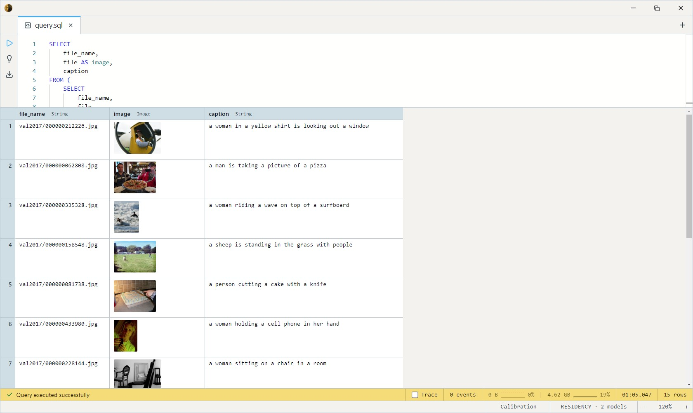

# ViT-GPT2 Image Captioner

The vanilla "describe this image" baseline. A ViT-base image encoder
(224×224, 16×16 patches) feeds a GPT-2 decoder through cross-attention,
producing one short English sentence per image — typically 10–16 tokens.

This is the classic captioner that predates task-prompted models. It
does exactly one thing: a plain caption. There are no task tokens, no
OCR, no detection. If you need any of those from the same model, reach
for [Florence-2](../florence2/index.md) instead; pick ViT-GPT2 when you want a
small, predictable, single-purpose caption and nothing more.

One SQL-visible model ships: `vit_gpt2_caption`. It takes an `Image`
and returns a `String`. There's a single variant (fp32, CPU-friendly,
no GPU required) so there's no size ladder to choose from.

## Example SQL

The COCO 2017 validation split is images-only — a `file` column carries
the decoded JPEG and `file_name` carries its path inside the source zip.

Caption every image in the val2017 split:

```sql
SELECT
    file_name,
    file AS image,
    models.vit_gpt2_caption(file) AS caption
FROM datasets.coco_val2017
LIMIT 10;
```

Find images the model thinks contain people — a cheap keyword filter
over the generated caption (no detector needed):

```sql
SELECT
    file_name,
    file AS image,
    caption
FROM (
    SELECT
        file_name,
        file,
        models.vit_gpt2_caption(file) AS caption
    FROM datasets.coco_val2017
    LIMIT 50
) t
WHERE caption LIKE '%person%'
   OR caption LIKE '%people%'
   OR caption LIKE '%man%'
   OR caption LIKE '%woman%';
```

Output:



## Output shape

`vit_gpt2_caption` returns a single `String` — one short, lower-cased
English sentence (e.g. `a man riding a skateboard down a street`).
Generation is capped at 16 tokens, so captions are terse by design.

## Tips

- **ViT normalization, not ImageNet.** The encoder uses `[0.5, 0.5, 0.5]`
  mean/std (inherited from `google/vit-base-patch16-224`), handled
  internally by the model body — pass the raw `Image` column straight in.
- **Captions are short and generic.** 16-token greedy decoding with no
  KV cache. Expect adequate, not vivid — this is a baseline. For
  multi-sentence or paragraph descriptions, use Florence-2's
  detailed / more-detailed caption models.
- **Caption once, filter many.** The model call is the expensive part.
  Materialize captions into a `String` column and run `LIKE` / full-text
  filters over that, rather than re-captioning per query.

## License & attribution

Apache-2.0. Original model by nlpconnect (Ankur Singh et al.); ONNX
export and re-host on HuggingFace under `Heliosoph`.

- Upstream: [nlpconnect/vit-gpt2-image-captioning](https://huggingface.co/nlpconnect/vit-gpt2-image-captioning)
- ONNX export: [Heliosoph/vit-gpt2-image-captioning-onnx](https://huggingface.co/Heliosoph/vit-gpt2-image-captioning-onnx)
