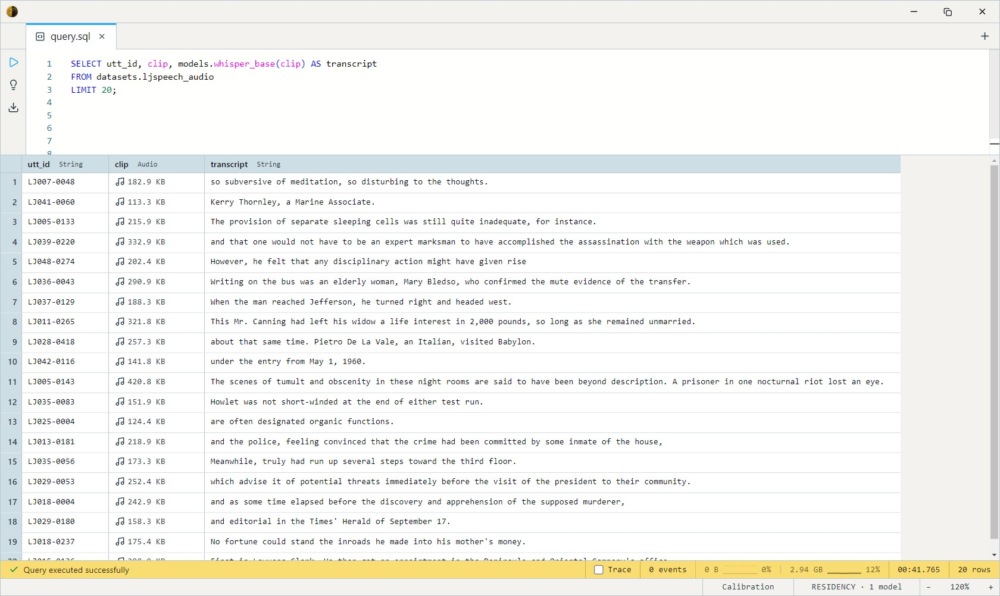

# Whisper

OpenAI's reference speech-to-text model. An encoder-decoder that turns an
audio clip into a text transcript — the de facto standard for ASR. All
four variants share the architecture, tokenizer, and the same SQL
contract; they differ only in parameter count (and therefore speed vs
accuracy). Every variant returns a plain `String`, so swapping sizes is a
one-line change to the `models.` name.

> **English-only in this build.** Whisper is multilingual, but the SQL
> bodies pin the decoder prompt to `<|en|><|transcribe|><|notimestamps|>`
> — so every variant transcribes as **English, no timestamps**.
> Multilingual, translate-to-English, and timestamped modes are a
> follow-up.

## When to use which variant

| Variant          | Model name               | Disk     | Best for                                                    |
| ---------------- | ------------------------ | -------- | ---------------------------------------------------------- |
| Tiny             | `whisper_tiny`           | ~148 MB  | Phones / embedded / ballpark transcription. Fastest.       |
| **Base**         | `whisper_base`           | ~281 MB  | **Default.** Balanced speed / accuracy on CPU.             |
| Small            | `whisper_small`          | ~927 MB  | Quality over throughput. ~3× the cost of Base.             |
| Large v3 Turbo   | `whisper_large_v3_turbo` | ~3.0 GB  | Top accuracy. Heaviest; still CPU-runnable, faster on GPU. |

All four run on CPU (no GPU required). Start with **Base**; move up only
when transcription quality is the bottleneck.

## Example SQL

The LJSpeech corpus is single-speaker English audio — a `file` column
carries the decoded WAV and `file_name` carries its path inside the
source archive.

Transcribe a sample of clips:

```sql
SELECT utt_id, clip, models.whisper_base(clip) AS transcript
FROM datasets.ljspeech_audio
LIMIT 20;
```

Output:



Compare two model sizes side by side on the same clips:

```sql
SELECT
    utt_id,
    clip,
    models.whisper_tiny(clip)  AS tiny,
    models.whisper_small(clip) AS small
FROM datasets.ljspeech_audio
ORDER BY file_name
LIMIT 5;
```

Bound the decoder for short clips with `max_tokens` (fewer tokens =
faster; 448 is the ceiling):

```sql
SELECT utt_id, audio_duration(clip), models.whisper_tiny(clip, 64) AS transcript
FROM datasets.ljspeech_audio
WHERE audio_duration(clip) < 5
LIMIT 50;
```

## Output shape

Every variant returns a single `String` — the transcript text, lower-
cased English with normal punctuation, no timestamps.

## Tips

- **One 30-second window per call.** The encoder consumes a fixed
  30 s mel spectrogram; audio longer than 30 s is truncated, not chunked.
  LJSpeech clips (~6 s median) fit comfortably — but for long recordings
  you'll need to segment the audio first (chunked long-form decode is a
  follow-up).
- **Resampling is automatic.** The body downmixes to mono and resamples
  to 16 kHz internally (`audio_to_mono` + `audio_samples`), so pass any
  `Audio` column straight in — LJSpeech's 22.05 kHz is handled for you.
- **`max_tokens` caps the decode loop.** The ceiling is 448 (Whisper's
  positional-embedding limit). Lowering it bounds runtime on short clips;
  raise it back toward 448 only for dense, fast speech.
- **English-only — see the note above.** Feeding non-English audio will
  still produce English-token output (often a transliteration or
  mistranscription), not a translation or native-script transcript.
- **Transcribe once, reuse.** The model call is the cost. Materialize
  transcripts into a `String` column and run text queries over that
  rather than re-transcribing.

## License & attribution

MIT. Original model by OpenAI (Whisper — Radford, Kim, Xu et al.); ONNX
export by onnx-community.

- Paper: [Robust Speech Recognition via Large-Scale Weak Supervision](https://arxiv.org/abs/2212.04356)
- Upstream: [openai/whisper](https://github.com/openai/whisper)
- ONNX exports: [onnx-community/whisper-base](https://huggingface.co/onnx-community/whisper-base) (and `-tiny` / `-small` / `-large-v3-turbo`)
